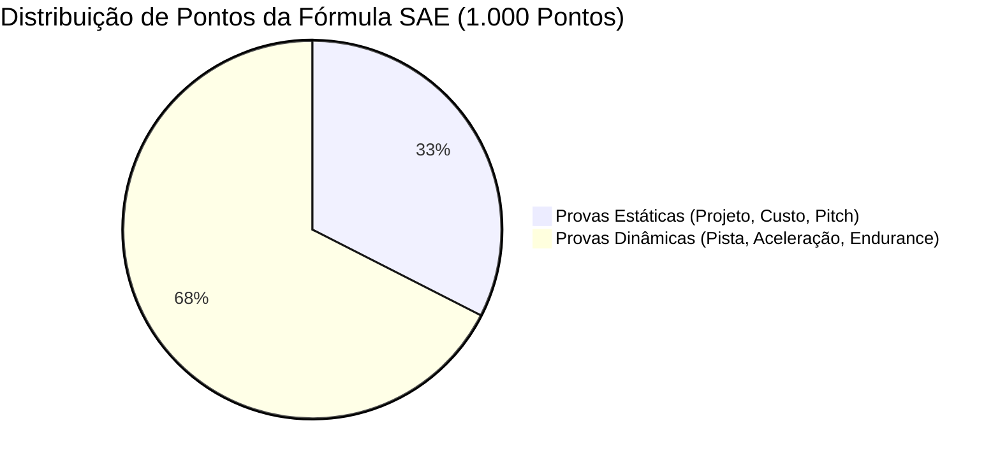
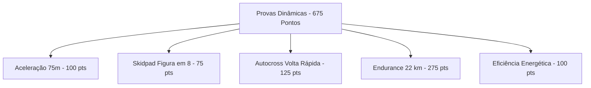

# 🏆 Regulamento Fórmula SAE & Dinâmica da Competição

Guia completo sobre a estrutura da competição **Fórmula SAE Brasil**, critérios de inspeção técnica de veículos elétricos (*EV Scrutineering*) e pontuação das provas estáticas e dinâmicas (1.000 pontos no total).

---

## 🏁 1. A Competição Fórmula SAE

A competição da **SAE International** desafia estudantes universitários a conceberem uma equipe fictícia de engenharia e manufatura para desenvolver um carro de corrida monoposto voltado ao mercado de pilotos amadores de fim de semana.

A pontuação total é de **1.000 pontos**, dividida em duas grandes categorias:

---

## 🔍 2. Inspeções Técnicas Mandatórias (*Scrutineering*)

Nenhum veículo pode entrar na pista sem receber os selos de aprovação em inspeções de segurança extremamente rigorosas:

1. **Inspeção Técnica Mecânica & Chassi:**
   * Triangulação da estrutura tubular, espessura e material dos tubos de proteção (*Main Hoop* e *Front Hoop*), cintos de segurança de 6 pontos e cone atenuador de impacto dianteiro.
2. **Inspeção Técnica Elétrica (EV Scrutineering):**
   * Verificação da integridade do Sistema Trativo de Alta Tensão (**TS - Tractive System**).
   * Validação do **IMD** (*Insulation Monitoring Device*): simulação de fuga de corrente para o chassi; o sistema precisa cortar a alta tensão em milissegundos.
   * Validação do **BMS** (*Battery Management System*): teste de corte por sobretensão, subtensão ou sobreaquecimento de célula.
3. **Teste de Inclinação (*Tilt Test*):**
   * O carro é inclinado a $45^\circ$ (sem vazamento de fluidos de freio ou arrefecimento) e a $60^\circ$ (sem tombar ou tocar o solo com as rodas do lado oposto).
4. **Teste de Chuva (*Rain Test*):**
   * O carro elétrico com o sistema de alta tensão armado recebe jatos contínuos de água por 2 minutos para comprovar a isolação IP65+ das caixas de bateria e eletrônica.
5. **Teste de Freio (*Brake Test*):**
   * O carro deve acelerar em linha reta e travar bruscamente: **as 4 rodas devem travar simultaneamente**, sem desvio de trajetória e sem desligar o motor de forma anômala.

---

## 📑 3. Provas Estáticas (325 Pontos)

| Prova | Pontuação | O que é avaliado pelos juízes |
| :--- | :---: | :--- |
| **Projeto de Engenharia (*Design Event*)** | **150 pts** | Sabatina técnica detalhada onde cada subsistema (chassi, suspensão, telemetria, powertrain) defende suas escolhas de projeto, simulações CAE/FEA/CFD e validações empíricas. |
| **Custo e Manufatura (*Cost Event*)** | **100 pts** | Relatório de custos completo (BOM - *Bill of Materials*), análise de processos de fabricação (usinagem, solda, laminação) e plano de produção em série (1.000 unidades/ano). |
| **Apresentação de Negócios (*Business Pitch*)** | **75 pts** | Apresentação em formato de pitch para potenciais investidores de risco, defendendo a viabilidade comercial e mercadológica do protótipo. |

---

## 🏎️ 4. Provas Dinâmicas de Pista (675 Pontos)

1. **Aceleração (100 pts):** Arrancada em reta pura de 75 metros a partir da imobilidade. Monopostos elétricos com tração direta costumam atingir $0-100\text{ km/h}$ em menos de 3.5 segundos.
2. **Skidpad (75 pts):** Circuito em formato de "oito", testando aceleração lateral contínua, balanço de rolagem e aderência máxima dos pneus.
3. **Autocross (125 pts):** Volta lançada em circuito sinuoso de cerca de 800m com cones. Mede a agilidade geral e define a ordem de largada para o Endurance.
4. **Endurance (275 pts):** A prova rainha da competição. Percurso total de **22 km** com troca de piloto na metade da prova. Mais da metade dos protótipos quebram ou sofrem *shutdown* térmico antes de completar os 22 km.
5. **Eficiência Energética (100 pts):** Medição da energia elétrica consumida durante os 22 km do Endurance em relação ao tempo de volta.

---

## 🤖 5. A Categoria Autônoma (*Formula Student Driverless*)

A fronteira mais recente da competição:
* O mesmo protótipo elétrico precisa navegar de forma autônoma sem piloto a bordo através de um circuito delimitado por **cones azuis (lado esquerdo) e amarelos (lado direito)**.
* Provas autônomas: *Acceleration Driverless, Skidpad Driverless, Autocross Driverless e Trackdrive* (10 voltas autônomas).

---
* 🔗 Voltar para a [[🏎️ UTForce E-Racing - Visao Geral|Visão Geral da UTForce]]
* 🔗 Ver [[⚡ Powertrain, Baterias e Sistema Trativo (Alta Tensao)|Powertrain e Alta Tensão]]
