# 👥 Estrutura da Equipe, Organograma & Roster — UTForce E-Racing

Estrutura organizacional, divisões departamentais e roster oficial da equipe de Fórmula SAE Elétrico da **UTFPR Câmpus Ponta Grossa**.

---

## 🏎️ 1. Identidade & Missão da UTForce

* **Equipe:** UTForce E-Racing — Fórmula SAE Elétrico.
* **Instituição:** Universidade Tecnológica Federal do Paraná (UTFPR-PG).
* **Marco Histórico:** Pioneira como **o 1º carro elétrico dos Campos Gerais**.
* **Objetivo:** Projetar, simular, construir, testar e competir com um protótipo monoposto de corrida 100% elétrico, segundo o regulamento internacional da *SAE International*.

---

## 🏛️ 2. Organograma Institucional

A equipe é estruturada em duas grandes diretorias sob liderança da Capitania:

```mermaid
graph TD
    Cap[Capitania Geral]
    
    Cap --> Tech[Coordenação Técnica]
    Cap --> Admin[Coordenação Administrativa]

    subgraph Mec ["Engenharia Mecânica & Estrutura"]
        Tech --> Chassi[Chassi & Estrutura]
        Tech --> Susp[Suspensão & Direção]
        Tech --> Freio[Freios]
        Tech --> Aero[Aerodinâmica]
        Tech --> Comp[Compósitos & Carenagem]
    end

    subgraph Eletro ["Engenharia Elétrica & Powertrain"]
        Tech --> Power[Powertrain & Motor]
        Tech --> Bateria[Bateria & Acumulador HV]
    end

    subgraph Soft ["Computação, Eletrônica & IA"]
        Tech --> Telem[Telemetria & Aquisição de Dados]
        Tech --> Emb[Sistemas Embarcados & Baixa Tensão]
        Tech --> Auto[Sistemas Autônomos / Driverless]
    end

    subgraph Gest ["Gestão & Negócios"]
        Admin --> Fin[Financeiro & Custos]
        Admin --> Mkt[Marketing & Audiovisual]
        Admin --> Patr[Patrocínios & Relações Externas]
        Admin --> RH[Recursos Humanos]
        Admin --> Eventos[Eventos & Logística]
    end

    style Cap fill:#DF0A3B,stroke:#fff,color:#fff
    style Tech fill:#1a1a1a,stroke:#DF0A3B,color:#fff
    style Admin fill:#1a1a1a,stroke:#DF0A3B,color:#fff

```

---

## 🏁 3. Liderança e Roster Oficial (Elenco Ativo)

Baseado no cadastro sincronizado do portal oficial (`SiteUTForce/src/data/roster.json`):

### A. Capitania & Coordenações:
* **Capitão Geral:** Eduardo Nowacki (#01)
* **Coordenador Técnico:** Murilo Caetano Ferreira Heleuterio
* **Coordenador Administrativo:** Valentim Klimiont

### B. Divisões Técnicas Principais:
| Área | Membros Registrados | Foco de Engenharia |
| :--- | :--- | :--- |
| **Telemetria** | **Lucas Fernandes Christen**, Julia Ferreira Jula, Conrado G. Franson, Ravi Jesus | Barramento CAN, telemetria sem fio, aquisição de sensores, dashboard em tempo real. |
| **Sistemas Autônomos** | **Lucas Fernandes Christen**, Julia Ferreira Jula | Percepção de cones por visão/LiDAR, SLAM, controle autônomo (*Formula Driverless*). |
| **Bateria / Acumulador** | Felipe Ozorio | Dimensionamento das células Li-Ion, BMS, isolamento e refrigeração. |
| **Powertrain** | Guilherme Camargo Ferreira da Cruz | Inversor trifásico, motor elétrico, transmissão e arrefecimento. |
| **Chassi & Estrutura** | Bruno Gonçalves Boroviec, Heric Bruno Fontana, Nicollas Borges | Estrutura tubular/spaceframe, rigidez torcional e ergonomia do piloto. |
| **Compósitos** | Gabriel Correa | Laminação em fibra de carbono, carenagem leve e proteções estruturais. |
| **Freios** | Gina Luca Constantim, João Felipe Batista Presnny | Balanço de frenagem dianteiro/traseiro, discos, pinças e plausibilidade APPS/Brake. |

### C. Divisões Administrativas:
* **Marketing:** Vitor Alexandre Dantas Cardoso, Isadora
* **Eventos:** Pedro Pacher

---

## 🎯 4. O Papel de Lucas Christen na Equipe

Lucas Christen atua em três frentes estratégicas de alta tecnologia na UTForce:
1. **Telemetria:** Arquitetura do barramento CAN, leitura de sensores do protótipo (suspensão, temperatura de pneus, tensão de células) e envio para boxes em tempo real.
2. **Sistemas Autônomos (Driverless):** Pesquisa e implementação de visão computacional e algoritmos de controle para navegação autônoma entre cones.
3. **Plataforma Web & Inteligência:** Concepção e desenvolvimento do **Portal Oficial do UTForce** e do seu **Chatbot Determinístico de Atendimento** (`SiteUTForce`).

---
* 🔗 Ir para a [[🏎️ UTForce E-Racing - Visao Geral|Visão Geral da UTForce E-Racing]]
* 🔗 Ver [[🏆 Regulamento Formula SAE e Provas da Competicao|Regulamento e Provas da Competição]]
