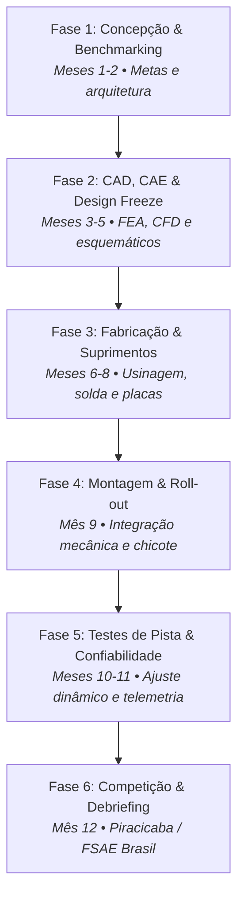

# 📅 Ciclo de Engenharia & Temporada SAE — UTForce E-Racing

Fases de desenvolvimento, marcos críticos de entrega (*milestones*), documentos obrigatórios da SAE e planejamento anual da equipe.

---

## ⏳ 1. O Ciclo de Desenvolvimento em 6 Fases

O desenvolvimento de um protótipo de Fórmula SAE Elétrico obedece a um ciclo anual rigoroso de engenharia simultânea:

---

## 📑 2. Documentos Oficiais Obrigatórios da SAE

Durante a temporada, a equipe precisa submeter relatórios técnicos auditados pelos juízes da SAE meses antes da competição física:

| Documento | Prazo Típico | Escopo |
| :--- | :---: | :--- |
| **ESF (*Electrical Safety Form*)** | T-90 dias | Documento mais crítico para carros elétricos. Descreve em detalhes os circuitos de alta tensão, isolamento do acumulador, topologia do BMS, relés de segurança (AIRs) e circuito de pré-carga. |
| **SES (*Structural Equivalency Spreadsheet*)** | T-90 dias | Comprova através de cálculos e testes de corpos de prova que o chassi cumpre a equivalência estrutural aos tubos de aço padrão especificados no regulamento. |
| **FMEA (*Failure Mode and Effects Analysis*)** | T-60 dias | Matriz detalhada de análise de riscos, modos de falha em potencial de cada componente e ações mitigadoras de segurança. |
| **CRD (*Cost Report Documents*)** | T-45 dias | Tabela de custos detalhada de cada parafuso, conector, solda e hora de fabricação do protótipo. |
| **Design Spec Sheet & Executive Summary** | T-30 dias | Resumo executivo de engenharia e especificações técnicas de performance do carro. |

---

## 🏁 3. Etapas de Validação em Pista (*Testing Days*)

Os testes práticos são organizados com base na telemetria embarcada:

1. **Primeira Partida (*First Power-On*):** Teste de bancada em baixa tensão (12V/24V) e energização gradual do inversor.
2. **Shakedown de Baixa Velocidade:** Verificação de esterçamento, folgas mecânicas, arrefecimento e temperatura dos módulos de bateria.
3. **Calibração de Frenagem:** Ajuste do balanço dianteiro/traseiro (*balance bar*) para travar as 4 rodas sem desvio de direção.
4. **Sessões de Autocross & Skidpad:** Gravação de dados de aceleração lateral e calibração de mapas de torque do motor elétrico.
5. **Simulação de Endurance (22 km):** Teste de estresse térmico contínuo. Monitoramento em tempo real via telemetria para garantir que as células não atinjam o teto regulamentar de temperatura ($60^\circ\text{C}$).

---
* 🔗 Voltar para a [[🏎️ UTForce E-Racing - Visao Geral|Visão Geral da UTForce]]
* 🔗 Ver [[📡 Telemetria, Sensores e Aquisicao de Dados|Telemetria e Aquisição de Dados]]
