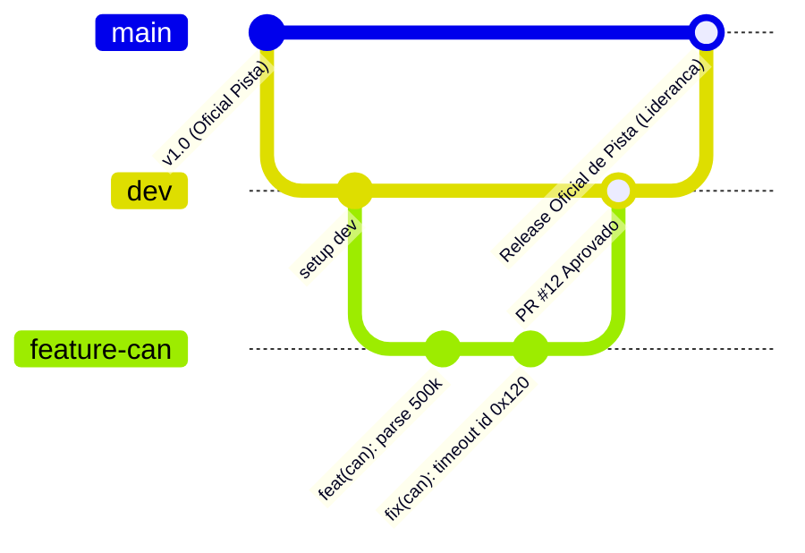

# 🧭 Guia Oficial de Git, Branching & Conventional Commits — UTForce E-Racing

> **Documento Normativo de Engenharia & Gestão de Versão.**  
> Este guia estabelece o padrão de versionamento, ciclo de branches, boas práticas de colaboração e convenções de commit para todos os membros e subsistemas da equipe **UTForce E-Racing**.

---

## 📑 Sumário

1. [Por que Padronizar o Versionamento na UTForce?](#1-por-que-padronizar-o-versionamento-na-utforce)
2. [Arquitetura de Branches (Escala de 3 Níveis)](#2-arquitetura-de-branches-escala-de-3-níveis)
3. [Catálogo de Conventional Commits (feat, fix, chore, etc.)](#3-catálogo-de-conventional-commits-feat-fix-chore-etc)
4. [Dicionário Prático de Comandos Essenciais](#4-dicionário-prático-de-comandos-essenciais)
5. [Passo a Passo: O Ciclo de Trabalho do Membro](#5-passo-a-passo-o-ciclo-de-trabalho-do-membro)
6. [Pull Requests & Revisão de Código (Code Review)](#6-pull-requests--revisão-de-código-code-review)
7. [Como Resolver Conflitos com Segurança](#7-como-resolver-conflitos-com-segurança)
8. [Regras de Ouro & O que NUNCA Enviar ao Repositório](#8-regras-de-ouro--o-que-nunca-enviar-ao-repositório)

---

## 1. Por que Padronizar o Versionamento na UTForce?

Em uma equipe de Fórmula SAE, software e telemetria atuam em ambiente de **missão crítica**. Uma linha de código quebrada ou uma configuração incorreta no barramento CAN pode interromper a aquisição de dados durante um teste dinâmico na pista ou impedir a liberação no *Scrutineering* elétrico.

O Git não é apenas um local de backup: é o **registro histórico auditável da engenharia do carro elétrico**. Com padrões definidos:
* Nenhuma alteração não testada entra diretamente no carro ou na documentação oficial.
* Sabemos exatamente quem alterou cada calibração, quando e por qual motivo.
* Vários membros podem trabalhar simultaneamente (na telemetria, no chassi, no site ou no BMS) sem sobrescrever o trabalho do colega.

---

## 2. Arquitetura de Branches (Escala de 3 Níveis)

Adotamos uma versão simplificada e robusta do **Git Flow**, dividida em três camadas hierárquicas:



| Nível | Branch | Papel no Projeto | Política de Acesso |
| :---: | :--- | :--- | :--- |
| **1 (Principal)** | `main` | **Versão Oficial e Estável.** Código e documentos 100% testados, auditados e prontos para uso em bancada ou pista. | 🔒 **Protegida.** Proibido push direto. Atualizada apenas via Pull Request aprovado pela liderança. |
| **2 (Integração)** | `dev` | **Área de Homologação.** Onde as funcionalidades de todos os subsistemas se encontram para testes conjuntos. | 🛡️ **Semi-protegida.** Recebe merges das branches de feature através de revisão de código. |
| **3 (Trabalho)** | `feature/*`<br>`fix/*`<br>`docs/*` | **Área Individual do Membro.** Onde cada pessoa desenvolve sua tarefa isoladamente sem interferir nos demais. | 🔓 **Livre.** O autor da branch faz commits e envia ao GitHub livremente. |

### Padrão de Nomes para Branches de Trabalho
* `feature/nome-da-tarefa`: Novas implementações (ex: `feature/grafico-temperatura-bms`).
* `fix/nome-do-bug`: Correção de erros (ex: `fix/overflow-delta-tempo`).
* `docs/nome-do-documento`: Atualizações documentais (ex: `docs/manual-freios-esp32`).
* `refactor/nome-do-modulo`: Melhorias de código sem alterar comportamento (ex: `refactor/serial-worker`).

---

## 3. Catálogo de Conventional Commits (feat, fix, chore, etc.)

A UTForce segue rigorosamente o padrão internacional **Conventional Commits**. Cada commit deve explicar claramente **o que** foi feito e **onde**.

### Formato Padrão
```text
tipo(escopo opcional): descrição curta em português no imperativo

[corpo opcional explicando o motivo técnico da mudança]
```

### Tipos Obrigatórios de Commit

| Prefixo | Quando Utilizar? | Exemplo Real na UTForce |
| :--- | :--- | :--- |
| **`feat`** | Adição de uma **nova funcionalidade** ou recurso ao software/carro. | `feat(telemetria): adiciona leitura de corrente do inversor na CAN` |
| **`fix`** | Correção de um **bug ou falha** que causava erro ou comportamento incorreto. | `fix(graficos): corrige travamento ao plotar aceleracao lateral acima de 60fps` |
| **`docs`** | Alterações **exclusivas em documentação** (arquivos Markdown, manuais, diagramas). | `docs(baterias): atualiza especificacoes das celulas Li-Ion 18650` |
| **`refactor`**| Modificação no código que **não adiciona funcionalidade nem corrige bug**, apenas melhora a estrutura interna. | `refactor(qthread): simplifica emissao de sinais Qt na thread do simulador` |
| **`chore`** | Tarefas operacionais de rotina, dependências ou organização sem impacto no produto. | `chore(deps): atualiza versao do pyqtgraph no requirements.txt` |
| **`test`** | Criação ou ajuste de **testes automatizados** (unitários ou bancada). | `test(can): adiciona testes unitarios com pytest para decodificador de pacotes` |
| **`perf`** | Alteração de código com foco estrito em **aumento de velocidade ou redução de memória**. | `perf(interpolacao): substitui loop python por array numpy no calculo de delta T` |
| **`style`** | Ajustes de **formatação, indentação ou estilo visual** que não afetam lógica. | `style(ui): padroniza cores dos botoes de telemetria no modo escuro` |
| **`build`** | Mudanças em scripts de **compilação, empacotamento ou dependências de build**. | `build(pyinstaller): adiciona spec para incluir icones no executavel .exe` |
| **`ci`** | Ajustes em **pipelines de automação** do GitHub Actions. | `ci(actions): adiciona etapa de validacao de sintaxe python nos pull requests` |

---

### Exemplos: Bons Commits vs. Maus Commits

| ❌ Mau Exemplo (Evite!) | ✅ Bom Exemplo (Padrão UTForce) |
| :--- | :--- |
| `git commit -m "alteracoes"` | `git commit -m "feat(sensores): integra leitura do sensor de curso da suspensao"` |
| `git commit -m "arrumando bug"` | `git commit -m "fix(bms): corrige calculo de tensao minima da celula sob carga"` |
| `git commit -m "arquivos"` | `git commit -m "docs(regras): adiciona capitulo de scrutineering mecanico da SAE"` |
| `git commit -m "subindo codigo final que agora vai"` | `git commit -m "refactor(worker): desacopla conexao serial da interface pyside6"` |

---

## 4. Dicionário Prático de Comandos Essenciais

### A. Preparação e Consulta
```bash
# Verificar o estado atual dos seus arquivos (o que foi modificado, deletado ou adicionado)
git status

# Visualizar exatamente linha por linha o que mudou antes de preparar o commit
git diff

# Ver o histórico recente de commits em formato de grafo resumido
git log --oneline --graph -n 10
```

### B. Gestão de Branches
```bash
# Listar todas as branches locais
git branch

# Criar e já entrar imediatamente em uma nova branch de trabalho (a partir da atual)
git checkout -b feature/nome-da-tarefa

# Alternar para uma branch que já existe
git checkout dev
# (Ou no Git mais recente):
git switch dev
```

### C. Preparação e Criação de Commits
```bash
# Adicionar todos os arquivos modificados para a área de preparação (staging)
git add .

# Adicionar um arquivo específico
git add "caminho/do/arquivo.py"

# Gravar o commit com a mensagem padronizada no formato Conventional Commits
git commit -m "feat(telemetria): adiciona suporte ao protocolo de telemetria v2"
```

### D. Sincronização com o GitHub
```bash
# Baixar as últimas atualizações do GitHub e mesclar na sua branch atual
git pull origin dev

# Enviar sua branch pela primeira vez para o GitHub (configurando o upstream)
git push -u origin feature/nome-da-tarefa

# Próximos envios da mesma branch
git push
```

### E. Recursos Salvadores (Stash & Descarte)
```bash
# Precisou trocar de branch urgente mas tem alterações incompletas que não quer commitar?
git stash          # Guarda suas alterações temporariamente em uma gaveta

# Quando voltar para a sua branch:
git stash pop      # Restaura as alterações que estavam guardadas na gaveta

# Descartar alterações de um arquivo que ainda não foi commitado
git checkout -- caminho/do/arquivo.py
```

---

## 5. Passo a Passo: O Ciclo de Trabalho do Membro

Siga este roteiro em **todas as suas tarefas**:

### 1º Passo: Comece sempre com a versão mais recente
```bash
# Vá para a branch dev
git checkout dev

# Baixe as atualizações enviadas pelos outros membros
git pull origin dev
```

### 2º Passo: Crie sua branch isolada
```bash
git checkout -b feature/calibracao-pedal-acelerador
```

### 3º Passo: Trabalhe e faça seus testes
Edite os arquivos no VS Code, Obsidian ou sua IDE de preferência. Realize os testes unitários ou simulações.

### 4º Passo: Revise o que foi alterado
```bash
git status
git diff
```

### 5º Passo: Faça commits atômicos e bem descritos
```bash
git add .
git commit -m "feat(pedal): adiciona curva de resposta exponencial ao acelerador"
```

### 6º Passo: Envie sua branch ao GitHub
```bash
git push -u origin feature/calibracao-pedal-acelerador
```

### 7º Passo: Abra o Pull Request
1. Acesse o repositório no GitHub: `https://github.com/Lucas-Christen/Telemetria-UTForce`.
2. Um aviso amarelo surgirá: **"Compare & pull request"**. Clique nele.
3. Configure:
   - **Base (destino):** `dev`
   - **Compare (sua branch):** `feature/calibracao-pedal-acelerador`
4. Descreva brevemente o que foi implementado e solicite a revisão do responsável.

---

## 6. Pull Requests & Revisão de Código (Code Review)

O **Pull Request (PR)** é o momento de validação e garantia de excelência da equipe:

1. **Revisão Atenta:** O revisor acessa a aba **Files changed** no GitHub para conferir linha a linha o que foi modificado.
2. **Comentários Construtivos:** Caso falte um teste, haja erro de fórmula ou código fora do padrão, o revisor comenta diretamente na linha afetada.
3. **Aprovação (*Approve*):** O revisor clica em **Review changes $\to$ Approve**.
4. **Merge na `dev`:** O código é integrado à branch de desenvolvimento.
5. **Limpeza:** A branch de feature no GitHub pode ser deletada para manter o repositório limpo.

---

## 7. Como Resolver Conflitos com Segurança

Um conflito acontece quando **duas pessoas alteraram a mesma linha do mesmo arquivo** em branches diferentes. O Git não sabe qual das duas escolher e pede a sua ajuda.

### Como o Git sinaliza um conflito no arquivo:
```text
<<<<<<< HEAD (Sua versão local)
taxa_amostragem_hz = 20
=======
taxa_amostragem_hz = 50
>>>>>>> dev (Versão que veio do GitHub)
```

### Passo a Passo para Resolver:
1. Abra o arquivo marcado com conflito no seu editor de código.
2. Escolha qual valor deve permanecer (ou combine os dois).
3. **Apague manualmente os marcadores** `<<<<<<<`, `=======` e `>>>>>>>`.
4. Salve o arquivo.
5. Registre a resolução no Git:
   ```bash
   git add nome-do-arquivo-com-conflito.py
   git commit -m "fix(merge): resolve conflito na frequencia de amostragem CAN"
   git push
   ```

---

## 8. Regras de Ouro & O que NUNCA Enviar ao Repositório

### 🚫 O que NUNCA deve ir para o Git (`.gitignore`):
* **Senhas, tokens e chaves privadas:** (`.env`, chaves de API, certificados).
* **Ambientes virtuais e pacotes pesados:** (`venv/`, `.venv/`, `node_modules/`).
* **Arquivos temporários e cache compilado:** (`__pycache__/`, `*.pyc`, `.DS_Store`, `Thumbs.db`).
* **Binários gigantes ou logs de teste desnecessários:** (`*.exe`, dumps de logs de vários gigabytes).

### 🏆 As 5 Regras de Ouro da UTForce:
1. **Nunca faça `git push` direto na `main`:** A branch principal é a versão sagrada de pista.
2. **Faça commits pequenos e frequentes:** Um commit deve resolver uma coisa só. É muito mais fácil rastrear 5 commits pequenos do que 1 commit gigante chamado *"várias alterações"*.
3. **Puxe (`pull`) antes de começar a trabalhar:** Evite retrabalho e conflitos mantendo sua `dev` sempre atualizada.
4. **Mensagens de commit explicativas:** Use os tipos do Conventional Commits (`feat`, `fix`, `docs`, `chore`).
5. **Dúvida? Não force:** Se o Git der erro ao dar push, **NUNCA use `git push --force`** sem falar antes com a liderança técnica, pois isso pode apagar o histórico de outros membros.

---

> **Dúvidas ou suporte com Git?**  
> Procure a liderança de Telemetria e Sistemas Eletrônicos da **UTForce E-Racing**.
