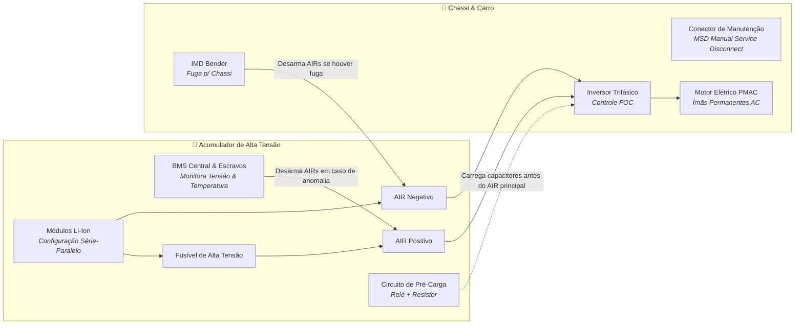

# ⚡ Powertrain, Baterias & Sistema Trativo (Alta Tensão)

Especificação da arquitetura elétrica do **Sistema Trativo (*Tractive System - TS*)**, conjunto de baterias de tração, circuitos de segurança regulamentares e controle de tração da UTForce.

---

## ⚡ 1. Visão Geral do Sistema Trativo de Alta Tensão

O regulamento da Fórmula SAE permite tensões de até **600V DC** no circuito de alta tensão. A arquitetura clássica é dividida entre o container de baterias (*Accumulator Container*), o circuito intermediário e o inversor/motor:

---

## 🔋 2. O Pacote de Baterias (*Accumulator Container*)

O acumulador é o coração do carro elétrico e exige contenção blindada à prova de fogo:
* **Células:** Íons de Lítio (Li-Ion) com alta densidade de corrente de descarga (alta taxa C).
* **Estrutura de Contenção:** Caixa construída em alumínio ou compósitos resistentes ao fogo, isolada eletricamente de todas as partes condutoras do chassi.
* **Monitoramento de Células (BMS):**
  * Mede a tensão de **cada célula individualmente** (corte imediato se qualquer célula cair abaixo do limite seguro ou ultrapassar o teto de sobrecarga).
  * Mede a temperatura de ao menos **30% das células** distribuídas uniformemente pelo pacote.
  * Teto térmico regulamentar: **$60^\circ\text{C}$** — ultrapassar essa temperatura abre os relés e imobiliza o veículo.

---

## 🛡️ 3. Circuitos de Segurança Regulamentares

| Componente | Sigla | Função Crítica no Carro |
| :--- | :---: | :--- |
| **Accumulator Isolation Relays** | **AIRs** | Contatores de alta potência normalmente abertos. Só fecham quando o circuito de segurança (*Shutdown Circuit*) estiver 100% íntegro. |
| **Insulation Monitoring Device** | **IMD** | Monitora constantemente a resistência de isolação entre a alta tensão flutuante e a massa do chassi. Dispara se a isolação cair abaixo de $500\,\Omega/\text{V}$. |
| **Circuito de Pré-Carga** | **Precharge** | Alimenta os capacitores de entrada do inversor através de um resistor limitador antes do AIR positivo fechar, evitando correntes de surto de milhares de ampères que fundiriam os contatos. |
| **Circuito de Descarga** | **Discharge** | Descarrega a tensão residual dos barramentos para menos de $60\text{V DC}$ em menos de 5 segundos após o desligamento do carro. |
| **Manual Service Disconnect** | **MSD** | Plugue de desconexão física rápida removível sem ferramentas para manutenção segura. |

---

## 🏎️ 4. Inversor Trifásico & Motor Elétrico

* **Inversor:** Converte a corrente contínua da bateria em corrente alternada trifásica com modulação PWM senoidal via controle vetorial orientado a campo (**FOC - Field-Oriented Control**).
* **Frenagem Regenerativa (*Regen*):** Em desaceleração, o motor atua como gerador, convertendo energia cinética de volta em energia química nas baterias, poupando os freios mecânicos e garantindo pontuação máxima na prova de Eficiência Energética.

---
* 🔗 Voltar para a [[🏎️ UTForce E-Racing - Visao Geral|Visão Geral da UTForce]]
* 🔗 Ver [[📡 Telemetria, Sensores e Aquisicao de Dados|Telemetria e Aquisição de Dados]]
