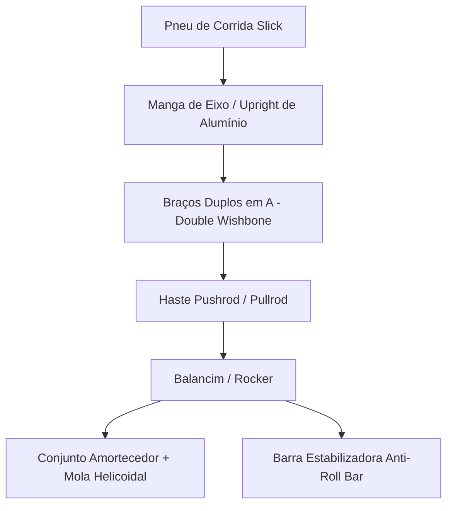

# 🏎️ Chassi, Dinâmica Veicular, Freios & Aerodinâmica

Especificação dos subsistemas mecânicos estruturais e dinâmicos do protótipo monoposto elétrico da UTForce E-Racing.

---

## 🏗️ 1. Chassi & Estrutura (*Spaceframe*)

A integridade do piloto e a rigidez da plataforma de competição dependem do projeto do chassi:
* **Estrutura Tubular (*Spaceframe*):** Tubulação em aço liga (ex: AISI 4130 cromomolibdênio ou aço carbono SAE 1020), triangulada para maximizar a rigidez torcional ($> 1.200\text{ Nm/grau}$) com massa mínima.
* **Célula de Sobrevivência do Piloto:**
  * **Main Hoop (Arco Principal):** Tubo contínuo posicionado logo atrás do capacete do piloto.
  * **Front Hoop (Arco Dianteiro):** Protege as pernas e os braços na região do volante.
  * **Side Impact Structure:** Triangulação lateral para absorção de impactos laterais contra outros veículos ou guard-rails.
  * **Atenuador de Impacto (IA):** Bloco de espuma de alumínio ou poliuretano estrutural na dianteira capaz de desacelerar o carro a menos de $20G$ em impacto frontal a $7\text{ m/s}$.

---

## 🛞 2. Suspensão & Dinâmica Veicular

O objetivo da suspensão é manter o contato ideal dos 4 pneus com o asfalto sob acelerações laterais superiores a $1.5G$:

### Geometria e Parâmetros Cinemáticos:
* **Cambagem (*Camber*):** Ajuste estático levemente negativo ($-1.5^\circ$ a $-2.5^\circ$) para compensar a rolagem da carroceria nas curvas de alta aceleração lateral no Skidpad.
* **Caster & KPI:** Proporcionam alinhamento e retorno do volante, transmitindo sensação de contato (*force feedback*) para o piloto.
* **Geometria de Direção Ackermann:** As rodas esterçam em ângulos ligeiramente diferentes para que percorram raios de curva concêntricos sem arrastar borracha.

---

## 🛑 3. Sistema de Freios & Plausibilidade

O sistema mecânico opera através de dois circuitos hidráulicos independentes (dianteiro e traseiro):
* **Cilindros Mestres Duplos:** Acionados por um pedal usinado em alumínio aeronáutico com **barra de balanço regulável (*balance bar*)**, permitindo ao piloto alterar o equilíbrio de frenagem dianteira/traseira durante a prova.
* **Discos de Freio Flutuantes:** Fabricados em aço inoxidável cortado a laser com alívio de peso e perfurações para dissipação térmica.
* **Placa BSPD (*Brake System Plausibility Device*):**
  * Circuito puramente analógico e não programável exigido pela SAE.
  * Se o piloto pisar com força no pedal de freio enquanto o acelerador (APPS) indicar abertura de aceleração $> 25\%$, o BSPD desarma os relés principais de alta tensão imediatamente.

---

## 🌬️ 4. Aerodinâmica & Compósitos (*Aero Package*)

Projetado para produzir *Downforce* (sustentação negativa), empurrando os pneus contra o solo em velocidades médias de circuito sinuoso ($40\text{ a }80\text{ km/h}$):
* **Asa Dianteira (*Front Wing*):** Perfil multi-elemento com *endplates* que direcionam o ar para longe dos pneus dianteiros (*outwash*).
* **Asa Traseira (*Rear Wing*):** Montada nos suportes do chassi, gerando a maior parte do downforce traseiro para estabilidade em frenagens e saídas de curva.
* **Carenagem em Fibra de Carbono (CFRP):** Leve, com acabamento estético de alta qualidade em preto e vermelho característicos da UTForce.

---
* 🔗 Voltar para a [[🏎️ UTForce E-Racing - Visao Geral|Visão Geral da UTForce]]
* 🔗 Ver [[🌐 Site Oficial e Landing Page Institucional|Site Oficial da Equipe]]
