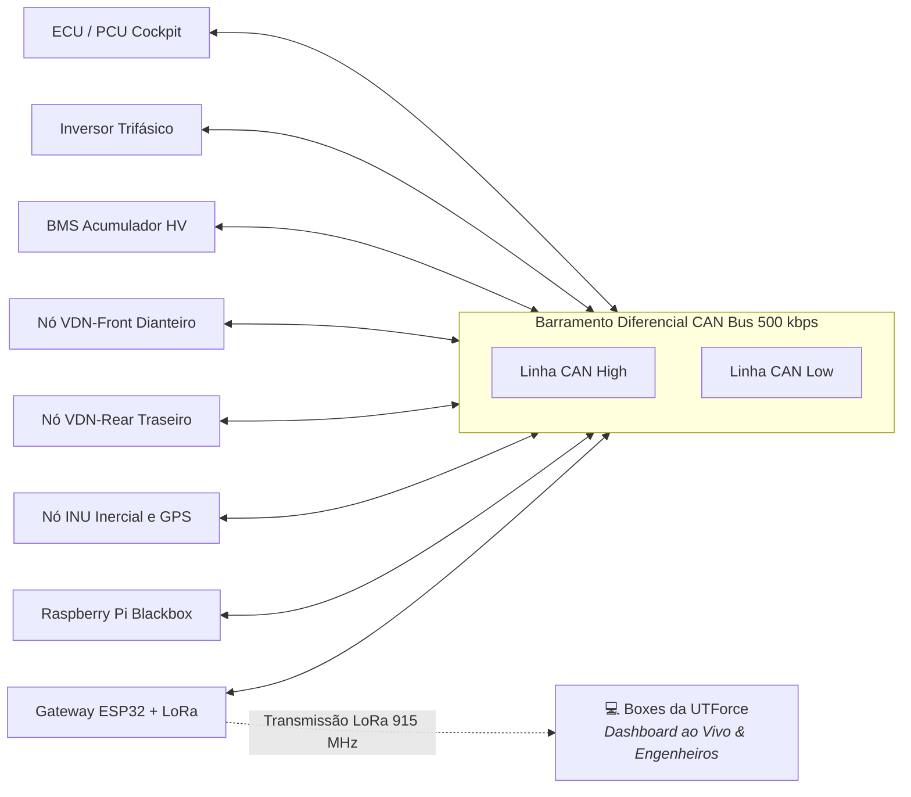

# 📡 Telemetria, Sensores & Aquisição de Dados — UTForce E-Racing

Especificação da arquitetura de comunicação embarcada (**Rede CAN**), sensores veiculares, transmissão sem fio para os boxes e ferramentas de análise de dados de pista da UTForce.

---

## 🌐 1. Topologia da Rede CAN (*Controller Area Network*)

O barramento CAN diferencial (**CAN High / CAN Low**) a $500\text{ kbps}$ conecta todos os nós inteligentes do monoposto com imunidade a ruídos eletromagnéticos gerados pelo inversor:

---

## 🎛️ 2. Pacote de Sensores Críticos do Protótipo

A aquisição de dados alimenta tanto os pilotos quanto os engenheiros nos boxes para refinar o *setup* do chassi:

| Sensor | Grandeza Física | Aplicação de Engenharia | Taxa Típica |
| :--- | :--- | :--- | :---: |
| **Efeito Hall nas Rodas (TLE4922)** | Velocidade angular das 4 rodas | Cálculo de escorregamento (*slip ratio*), velocidade real e acionamento do controle de tração. | $10\text{ Hz}$ |
| **Potenciômetros Lineares (75 mm)** | Curso dos amortecedores (4 rodas) | Análise de rolagem, afundamento em frenagem (*dive*) e validação de molas/barras estabilizadoras. | $10\text{ Hz}$ |
| **Termopares Infravermelhos (MLX90614)** | Temperatura da banda dos pneus (In/Mid/Out) | Avaliação da cambagem estática/dinâmica e pressão ideal de contato dos pneus com o asfalto. | $2\text{ Hz}$ |
| **IMU (9-DOF BNO085)** | Acelerações ($G_x, G_y, G_z$) e taxa de guinada (*Yaw Rate*) | Diagrama $G\text{-}G$, aderência no Skidpad e estabilidade rotacional do carro. | $20\text{ Hz}$ |
| **Transdutores de Pressão (100 bar)** | Pressão das linhas de freio dianteira e traseira | Verificação da plausibilidade de frenagem e calibração da barra de balanço (*bias*). | $10\text{ Hz}$ |
| **Sensores Duplos APPS** | Posição do pedal do acelerador | Regulamento SAE: exige dois sensores independentes; discrepância $> 10\%$ corta torque. | $20\text{ Hz}$ |
| **Célula de Carga na Direção (INA333)** | Esforço no volante | Avaliação de fadiga do piloto, caster e geometria de direção (*Ackermann*). | $10\text{ Hz}$ |

---

## 📶 3. Gateway de Telemetria Sem Fio & Caixa Preta

O módulo de telemetria desenvolvido pela área de software cumpre dois papéis vitais:
1. **Gravação Local em Cartão SD (*Blackbox* no Raspberry Pi):**
   * Grava todas as mensagens CAN em formato binário de alta velocidade sem perda de pacotes (`.blf` e `.csv`).
   * Resistente a desligamentos bruscos por chave geral via modo *OverlayFS Read-Only*.
2. **Transmissão para o Box (*Live Telemetry* via LoRa SX1262):**
   * Envia pacotes compactados por rádio frequência a 915 MHz com *bit-packing* e CRC16.
   * Permite que a equipe nos boxes monitore em tempo real:
     * **Temperatura máxima das células do acumulador** (alerta preventivo antes do corte de $60^\circ\text{C}$).
     * **Consumo instantâneo e acumulado de energia** (estratégia de ritmo de corrida para fechar os 22 km do Endurance).
     * **Alarmes do IMD e falhas de isolação**.

---

## 📊 4. Ferramentas de Análise Pós-Sessão

Após cada saída de pista, os dados brutos são descarregados para ferramentas de engenharia:
* **MoTeC i2 Pro / Grafana:** Geração de mapas de pista coloridos por velocidade, gráficos de comparação de voltas (*delta times*), histerese de amortecimento e pontos ideais de frenagem.
* **Scripts Python (Pandas + NumPy):** Análise estatística de consumo de bateria e envelope de tração.

---

## 💻 5. Software de Telemetria Desktop UTForce (PySide6 & pyqtgraph)

Para substituir dependências de ferramentas proprietárias e prover uma estação de telemetria com gráficos reconfiguráveis e latência nula, foi construída a aplicação desktop proprietária da equipe:

* **Módulo Completo no Vault:** [[📡 Software de Telemetria UTForce - Visao Geral|Software de Telemetria UTForce (Desktop PySide6)]]
* **Hub Pessoal & Portfólio:** [[📡 Telemetria UTForce - Hub Pessoal & Portfolio|Telemetria UTForce (Christen)]]
* **Principais Funcionalidades da Aplicação:**
  * **Simulador & Ingestão Multi-thread:** Ingestor desacoplado via `QThread` e `pyqtSignal`, alimentando sem travamento mais de 70 sensores com taxa de até 100 Hz (veja [[🔄 Simulador Multi-thread, Qt Signals e Pipeline de Dados|Simulador Multi-thread & Pipeline de Dados]] e [[📊 Dicionario Completo dos 70+ Sensores Automotivos|Dicionário Completo dos 70+ Sensores Automotivos]]).
  * **Plotadores e Docks Reordenáveis:** Gráficos interativos em tempo real via `pyqtgraph`, permitindo arrastar, acoplar e desacoplar eixos e sensores dinamicamente (veja [[📈 Monitoramento em Tempo Real e Graficos Draggable (pyqtgraph)|Monitoramento e Gráficos Draggable pyqtgraph]]).
  * **Comparação de Voltas & $\Delta T$:** Cálculo de ganho/perda de tempo entre voltas com interpolação linear por distância percorrida ($d$) e análise do delta de tempo (veja [[⏱️ Comparacao de Voltas, Delta T e Interpolacao Linear|Comparação de Voltas, Delta T e Interpolação Linear]]).
  * **Status Visual do Carro & Alertas:** Mapa de calor de pneus, diagnóstico térmico de motor e acumulador, e barras de status com faixas de segurança verde/amarelo/vermelho (veja [[🏎️ Status Visual do Carro e Alertas Termicos|Status Visual do Carro e Alertas Térmicos]]).
  * **Setup Dinâmico de Suspensão:** Parametrização em tempo real de rigidez de molas, taxas de compressão/retorno de amortecedores e calibração de sensores (veja [[🔧 Setup Dinamico e Parametros de Suspensao|Setup Dinâmico e Parâmetros de Suspensão]]).
  * **Build Portátil:** Empacotamento para Windows/Linux através de PyInstaller (veja [[📦 Empacotamento Executavel com PyInstaller|Empacotamento Executável com PyInstaller]]).

---

## 🔌 6. Sistema Embarcado, Microcontroladores & Condicionamento de Sinais

Toda a infraestrutura física de placas, esquemáticos, pinagens e firmwares da telemetria está documentada exaustivamente no novo módulo:

* **Módulo Completo de Hardware Embarcado:** [[📡 Hardware de Telemetria Embarcada - Visao Geral|Hardware de Telemetria Embarcada, Sensores & Driverless]]
* **Portfólio Pessoal de Hardware & IoT:** [[📡 Telemetria Embarcada & IoT - Hub Pessoal & Portfolio|Hub Pessoal Telemetria Embarcada & IoT]]
* **Principais Tópicos Detalhados:**
  * [[🌐 Topologia Macro da Rede CAN 500k e Distribuicao dos Nos|Topologia Macro da Rede CAN 500k e Distribuição dos Nós]]
  * [[🟢 No VDN-Front (ESP32 Heltec V3, Entradas Digitais e SPI)|Nó VDN-Front (ESP32 Heltec V3)]] e [[🟢 No VDN-Rear (ESP32 Heltec V3, Simetria e Sensores Traseiros)|Nó VDN-Rear (ESP32 Heltec V3)]]
  * [[🔵 No PCU (Controle, Powertrain, APS, Freios e Direcao)|Nó PCU (Pedais, Freios e Direção)]] e [[🟣 No INU (ESP32 T-Beam, GPS NEO-M8N e IMU BNO085 9-DoF)|Nó INU (GPS NEO-M8N e BNO085)]]
  * [[📊 Dicionario Completo de Canais, Fontes e Taxas de Amostragem (Hz)|Dicionário Oficial de Canais Físicos vs Software e Taxas Hz]]
  * [[⚡ Circuitos Condicionadores (Divisores 33k-12k, Filtros RC e ADCs MCP3208-ADS131M08)|Circuitos Condicionadores (Divisores 33k/12k, Filtros RC e ADCs MCP3208/ADS131M08)]]
  * [[🔴 Gateway e Logger Raspberry Pi (SocketCAN, Logs BLF e CSV)|Blackbox no Raspberry Pi 4 com SocketCAN e Logs BLF]]
  * [[📡 Modulo LoRa SX1262, Bit-Packing Compacto e CRC16|Transmissão Sem Fio LoRa SX1262 a 915 MHz com Bit-Packing]]
  * [[🤖 Arquitetura de Transicao: Da Telemetria Convencional ao Driverless|Transição para Carro Autônomo (Fórmula Driverless & ROS 2)]]

---
* 🔗 Voltar para a [[🏎️ UTForce E-Racing - Visao Geral|Visão Geral da UTForce]]
* 🔗 Ver [[📡 Software de Telemetria UTForce - Visao Geral|Software de Telemetria (Desktop PySide6)]]
* 🔗 Ver [[🤖 Sistemas Autonomos e Formula Driverless|Sistemas Autônomos (Driverless)]]
* 🔗 Ver [[🤖 Plataforma Autonoma JetBot ROS 2 - Visao Geral|Plataforma Autônoma JetBot ROS 2]]
