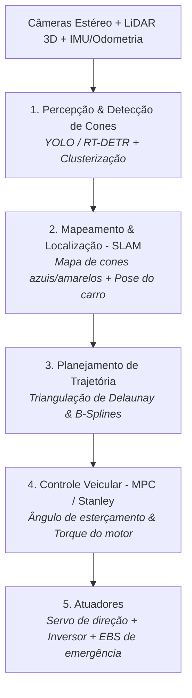

# 🤖 Sistemas Autônomos & Formula Driverless — UTForce E-Racing

Arquitetura de direção autônoma do protótipo monoposto para a categoria **Formula Student Driverless**: percepção de cones por visão/LiDAR, mapeamento e localização simultâneos (SLAM), planejamento de trajetória e atuadores de segurança.

---

## 🏎️ 1. O Desafio Formula Student Driverless (FSD)

Na categoria autônoma, o veículo deve percorrer uma pista desconhecida sem nenhuma intervenção humana:
* **Delimitação de Pista:**
  * **Cones Azuis:** Limite esquerdo da pista.
  * **Cones Amarelos:** Limite direito da pista.
  * **Cones Pequenos Laranjas:** Áreas de largada, parada e zona de frenagem.
  * **Cones Grandes Laranjas:** Portões de início e fim de cronometragem.

---

## 👁️ 2. Camada de Percepção & Visão Computacional

A detecção de cones exige alta taxa de atualização ($> 30\text{ FPS}$) e alcance de até 25 metros:
1. **Câmera Estéreo / Monocular com Deep Learning:**
   * Redes neurais leves (YOLOv8 nano / RT-DETR) treinadas no dataset clássico de cones de Fórmula SAE.
   * Classifica a cor do cone (azul vs amarelo) e estima a distância métrica.
2. **LiDAR 3D (Opcional/Complementar):**
   * Nuvem de pontos segmentada por planos de solo (RANSAC).
   * Fusão sensorial câmera + LiDAR para tolerância a variações extremas de reflexo solar no asfalto.

---

## 🗺️ 3. SLAM & Planejamento de Trajetória (*Path Planning*)

Sem GPS de precisão centimétrica dentro do autódromo, o carro precisa mapear o circuito enquanto corre:
* **FastSLAM / GraphSLAM:** Mantém a estimativa da posição do carro em relação aos cones já mapeados. Na segunda volta da prova de *Trackdrive*, o carro já conhece o mapa e passa a acelerar na linha ideal de corrida (*racing line*).
* **Triangulação de Delaunay:**
  * Conecta cones azuis e amarelos adjacentes formando triângulos.
  * O ponto médio de cada aresta mista define a linha central segura da pista.
  * Curvas B-Splines suavizam a rota para calcular acelerações laterais confortáveis para os pneus.

---

## 🎮 4. Controle Veicular & Atuação Físico-Mecânica

1. **Controlador Lateral (Direção):**
   * **Controlador Stanley / MPC (*Model Predictive Control*):** Minimiza o erro de cabeceamento e o erro lateral em relação à trajetória planejada, enviando pulsos para o servo motor acoplado à coluna de direção.
2. **Controlador Longitudinal (Aceleração e Frenagem):**
   * Controla a solicitação de torque via barramento CAN para o inversor trifásico.

---

## 🚨 5. Sistema de Frenagem de Emergência (EBS - *Emergency Braking System*)

> [!IMPORTANT]
> **Segurança Crítica Regulamentar:**
> O regulamento SAE exige um sistema independente de frenagem de emergência redundante:
> * **Atuação Pneumática Passiva:** Um reservatório de ar comprimido mantém o freio desarmado via válvula solenóide normalmente aberta.
> * Se o computador de bordo falhar, se o sinal de rádio (*Remote Emergency Stop - RES*) cair ou se a energia for cortada, a válvula despressuriza e as molas comprimem os discos de freio com força máxima imediatamente.

---

## 🚀 6. Plataforma de Validação em Escala Reduzida (JetBot ROS 2)

Para validar a arquitetura de software, o pipeline do ROS 2 e os algoritmos reativos de pista fechada antes de embarcar no monoposto de alta tensão, a equipe utiliza a plataforma de desenvolvimento em escala reduzida:

* 🤖 **Plataforma Completa Documentada:** [[🤖 Plataforma Autonoma JetBot ROS 2 - Visao Geral|JetBot ROS 2 (Jazzy & Gazebo Harmonic)]]
  * [[🏎️ Controlador de Corrida Autonoma (race_follower.py)|Algoritmo de Corrida com PCA de Paredes e Follow-the-Gap]]
  * [[📈 Aprendizado Espacial de Velocidade por Trecho (AIMD Profiling)|Aprendizado de Velocidade por Trecho (AIMD) e Frenagem Antecipada]]
  * [[🗺️ Gerador Procedural de Circuitos Fechados (gen_track.py)|Gerador Paramétrico de Autódromos Fechados em SDF]]

---

* 🔗 Voltar para a [[🏎️ UTForce E-Racing - Visao Geral|Visão Geral da UTForce]]
* 🔗 Ver [[🏎️ Chassi, Dinamica Veicular, Freios e Aerodinamica|Chassi e Dinâmica Veicular]]
* 📡 Ver [[📡 Telemetria, Sensores e Aquisicao de Dados|Telemetria e Barramento CAN]]
