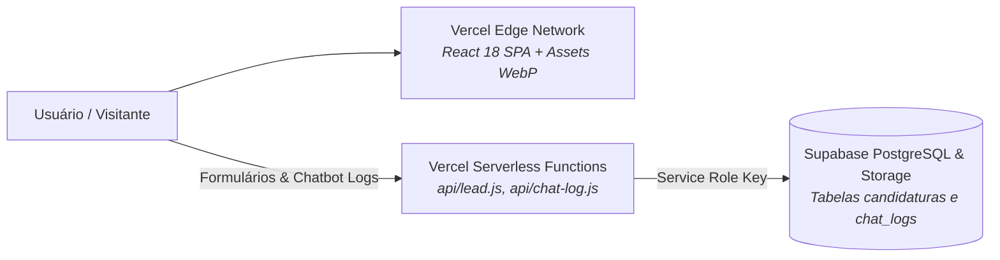

# 🚀 Setup Local, Scripts & Deploy na Vercel — Site UTForce

Guia completo para execução local da landing page, suíte de testes com Vitest, bancada de avaliação do assistente virtual e implantação contínua na Vercel.

---

## 💻 1. Requisitos de Ambiente

* **Node.js:** Versão `>= 18.0` (recomendado `>= 20 LTS`)
* **Gerenciador de Pacotes:** `npm` (versão 9+)
* **Conta e Projeto Supabase:** Instância PostgreSQL ativa para a captura de leads e logs.
* **Vercel CLI (Opcional para testes locais de Serverless Functions):** `npm i -g vercel`.

---

## ⚡ 2. Execução Local Passo a Passo

```bash
cd "/home/lucaschristen/Documentos/UTFPR/SiteUTForce"

# 1. Instalação das dependências
npm install

# 2. Configurar variáveis de ambiente (criar .env localmente a partir de .env.example)
cp .env.example .env
# Preencher SUPABASE_URL e SUPABASE_SERVICE_ROLE_KEY

# 3. Subir o servidor de desenvolvimento com Vite (porta 5173 com HMR instantâneo)
npm run dev

# 4. Executar os testes unitários da aplicação e do Chatbot
npm test

# 5. Executar a bancada de avaliação de acurácia do Chatbot
npm run eval
```

---

## 📜 3. Scripts do `package.json`

| Comando | O que executa | Descrição |
| :--- | :--- | :--- |
| `npm run dev` | `vite` | Inicializa o servidor local em `http://localhost:5173`. |
| `npm run build` | `vite build` | Compila o bundle otimizado de produção em `dist/` (HTML, CSS e JS minificados). |
| `npm run preview` | `vite preview` | Sobe um servidor estático local servindo a pasta `dist/` para validação pré-deploy. |
| `npm test` | `vitest run` | Roda toda a suíte de testes unitários do chatbot e dos componentes. |
| `npm run test:watch` | `vitest` | Roda os testes em modo watch reativo durante o desenvolvimento. |
| `npm run eval` | `node scripts/eval-chatbot.mjs` | Mede cobertura e precisão de recusa contra o conjunto de 105 frases reservadas. |

---

## ☁️ 4. Infraestrutura de Deploy na Vercel

A arquitetura do site é dividida entre arquivos estáticos na CDN global da Vercel e funções serverless:



### A. Configuração `vercel.json`:
```json
{
  "framework": "vite"
}
```
* As funções na pasta `api/` são automaticamente detectadas e compiladas como endpoints serverless pelo runtime Node.js da Vercel.

### B. Variáveis de Ambiente Mandatórias na Vercel:
Configurar no dashboard da Vercel (*Settings > Environment Variables*):
* `SUPABASE_URL`: URL do projeto Supabase (`https://xxxx.supabase.co`).
* `SUPABASE_SERVICE_ROLE_KEY`: Chave de serviço privada (necessária para realizar bypass seguro de RLS e gravar nas tabelas `candidaturas` e `chat_logs` e no bucket `curriculos`).

> [!CAUTION]
> **Nunca use a Anon Key nas funções de backend:**
> As tabelas de `candidaturas` e `chat_logs` possuem Row Level Security (RLS) ativado **sem nenhuma policy pública**. Apenas a `SUPABASE_SERVICE_ROLE_KEY` consegue gravar registros, impedindo que visitantes forjem envios diretos via API pública.

---
* 🔗 Voltar para a [[🌐 Site UTForce - Visao Geral|Visão Geral do Site UTForce]]
* 🔗 Ver [[🧪 Bancada de Avaliacao e Metricas do Chatbot (eval-chatbot)|Bancada de Avaliação do Chatbot]]
