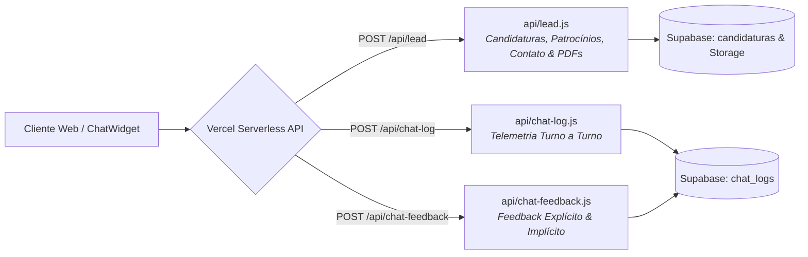

# 🌐 Contrato da API Serverless & Endpoints — Site UTForce

Documentação técnica das funções serverless hospedadas na Vercel (`api/*.js`), especificando contratos de entrada, validações rigorosas de payload, códigos de status HTTP e integração transacional com o Supabase.

---

## 🧭 1. Catálogo Geral de Endpoints

Todos os endpoints operam estritamente sob o verbo **`POST`**, devolvendo HTTP 405 para qualquer outro método.

---

## 📥 2. `POST /api/lead` — Captura de Leads e Arquivos

Recebe inscrições para processos seletivos da equipe, manifestações de interesse de patrocinadores e formulários de contato geral:

* **Content-Type:** `multipart/form-data` (quando há anexo de currículo) ou `application/json`.
* **Tipos Permitidos (`type`):**
  * `'candidatura'`: Exige `name`, `email` e `area`. Opcionalmente recebe anexo de currículo em PDF.
  * `'patrocinio'`: Exige `name`, `email` e `company`. Opcionalmente recebe mensagem e anexo.
  * `'contato'`: Exige `name`, `email` e `message`.

### Regras de Validação & Rollback de Arquivos:
1. **Validação Estrita de PDF:** O arquivo anexado deve ter no máximo **3 MB** (`file.size <= 3 * 1024 * 1024`) e MIME type verificado `application/pdf`.
2. **Nome Seguro:** O arquivo recebe prefixo temporal e UUID aleatório para evitar colisões no bucket:
   $$\text{safeName} = \text{Date.now()} + \text{"-"} + \text{randomUUID().slice(0, 8)} + \text{".pdf"}$$
3. **Mecanismo de Rollback Transacional:**
   Se o upload para o bucket `curriculos` for bem-sucedido, mas o `insert` na tabela `candidaturas` falhar, a função serverless **remove o PDF do bucket imediatamente** via `supabase.storage.from('curriculos').remove([resumePath])`, impedindo que arquivos órfãos fiquem esquecidos no storage.

### Respostas HTTP:
* **`200 OK`:** `{"ok": true}`
* **`400 Bad Request`:** `{"error": "name and email required"}` | `{"error": "file must be a PDF"}` | `{"error": "file exceeds 3MB limit"}`
* **`405 Method Not Allowed`:** `{"error": "method not allowed"}`
* **`500 Internal Error`:** `{"error": "could not save lead"}`

---

## 📊 3. `POST /api/chat-log` — Telemetria de Conversas

Registra cada interação do chatbot para diagnosticar perguntas não reconhecidas:

* **Content-Type:** `application/json`
* **Campos Obrigatórios:**
  * `sessionId`: UUID versão 4 válido (`/^[0-9a-f]{8}-[0-9a-f]{4}-[0-9a-f]{4}-[0-9a-f]{4}-[0-9a-f]{12}$/i`).
  * `turn`: Inteiro de 1 a 200 (`MAX_TURN`).
  * `lang`: `'pt-BR'` ou `'en-US'`.
  * `message`: Texto da mensagem, **já redigido no cliente** (removendo PII), truncado no servidor em até 300 caracteres (`MAX_MESSAGE_LEN`).
* **Campos Opcionais de Diagnóstico do Matcher:**
  * `intentKind`: Identificador da intenção resolvida (ex: `areaDetail`, `sponsorship`).
  * `replyKey`: Chave i18n da resposta.
  * `area`: Nome da área de engenharia identificada.
  * `via`: Caminho da decisão (ex: `keyword`, `similarity`, `anaphora`, `smallTalk`).
  * `score`: Ponto flutuante entre 0.0 e 1.0 (similaridade por n-gramas).
  * `margin`: Diferença entre o 1º e o 2º colocado.
  * `unmatched`: Booleano indicando se caiu no fallback ("não sei").

---

## 👍 4. `POST /api/chat-feedback` — Avaliação e Sinais de Qualidade

Anexa avaliações explícitas ou comportamentos implícitos a um turno já registrado:

* **Content-Type:** `application/json`
* **Endereçamento Único:** Por `sessionId` e `turn`. Não expõe IDs internos de banco de dados para o frontend.
* **Sinais Aceitos (Patch Parcial):**
  * `vote`: `'up'` ou `'down'`.
  * `reason`: Motivo do voto negativo (restrito à lista fechada: `'nao_entendeu'`, `'incompleta'`, `'nao_era_isso'`).
  * `linkClicked`: Booleano indicando se o visitante clicou no link sugerido pelo bot.
  * `openedForm`: Booleano indicando se o bot convenceu o visitante a abrir o formulário de inscrição.

---
* 🔗 Voltar para a [[🌐 Site UTForce - Visao Geral|Visão Geral do Site UTForce]]
* 🔗 Ver [[🗄️ Modelagem de Banco, Supabase SQL e RLS|Modelagem de Banco e Supabase]]
