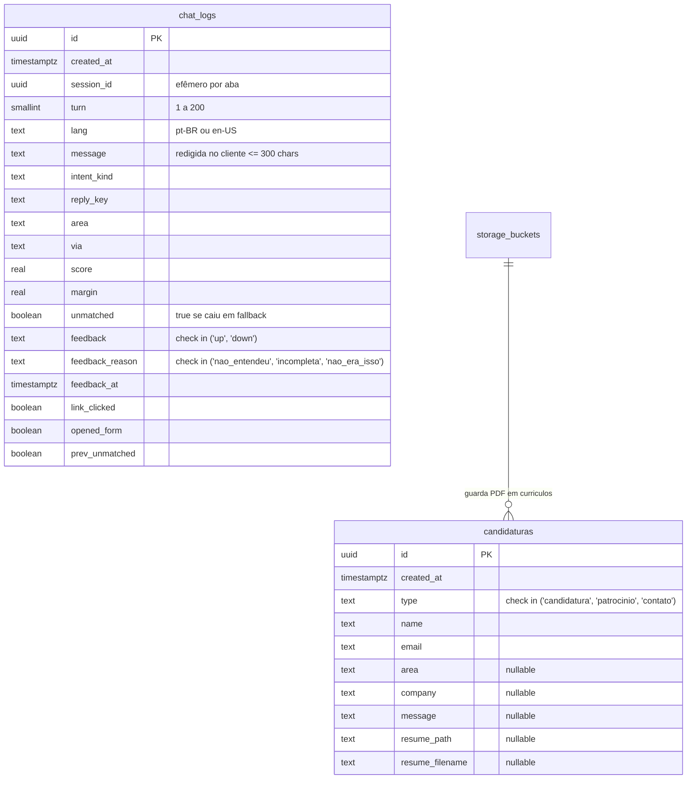

# 🗄️ Modelagem de Banco & Supabase SQL — Site UTForce

Especificação do esquema relacional em PostgreSQL gerenciado pelo **Supabase**, scripts de migração (`supabase-setup.sql`), políticas de Row Level Security (RLS) e storage de currículos.

---

## 🏛️ 1. Filosofia de Segurança: RLS Sem Políticas Públicas

O banco de dados do site implementa um modelo de **segurança defensiva estrita**:
* **Row Level Security (RLS) Habilitado em Todas as Tabelas.**
* **Zero Políticas Públicas:** Nem a chave anônima (`anon`) nem a autenticada possuem permissão de `SELECT`, `INSERT`, `UPDATE` ou `DELETE`.
* **Escrita Exclusiva por Serverless (`Service Role`):** Somente as funções executadas no backend da Vercel através da chave privada `SUPABASE_SERVICE_ROLE_KEY` têm acesso ao banco, impedindo injeção de dados por terceiros.

---

## 🗂️ 2. Estrutura das Tabelas Relacionais



---

## 📄 3. DDL Oficial do Banco de Dados (`supabase-setup.sql`)

### A. Tabela de Candidaturas e Contatos (`public.candidaturas`):
```sql
create table if not exists public.candidaturas (
  id uuid primary key default gen_random_uuid(),
  created_at timestamptz not null default now(),
  type text not null check (type in ('candidatura', 'patrocinio', 'contato')),
  name text not null,
  email text not null,
  area text,
  company text,
  message text,
  resume_path text,
  resume_filename text
);

alter table public.candidaturas enable row level security;
```

### B. Bucket Privado de Armazenamento (`storage.buckets`):
```sql
insert into storage.buckets (id, name, public, file_size_limit, allowed_mime_types)
values ('curriculos', 'curriculos', false, 3145728, '{application/pdf}')
on conflict (id) do nothing;
```

### C. Tabela de Telemetria do Chatbot (`public.chat_logs`):
```sql
create table if not exists public.chat_logs (
  id uuid primary key default gen_random_uuid(),
  created_at timestamptz not null default now(),
  session_id uuid not null,
  turn smallint not null,
  lang text not null,
  message text not null,
  intent_kind text,
  reply_key text,
  area text,
  via text,
  score real,
  margin real,
  unmatched boolean not null default false,
  feedback text check (feedback in ('up', 'down')),
  feedback_reason text check (feedback_reason in ('nao_entendeu', 'incompleta', 'nao_era_isso')),
  feedback_at timestamptz,
  link_clicked boolean not null default false,
  opened_form boolean not null default false,
  prev_unmatched boolean not null default false
);

alter table public.chat_logs enable row level security;
```

---

## ⚡ 4. Índices Estratégicos para Curadoria e Otimização

1. **Índice Único Composto de Turno (`chat_logs_session_turn_idx`):**
   ```sql
   create unique index if not exists chat_logs_session_turn_idx
     on public.chat_logs (session_id, turn);
   ```
   * Permite que `/api/chat-feedback` anexe votos sem precisar que o cliente conheça a chave primária `id`.
2. **Índice Parcial de Lacunas de Conhecimento (`chat_logs_unmatched_idx`):**
   ```sql
   create index if not exists chat_logs_unmatched_idx
     on public.chat_logs (created_at desc) where unmatched;
   ```
   * Otimiza a consulta principal da equipe: extrair exatamente o que as pessoas perguntaram e o bot respondeu "não sei", guiando a adição de novas âncoras.
3. **Índice Parcial de Sinais Negativos (`chat_logs_negative_idx`):**
   ```sql
   create index if not exists chat_logs_negative_idx
     on public.chat_logs (created_at desc)
     where feedback = 'down' or unmatched;
   ```

---
* 🔗 Voltar para a [[🌐 Site UTForce - Visao Geral|Visão Geral do Site UTForce]]
* 🔗 Ver [[🛡️ Seguranca, Redacao LGPD e Telemetria Anonima|Segurança e Redação LGPD]]
