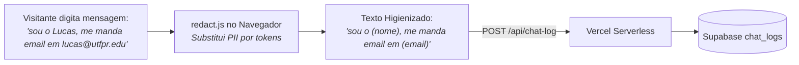

# 🛡️ Segurança, Redação LGPD & Telemetria Anônima — Site UTForce

Arquitetura de privacidade por concepção (*Privacy by Design*), técnica de redação de informações pessoais identificáveis (PII) antes da transmissão em rede (`redact.js`) e conformidade com a LGPD.

---

## 🔒 1. O Dilema da Telemetria vs Privacidade (LGPD)

Para evoluir o chatbot da UTForce, a equipe precisa saber **quais perguntas as pessoas fazem**. No entanto, em campos de chat aberto, visitantes frequentemente digitam e-mails, telefones ou o próprio nome.
* Se esses dados fossem gravados no banco, o sistema armazenaria dados pessoais sem consentimento explícito.
* Se não houvesse log nenhum, seria impossível descobrir onde o bot está falhando.

A solução de engenharia adotada por Lucas Christen foi implementar **Redação de Dados Estritamente no Cliente**:
O texto é higienizado **dentro do navegador do usuário**, antes de trafegar pela rede ou ser enviado à Vercel.

---

## 🧬 2. Algoritmo de Higienização de PII (`redact.js`)

A função `redactMessage()` aplica padrões de expressões regulares para neutralizar dados sensíveis:

### A. Padrões de Substituição:
| Tipo de Dado Sensível | Expressão Regular | Substituição |
| :--- | :--- | :---: |
| **E-mails** | `/[^\s@]+@[^\s@]+\.[a-z]{2,}/gi` | `[email]` |
| **Telefones Brasileiros** | `/(?:\+?\d{1,3}[\s.-]?)?(?:\(?\d{2,3}\)?[\s.-]?)?\d{4,5}[\s.-]?\d{4}\b/g` | `[tel]` |
| **CPFs, RGs e Matrículas**| `/\b\d[\d.\-/]{8,}\d\b/g` | `[num]` |
| **Links e URLs** | `/\bhttps?:\/\/\S+/gi` | `[url]` |
| **Nome do Visitante** | Regex dinâmico escapado do `userName` capturado | `[nome]` |

### B. Proteção contra Nomes Curtos:
O nome do usuário só é redigido se possuir **3 ou mais caracteres** (`userName.length >= 3`). Sem essa trava, um apelido curto de 2 letras (ex: `"Zé"`, `"Li"`) casaria dentro de palavras comuns do vocabulário (ex: *"faze"*, *"livro"*), fragmentando a pergunta.

---

## 🕶️ 3. Sessões Efêmeras sem Rastreamento (*Cookie-less*)

Para correlacionar turnos de uma mesma conversa sem rastrear a vida do visitante:
* **`sessionId` em Memória:** Um UUID v4 é gerado em memória no momento em que a aba abre.
* **Morte ao Fechar a Aba:** O identificador **não é salvo em cookies**, não vai para o `localStorage` e não é persistido entre sessões.
* **Zero Fingerprinting:** O backend **não registra o endereço IP do visitante**, não grava o cabeçalho *User-Agent* e não coleta identificadores de dispositivo.

---
* 🔗 Voltar para a [[🌐 Site UTForce - Visao Geral|Visão Geral do Site UTForce]]
* 🔗 Ver [[🎨 Arquitetura React 18, Tailwind e Componentes UI|Arquitetura React e Componentes]]
