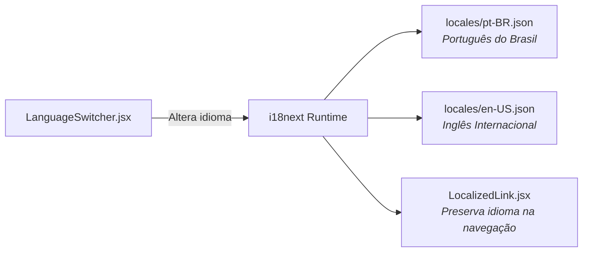

# 🌍 Sistema de Rotas & Internacionalização (i18n) — Site UTForce

Especificação do roteamento no cliente com **React Router v6**, motor bilíngue com **i18next** e metadados dinâmicos para SEO.

---

## 🧭 1. Tabela de Rotas da Aplicação (`App.jsx`)

O aplicativo utiliza `<BrowserRouter>` para navegação instantânea sem recarregamento de página:

| Rota | Componente | Descrição da Página |
| :--- | :--- | :--- |
| `/` | `<Home />` | Página principal com apresentação, vídeo do carro e métricas da equipe. |
| `/carro` | `<Carro />` | Render 3D do monoposto e detalhes dos 6 subsistemas de engenharia. |
| `/equipe` | `<Equipe />` | História da fundação, valores e depoimentos dos fundadores. |
| `/organograma`| `<Organograma />` | Estrutura hierárquica visual da capitania e coordenações. |
| `/membros` | `<Membros />` | Elenco oficial completo de estudantes sincronizado via `roster.json`. |
| `/competicoes`| `<Competicoes />` | Histórico e conquistas nas edições da Fórmula SAE Brasil. |
| `/galeria` | `<Galeria />` | Acervo fotográfico de pista, montagem de oficina e eventos. |
| `/patrocinio` | `<Patrocinio />` | Proposta de patrocínio empresarial, cotas e benefícios de incentivo. |
| `/contato` | `<Contato />` | Formulário para envio de dúvidas e mensagens à equipe. |
| `*` | `<NotFound />` | Página 404 customizada com botão de retorno à Home. |

---

## 🌐 2. Internacionalização Bilíngue (`i18next`)

A UTForce compete internacionalmente e busca patrocinadores multinacionais. O site possui suporte bilíngue completo:

* **Dicionários Estruturados:** Arquivos JSON centralizados em `src/i18n/locales/` cobrindo menus, textos institucionais e as fatias de geração do assistente virtual (`chat.gen.*`).
* **Links Localizados (`<LocalizedLink>`):** Wrapper em torno do `<Link>` do React Router que preserva o contexto idiomático e parâmetros de URL durante a transição de telas.

---

## 🔍 3. Otimização para Mecanismos de Busca (SEO & OpenGraph)

O componente `<RouteMeta>` atualiza as tags no `<head>` dinamicamente conforme a rota e o idioma selecionado:
* **`document.title`:** Atualizado com a página e a chancela oficial (ex: *"O Carro • UTForce E-Racing — Fórmula SAE Elétrico"*).
* **Meta Tags OpenGraph:** Imagens de pré-visualização para compartilhamento no LinkedIn e WhatsApp com imagem em alta resolução do monoposto elétrico (`/assets/car-render.webp`).

---
* 🔗 Voltar para a [[🌐 Site UTForce - Visao Geral|Visão Geral do Site UTForce]]
* 🔗 Ver [[💬 Componente ChatWidget e Experiencia de Conversa|Componente ChatWidget]]
