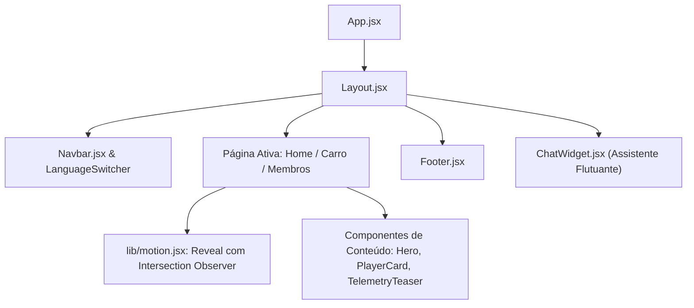

# 🎨 Arquitetura React 18 & Design System — Site UTForce

Estrutura de componentes de interface, paleta de cores institucional com **Tailwind CSS**, sistema de animações de entrada e renderização reativa da landing page da UTForce E-Racing.

---

## 🛠️ 1. Stack Tecnológica de Interface

* **Biblioteca:** React 18.3+ com Hooks nativos (`useState`, `useEffect`, `useMemo`, `useCallback`, `useRef`).
* **Bundler:** Vite 5 com compilação instantânea em ESM.
* **Estilização:** Tailwind CSS 3.4 configurado em `tailwind.config.js` com sistema de temas customizado.
* **Ícones:** `lucide-react` (ícones SVG modernos e consistentes).

---

## 🏎️ 2. O Design System "Carbon & Crimson"

A identidade visual reflete o automobilismo elétrico de alta tecnologia, utilizando texturas de fibra de carbono escurecida com o vermelho de competição da UTForce:

| Token Tailwind | Cor Hexadecimal | Aplicação no Site |
| :--- | :---: | :--- |
| **`carbon-950`** | `#0b0c0e` | Fundo principal da página e containers escuros. |
| **`carbon-900`** | `#14171a` | Superfície de cartões (*cards*), inputs e menus. |
| **`carbon-800`** | `#22272e` | Bordas e divisores sutis com baixo contraste. |
| **`brand`** | `#DF0A3B` | Cor de destaque primária (botões de ação, realces e ícones). |
| **`glow-brand`** | `radial-gradient` | Efeito de brilho vermelho neon atrás do render 3D do carro. |

---

## 🧱 3. Hierarquia de Componentes

---

## ✨ 4. Animações com `Reveal` (`src/lib/motion.jsx`)

Para proporcionar uma sensação de fluidez e sofisticação sem carregar bibliotecas pesadas de animação (como Framer Motion):
* O componente `<Reveal>` utiliza a **API nativa `IntersectionObserver`** do navegador.
* Quando o elemento entra na área visível da tela, classes CSS acionam uma transição suave de opacidade e translação vertical (`opacity: 1; transform: translateY(0)`).
* Suporte a delay escalonado (`delay={(i % 3) * 100}`) para efeito de cascata visual na grade de cartões de subsistemas e membros.

---
* 🔗 Voltar para a [[🌐 Site UTForce - Visao Geral|Visão Geral do Site UTForce]]
* 🔗 Ver [[🌍 Sistema de Rotas e Internacionalizacao (i18n)|Rotas e Internacionalização]]
