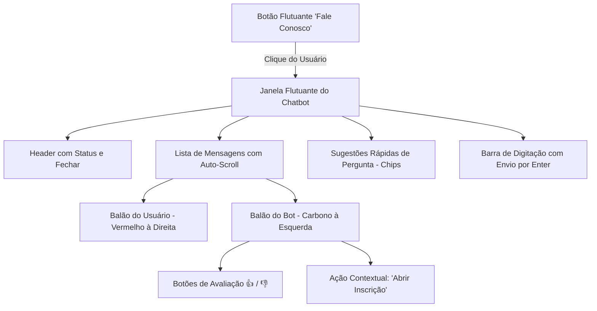

# 💬 Componente ChatWidget & Experiência de Conversa

Especificação da interface visual do assistente interativo (`src/components/chat/ChatWidget.jsx`), máquina de estados de diálogo, sugestões dinâmicas (*chips*) e integração com formulários de candidatura.

---

## 🏎️ 1. Visão Geral do `ChatWidget`

O `<ChatWidget>` é o componente que conecta a inteligência do motor de NLP determinístico à experiência visual do visitante na landing page:



---

## ⚙️ 2. Máquina de Estados e Contexto da Conversa

O estado do componente mantém não apenas as mensagens, mas o **contexto semântico ativo** da conversa:

```javascript
const [context, setContext] = useState({
  userName: null,       // Nome declarado pelo usuário
  lastArea: null,       // Última área de engenharia mencionada (ex: 'telemetry')
  lastIntent: null,     // Última intenção identificada
  awaitingName: false,  // Se o bot fez a pergunta "Como posso te chamar?"
  lng: 'pt-BR'          // Idioma ativo da sessão
});
```

* **Preservação de Contexto:** Se o usuário diz *"me fala da telemetria"* e logo depois pergunta *"quantas pessoas tem lá?"*, o componente injeta `lastArea: 'telemetry'` no processamento, permitindo a resolução contextual da anáfora.

---

## 🎯 3. Gatilhos de Ação Direta (*Action Triggers*)

O chatbot não é apenas informativo; ele atua como **funil de conversão**:
1. **Abertura de Formulário de Inscrição:**
   Se a pessoa perguntar sobre como entrar na equipe e confirmar interesse, a resposta do bot renderiza um botão interativo que **abre o modal de candidatura com a área já selecionada**.
2. **Sugestões Rápidas (*Quick Chips*):**
   Ao final de cada resposta, o componente oferece botões clicáveis com as dúvidas mais frequentes daquela área (ex: *"Como funciona o processo seletivo?"*, *"Quais os requisitos?"*), guiando visitantes menos propensos a digitar.
3. **Modal de Feedback com Diagnóstico:**
   Ao clicar em 👎, o usuário pode selecionar o motivo exato (*"Não entendeu o que perguntei"*, *"A resposta foi incompleta"* ou *"Não era bem isso"*), alimentando o índice de curadoria do Supabase.

---
* 🔗 Voltar para a [[🌐 Site UTForce - Visao Geral|Visão Geral do Site UTForce]]
* 🔗 Ver [[🪜 Cascata de Decisao de Intencoes em 8 Camadas|Cascata de Decisão de Intenções]]
