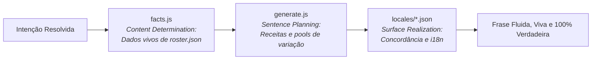

# 📝 Geração de Linguagem Natural (NLG) Baseada em Fatos

Especificação do motor de composição textual (`src/lib/chatbot/facts.js` e `generate.js`), que monta respostas dinâmicas e conversacionais a partir de fatos auditados sem utilizar LLMs.

---

## 🏛️ 1. O Conceito: Da Recuperação Rígida à Geração Controlada

Nas primeiras versões do assistente, as respostas eram textos estáticos recuperados diretamente do dicionário i18n (`intenção -> string fixa`). Isso criava diálogos robóticos e desatualizados.

Em vez de apelar para um LLM (que geraria custo por mensagem e inventaria regras inexistentes sobre a equipe), Lucas Christen implementou um pipeline clássico de **NLG (*Natural Language Generation*)**:

---

## 🧩 2. As Três Peças da Arquitetura

| Arquivo | Papel na Arquitetura | Analogia em NLG Clássica |
| :--- | :--- | :--- |
| **`facts.js`** | **O que é verdade:** Lê o arquivo `roster.json` em tempo de execução, calcula a contagem real de membros por área, identifica capitães e líderes de subsistema. | *Content Determination* |
| **`generate.js`** | **Quais fatos entram:** Seleciona a receita adequada, sorteia aberturas e fechos para dar variedade natural à conversa, e garante o fluxo do funil. | *Sentence Planning* |
| **`locales/*.json`** | **Como cada fatia é dita:** Renderiza as variantes gramaticais em português e inglês com concordância correta de plural e gênero. | *Surface Realization* |

---

## 🛡️ 3. As Duas Invariantes de Negócio

Para que a geração dinâmica sirva como um canal efetivo de conversão, duas regras estritas são **cobertas por testes automatizados com Vitest**:

1. **Invariante de Formulário:** Toda variante de resposta que aciona um formulário de contato ou patrocínio **deve obrigatoriamente mencionar o formulário** no texto.
2. **Invariante de Recrutamento:** Toda resposta que descreve uma área técnica de engenharia **deve obrigatoriamente terminar com um convite à candidatura** (o que permite que a resposta seguinte *"sim"* abra o modal de inscrição com a área já selecionada).

---

## 🔬 4. Resolução de Bugs de Geração (Concordância e Plural)

A passagem para geração introduziu desafios que o texto fixo não tinha:
* **Concordância Numérica:** Textos como *"tem 1 áreas abertas"* foram corrigidos com regras gramaticais condicionais de plural/singular.
* **Fato Disponível vs Intenção Reconhecida:** A equipe auditou e adicionou âncoras para garantir que todas as perguntas sobre áreas técnicas de engenharia (como *Telemetria*, *Chassi*, *Bateria*, *Aerodinâmica*) tivessem caminhos semânticos garantidos até o fato correspondente.

---
* 🔗 Voltar para a [[🌐 Site UTForce - Visao Geral|Visão Geral do Site UTForce]]
* 🔗 Ver [[🧪 Bancada de Avaliacao e Metricas do Chatbot (eval-chatbot)|Bancada de Avaliação do Chatbot]]
