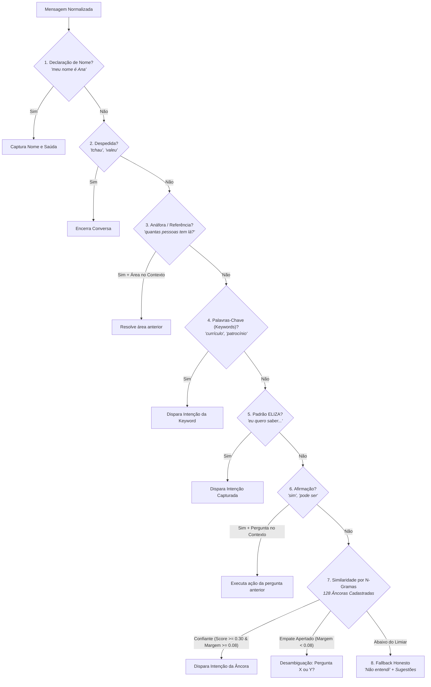

# 🪜 Cascata de Decisão em 8 Camadas (`matchIntent.js`)

Especificação detalhada da cascata de decisão determinística que classifica a intenção do usuário em menos de $1\text{ ms}$ sem rede e sem modelos generativos.

---

## 🧭 1. A Arquitetura em Cascata Ordenada

A ordem das camadas em `src/lib/chatbot/matchIntent.js` não é arbitrária: cada posição foi definida e refinada a partir de erros observados em baterias de testes empíricos com usuários reais.

---

## 🔍 2. Análise Detalhada das 8 Camadas

### Camada 1: Declaração de Nome
* **Padrões:** `"meu nome é [X]"`, `"me chamo [X]"`, `"sou o [X]"` ou apenas o nome isolado quando o bot acabou de perguntar (`awaitingName = true`).
* **Ação:** Armazena o nome no contexto da conversa e saúda o visitante pelo nome.

### Camada 2: Despedida (*Farewell*)
* **Padrões:** `"tchau"`, `"valeu"`, `"obrigado"`, `"ate mais"`, `"flw"`.
* **Ação:** Encerra a conversa com elegância e agradece a visita.

### Camada 3: Resolução de Anáfora e Elipse (Crucial!)
* **Padrões:** `"lá"`, `"nessa área"`, `"quantas pessoas tem lá?"`, `"o que eles fazem?"`.
* **Por que antecede as Keywords?**
  A pergunta *"quantas pessoas tem lá?"* contém a keyword `quantas pessoas`, que ativaria a intenção genérica de elenco. Como a camada de anáfora avalia primeiro, ela detecta que o usuário acabou de falar sobre **Telemetria** e responde sobre a Telemetria, em vez de mandá-lo para a lista de 30 membros.

### Camada 4: Palavras-chave Específicas (*Keywords*)
* Busca exata ou por início de radical (`KEYWORD_MIN_PREFIX_LEN = 4`).
* Compara especificidade: uma keyword longa (ex: `'aerodinamica'`, 12 letras) vence uma curta (ex: `'car'`, 3 letras).
* Distingue casamento contíguo (palavra exata) de espalhado (palavras soltas na frase).

### Camada 5: Eco ELIZA
* Captura intenções introduzidas por verbos de desejo: *"eu quero ajudar"*, *"gostaria de patrocinar"*, *"queria entrar na equipe"*.

### Camada 6: Afirmação Contextual
* Se o bot perguntou *"Quer mandar seu currículo para essa área?"* e o visitante responde *"sim"*, *"claro"*, *"pode ser"*, a camada 6 conecta a resposta positiva à ação pendente do turno anterior.

### Camada 7: Classificação por Similaridade de N-Gramas
* Utilizada quando nenhuma regra rígida casou. Compara a mensagem contra **128 frases âncora** cadastradas.
* **Margem de Segurança (`MIN_MARGIN = 0.08`):** Se a melhor intenção tiver score 0.42 e a segunda tiver 0.40 (diferença de 0.02 < 0.08), o bot não chuta: ele pergunta educadamente: *"Você quis dizer sobre o processo seletivo ou sobre patrocinar a equipe?"*.

### Camada 8: Fallback Honesto
* Se o score for menor que `0.30` ou não houver palavras de conteúdo em comum, o assistente admite que não sabe e exibe *chips* com os tópicos mais procurados.

---
* 🔗 Voltar para a [[🌐 Site UTForce - Visao Geral|Visão Geral do Site UTForce]]
* 🔗 Ver [[📐 Similaridade por N-Gramas, IDF e Tolerancia Levenshtein|Similaridade por N-Gramas e Levenshtein]]
