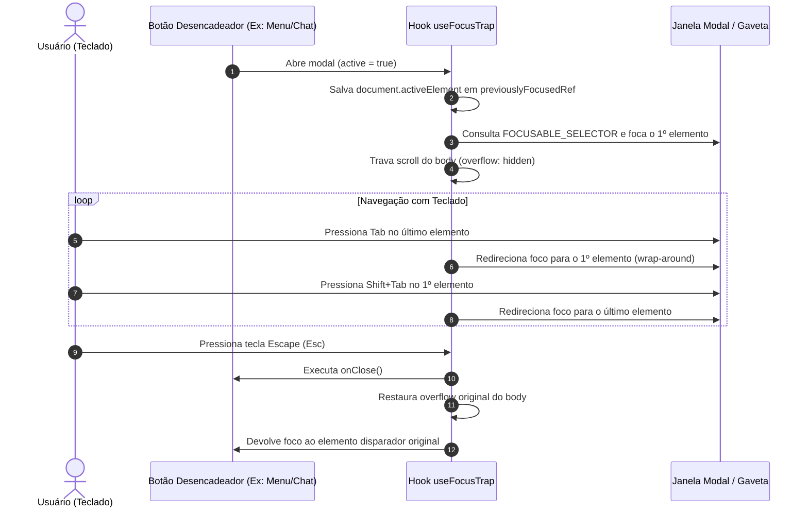

# ♿ Acessibilidade (a11y), Gestão de Foco e Motion Reduzido

> **Módulo:** `05 - Padrões & Diretrizes`  
> **Projeto:** [[🌐 Site UTForce - Visao Geral|Site Oficial UTForce E-Racing]]  
> **Diretrizes:** WCAG 2.1 AA, WAI-ARIA Modal Dialog Pattern  
> **Arquivos de Referência:** `src/hooks/useFocusTrap.js`, `src/lib/motion.jsx`, `src/index.css`

---

## 1. Importância da Acessibilidade em Sites Institucionais

O site da UTForce não atende apenas estudantes da UTFPR, mas também avaliadores de bancas de patrocínio, recrutadores de engenharia automotiva e candidatos de processos seletivos. A acessibilidade digital garante que qualquer pessoa, usando navegadores assistivos, leitores de tela ou exclusivamente o teclado, tenha acesso integral e fluido a todas as seções e formulários.

---

## 2. Gestão de Foco: O Hook `useFocusTrap`

Localizado em `src/hooks/useFocusTrap.js`, este custom hook implementa as recomendações da WAI-ARIA para modais, menus suspensos e gavetas interativas (como o menu mobile e o widget de chat).



### 2.1 Seletor Universal de Elementos Focáveis
```javascript
const FOCUSABLE_SELECTOR =
  'a[href], button:not([disabled]), textarea:not([disabled]), input:not([disabled]), select:not([disabled]), [tabindex]:not([tabindex="-1"])'
```
Elementos ocultos ou com `offsetParent === null` são filtrados dinamicamente para evitar envio de foco a elementos colapsados.

### 2.2 Ciclo Fechado de Tabulação (Keyboard Wrap-Around)
```javascript
const onKey = (e) => {
  if (e.key === 'Escape') {
    onClose?.()
    return
  }
  if (e.key !== 'Tab') return

  const focusables = getFocusables()
  if (focusables.length === 0) return

  const first = focusables[0]
  const last = focusables[focusables.length - 1]

  if (e.shiftKey && document.activeElement === first) {
    e.preventDefault()
    last.focus()
  } else if (!e.shiftKey && document.activeElement === last) {
    e.preventDefault()
    first.focus()
  }
}
```

### 2.3 Restauração de Foco e Destravamento de Scroll
Quando o modal é desmontado ou fechado:
1. `document.body.style.overflow` retorna ao estado prévio (evitando que a página fique travada).
2. O elemento que originalmente chamou o modal recebe o foco de volta via `previouslyFocusedRef.current?.focus?.()`, garantindo que o usuário de teclado nunca perca seu ponto de navegação.

---

## 3. Respeito a Movimento Reduzido (`prefers-reduced-motion`)

Usuários com distúrbios vestibulares ou sensibilidade a movimento podem configurar seus sistemas operacionais (Windows, Linux, macOS, iOS, Android) para reduzir animações visuais.

O site respeita essa configuração nativamente sem quebrar a renderização:

```css
/* src/index.css */
@layer utilities {
  .reveal {
    opacity: 0;
    transform: translateY(1.75rem);
    transition:
      opacity 0.7s cubic-bezier(0.22, 1, 0.36, 1),
      transform 0.7s cubic-bezier(0.22, 1, 0.36, 1);
    will-change: opacity, transform;
  }
  .reveal.is-visible {
    opacity: 1;
    transform: translateY(0);
  }

  /* Anulação estrita para movimento reduzido */
  @media (prefers-reduced-motion: reduce) {
    .reveal {
      opacity: 1;
      transform: none;
      transition: none;
    }
  }
}
```

### Impacto da Regra:
- **Normal**: Efeito de fade-in e subida suave de 28px (`translateY(1.75rem)`) com curva cúbica de aceleração.
- **Reduced Motion Ativo**: O elemento já aparece imediatamente opaco (`opacity: 1`) e em sua posição definitiva (`transform: none`), com custo zero de renderização por transição.

---

## 4. Práticas Adicionais de Acessibilidade no Projeto

| Recurso | Implementação | Benefício |
|---|---|---|
| **Contraste de Cores** | `#E00B3B` sobre `#080808` e texto `#ededf0` | Atende taxa de contraste WCAG AA para textos e botões. |
| **Labels e Aria-labels** | Botões de ícones no `Navbar` e `ChatWidget` possuem `aria-label="Abrir menu"` ou `aria-label="Fechar chat"` | Leitores de tela pronunciam o propósito do botão em vez de ignorá-lo. |
| **Tags Semânticas** | Uso estrito de `<header>`, `<nav>`, `<main>`, `<section>`, `<footer>` | Facilita a navegação estrutural por marcos (landmarks). |

---

## 🔗 Links Relacionados
- [[🎨 Design System, Tokens e Manual de Identidade Visual (IDV)]]
- [[💬 Componente ChatWidget e Experiencia de Conversa]]
- [[🎨 Arquitetura React 18, Tailwind e Componentes UI]]
