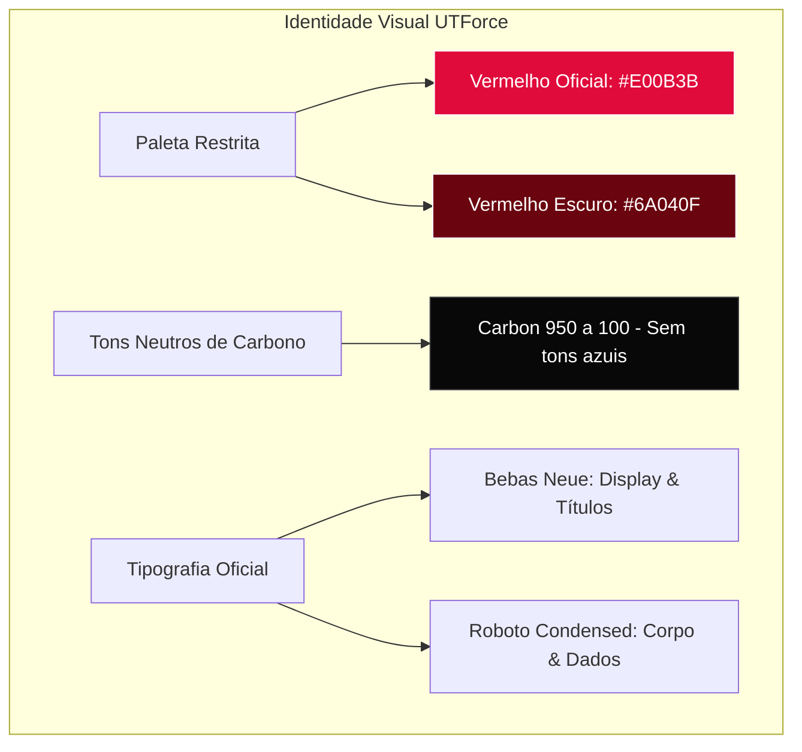
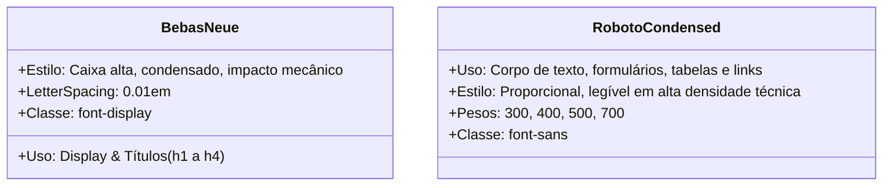

# 🎨 Design System, Tokens e Manual de Identidade Visual (IDV)

> **Módulo:** `05 - Padrões & Diretrizes`  
> **Projeto:** [[🌐 Site UTForce - Visao Geral|Site Oficial UTForce E-Racing]]  
> **Stack:** Tailwind CSS 3.4, PostCSS, Google Fonts (Bebas Neue + Roboto Condensed)  
> **Arquivos de Referência:** `tailwind.config.js`, `src/index.css`

---

## 1. Filosofia de Design & Regras de Marca

A identidade visual do site da UTForce E-Racing reflete diretamente a engenharia de alta performance do protótipo Fórmula SAE Elétrico. Para manter a sobriedade, agressividade e coerência visual do projeto, o código adota regras estritas definidas no **Manual de Identidade Visual (IDV)** oficial da equipe.



> [!CAUTION]
> **Regra Pétrea de Cores**: Nunca inventar tons de vermelho ou cinza fora das variáveis mapeadas. Para criar variações de destaque ou hover "mais claro/mais escuro", utilize **filtros CSS (`brightness`, `opacity`)** sobre a classe `brand`, e nunca declare hexadecimais aleatórios inline.

---

## 2. Paleta de Cores e Tokens Tailwind

Definidos em `tailwind.config.js`:

### 2.1 Cores de Marca (Brand)
| Token Tailwind | Hexadecimal | Papel no Sistema |
|---|---|---|
| `brand` (`DEFAULT`) | `#E00B3B` | Vermelho primário UTForce, botões primários, acentos, seleções de texto, bordas ativas. |
| `brand-dark` | `#6A040F` | Vermelho escuro de contraste, gradientes de texto e profundidade de sombras. |

### 2.2 Escala Neutra de Carbono (Carbon)
A paleta de cinzas foi calibrada especificamente para evitar tonalidades azuladas (como o `slate` padrão do Tailwind), garantindo um acabamento fosco inspirado em fibra de carbono:

| Token | Hexadecimal | Aplicação Principal |
|---|---|---|
| `carbon-950` | `#080808` | Fundo principal da aplicação (`body`), áreas de máximo contraste. |
| `carbon-900` | `#0f0f10` | Superfícies de cards, modais, cabeçalhos secundários. |
| `carbon-800` | `#1a1a1c` | Cards de destaque, menus suspensos, campos de formulário inativos. |
| `carbon-700` | `#26262a` | Bordas sutis, divisórias, polegar do scrollbar (`scrollbar-thumb`). |
| `carbon-600` | `#3a3a40` | Bordas com foco suave, elementos de interface secundários. |
| `carbon-400` | `#8a8a92` | Textos secundários, legendas técnicas, placeholders. |
| `carbon-300` | `#b5b5bd` | Ícones inativos, texto de leitura regular com atenuação. |
| `carbon-100` | `#ededf0` | Tipografia principal (títulos e textos de alto contraste). |

---

## 3. Tipografia & Hierarquia Textual

O site utiliza duas famílias tipográficas carregadas via Google Fonts:

```css
/* Importação oficial em src/index.css */
@import url('https://fonts.googleapis.com/css2?family=Bebas+Neue&family=Roboto+Condensed:wght@300;400;500;700&display=swap');
```



- **`font-display` (`Bebas Neue`)**: Injetado automaticamente via `@layer base` em todas as tags `h1`, `h2`, `h3`, `h4`. Confere ar de telemetria automotiva e pôster de competição.
- **`font-sans` (`Roboto Condensed`)**: Definido no `body` como fonte global da interface, garantindo excelente legibilidade em telas móveis mesmo com termos técnicos densos.

---

## 4. Texturas, Efeitos & Classes Utilitárias (`src/index.css`)

### 4.1 Blueprint / Carbon Grid (`bg-grid`)
Simula uma prancheta milimétrica de engenharia ou blueprint técnico aeroespacial:
```css
.bg-grid {
  /* Linhas milimétricas em 1px: renderização nítida em qualquer densidade de pixels (DPI) */
  background-image:
    linear-gradient(to right, rgba(255, 255, 255, 0.035) 1px, transparent 1px),
    linear-gradient(to bottom, rgba(255, 255, 255, 0.035) 1px, transparent 1px);
  background-size: 3.5rem 3.5rem;
}
```

### 4.2 Radial Brand Glow (`glow-brand`)
Efeito de iluminação difusa inspirado em faróis ou sistemas de aviso luminosos:
```css
.glow-brand {
  @apply bg-brand/20 rounded-full blur-3xl;
}
```

### 4.3 Gradiente de Texto Oficial (`text-gradient-brand`)
```css
.text-gradient-brand {
  @apply bg-gradient-to-br from-brand to-brand-dark bg-clip-text text-transparent;
}
```

### 4.4 Scrollbar Customizada de Automobilismo
```css
::-webkit-scrollbar {
  width: 0.625rem;
}
::-webkit-scrollbar-track {
  background: #080808;
}
::-webkit-scrollbar-thumb {
  background: #26262a;
  border-radius: 0.5rem;
}
::-webkit-scrollbar-thumb:hover {
  background: #e00b3b;
}
```

---

## 5. Padrões de Botões e Interações de Hover

Para manter a integridade visual da marca sem poluição de estilos, todos os botões seguem este padrão padronizado:

```jsx
// Botão Primário de Ação (Ex: CTA, Enviar Currículo, Chat)
<button
  className="inline-flex items-center justify-center gap-2 bg-brand text-white font-semibold 
             px-7 py-3.5 rounded-full transition-all duration-300 
             hover:brightness-110 hover:shadow-xl hover:shadow-brand/40 hover:-translate-y-0.5"
>
  Candidatar-se
</button>

// Botão Secundário / Contorno
<button
  className="inline-flex items-center justify-center gap-2 border border-carbon-700 text-carbon-100 
             font-semibold px-7 py-3.5 rounded-full transition-all duration-300 
             hover:border-brand hover:text-brand hover:bg-brand/5"
>
  Ver Especificações
</button>
```

---

## 🔗 Links Relacionados
- [[🎨 Arquitetura React 18, Tailwind e Componentes UI]]
- [[♿ Acessibilidade (a11y), Gestao de Foco e Motion Reduzido]]
- [[🌐 Site UTForce - Visao Geral]]
