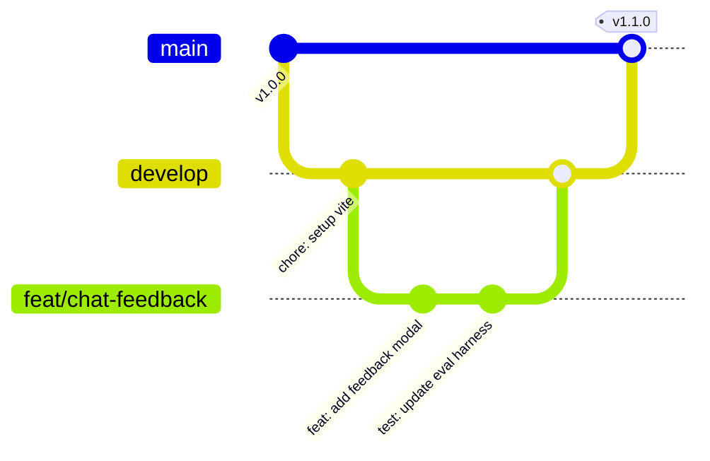

# 📐 Padrões de Código, Naming Conventions e Git Flow

> **Módulo:** `05 - Padrões & Diretrizes`  
> **Projeto:** [[🌐 Site UTForce - Visao Geral|Site Oficial UTForce E-Racing]]  
> **Padrões:** JavaScript ES6+, React 18, Tailwind CSS 3, Conventional Commits  
> **Arquivos de Referência:** `package.json`, `vite.config.js`, `vercel.json`

---

## 1. Organização e Arquitetura de Pastas

O projeto adota uma arquitetura modular orientada a domínios e co-locação de responsabilidades:

```text
SiteUTForce/
├── api/                   # Serverless Functions (Vercel Node.js runtime)
├── docs/                  # Runbooks técnicos e diagramas arquiteturais
├── public/                # Assets estáticos servidos sem processamento (logos, imagens, ícones)
├── scripts/               # Ferramentas CLI, harnesses de benchmark (.mjs) e DDLs SQL (.sql)
├── src/
│   ├── components/        # Componentes UI reutilizáveis e pastas por domínio (chat, contato, etc.)
│   ├── data/              # Dados estáticos serializados (membros, roster, especificações do carro)
│   ├── hooks/             # Custom Hooks do React (useFocusTrap, etc.)
│   ├── i18n/              # Dicionários e instâncias do i18next (pt-BR, en-US)
│   ├── lib/               # Módulos puros de lógica desacoplada (chatbot, roteamento, motion)
│   ├── pages/             # Componentes de topo correspondentes às rotas da aplicação
│   ├── App.jsx            # Configuração de rotas e ErrorBoundary
│   ├── index.css          # Diretivas do Tailwind e regras base de IDV
│   └── main.jsx           # Ponto de entrada (bootstrap) do ReactDOM
├── index.html             # Shell HTML inicial com preloads de fontes
├── tailwind.config.js     # Extensão do tema (cores de marca, fontes e animações)
└── vercel.json            # Configuração de rotas de rewrites da Vercel
```

---

## 2. Convenções de Nomenclatura (Naming Conventions)

| Categoria de Arquivo | Padrão Adotado | Extensão | Exemplos no Repositório |
|---|---|---|---|
| **Componentes React** | `PascalCase` | `.jsx` | `Navbar.jsx`, `MemberCard.jsx`, `RouteMeta.jsx`, `ChatWidget.jsx` |
| **Páginas de Rota** | `PascalCase` | `.jsx` | `Home.jsx`, `Carro.jsx`, `Competicoes.jsx`, `NotFound.jsx` |
| **Custom Hooks** | `camelCase` com prefixo `use` | `.js` | `useFocusTrap.js`, `useScrolled` (exportado de `motion.jsx`) |
| **Módulos / Bibliotecas JS** | `camelCase` | `.js` | `i18nRouting.js`, `redact.js`, `similarity.js`, `facts.js` |
| **Endpoints Serverless** | `kebab-case` | `.js` | `api/lead.js`, `api/chat-log.js`, `api/chat-feedback.js` |
| **Scripts Node / Utilitários CLI** | `kebab-case` | `.mjs` | `scripts/eval-chatbot.mjs` |
| **Scripts de Banco de Dados** | `kebab-case` | `.sql` | `scripts/supabase-setup.sql` |
| **Arquivos de Dados / JSON** | `camelCase` ou `kebab-case` | `.json` / `.js` | `roster.json`, `intents.seed.json`, `members.js` |

---

## 3. Padrões de Componentização e Estilo

### 3.1 Co-locação de Componentes Especializados
Componentes que servem exclusivamente a uma página ou subsistema devem residir em subpastas com o nome do domínio:
- `src/components/chat/` $\rightarrow$ `ChatBubble.jsx`, `ChatInput.jsx`, `FeedbackModal.jsx`.
- `src/components/contato/` $\rightarrow$ Formulário de lead e seletor de áreas.
- `src/components/equipe/` $\rightarrow$ Grids de membros, líderes de subsistema e cards de diretoria.

### 3.2 Padrão de Container Responsivo
Todas as páginas e seções estruturais adotam um container padronizado para evitar quebras visuais em monitores ultrawide ou celulares compactos:
```jsx
<div className="max-w-7xl mx-auto px-4 sm:px-6 lg:px-8">
  {/* Conteúdo da seção */}
</div>
```

### 3.3 Prioridade de Estilização
1. **1ª Opção**: Classes utilitárias do Tailwind CSS direto no JSX.
2. **2ª Opção**: Classes reutilizáveis do `@layer components` em `src/index.css` (`text-gradient-brand`, `bg-grid`, `glow-brand`).
3. **Proibido**: Estilos inline arbitrários (`style={{ color: '#ff0000' }}`), com exceção estrita de valores dinâmicos calculados em tempo real (como `transitionDelay` com base em índice).

---

## 4. Estratégia de Branches e Git Flow



### 4.1 Estrutura de Branches
- `main`: Branch de **produção**. Qualquer commit ou merge nesta branch dispara automaticamente o deploy de produção na Vercel (`https://siteutforce.vercel.app`).
- `develop`: Branch de integração de novas funcionalidades.
- `feat/*`: Branches de novas features (ex: `feat/chat-levenshtein`, `feat/telemetry-view`).
- `fix/*`: Correções de bugs ou gaps de fatos em `facts.js`.

### 4.2 Commits Semânticos (Conventional Commits)
As mensagens de commit devem seguir o padrão:
- `feat: adiciona filtro por subsistema no organograma`
- `fix: corrige limite de edição levenshtein para palavras curtas`
- `docs: inclui runbook de treino de classificador`
- `refactor: desacopla redacao de dados sensiveis no cliente`
- `perf: reduz bundle eliminando pacote externo de cosine similarity`

---

## 5. Checklist Pré-Deploy e Qualidade

Antes de solicitar Pull Request ou disparar merge na `main`:

```bash
# 1. Executar a bancada de regressão do chatbot
npm run eval

# 2. Testar o build de produção localmente
npm run build

# 3. Pré-visualizar o artefato gerado pelo Vite
npm run preview
```

### Invariantes de Segurança:
- Nunca comitar o arquivo `.env` ou `.env.local`.
- Garantir que a `SUPABASE_SERVICE_ROLE_KEY` seja configurada **exclusivamente no painel da Vercel** para as serverless functions, nunca exposta em variáveis que comecem com `VITE_`.

---

## 🔗 Links Relacionados
- [[🚀 Setup Local, Scripts e Deploy na Vercel]]
- [[🎨 Design System, Tokens e Manual de Identidade Visual (IDV)]]
- [[🛡️ Seguranca, Redacao LGPD e Telemetria Anonima]]
