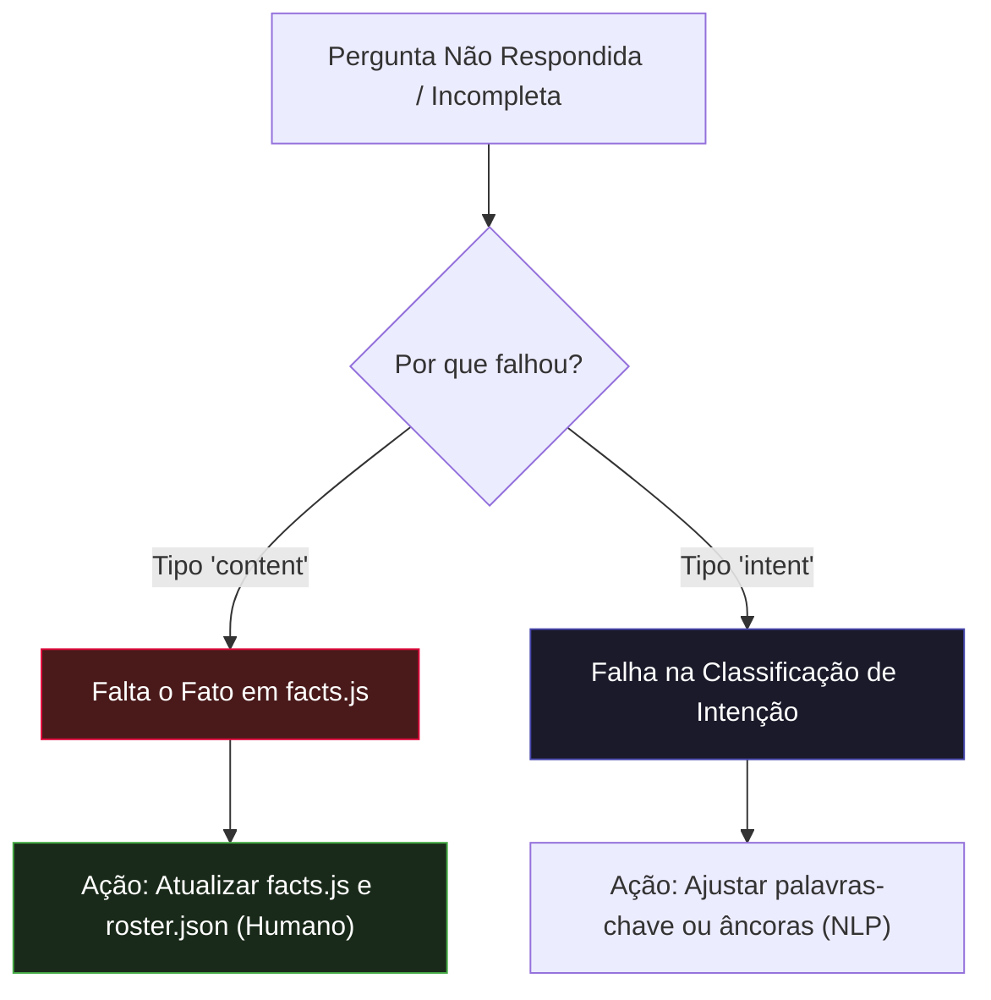

# 📖 Runbook de Custo Zero, Rotulagem e Evolução de NLP

> **Módulo:** `05 - Padrões & Diretrizes`  
> **Projeto:** [[🌐 Site UTForce - Visao Geral|Site Oficial UTForce E-Racing]]  
> **Arquivos de Referência:** `docs/treino-classificador.md`, `docs/arquitetura-chatbot.md`, `scripts/eval-chatbot.mjs`  
> **Status:** Operacional (Diretriz para expansão futura)

---

## 1. Princípios de Engenharia do Chatbot

O chatbot do site da UTForce foi concebido sobre três princípios rígidos:
1. **Zero Custo Operacional**: Sem chamadas a APIs pagas de LLM (OpenAI, Anthropic, Gemini). Roda inteiramente em JavaScript nativo (~3 KB) no navegador do visitante.
2. **Zero Latência (0ms)**: Respostas instantâneas calculadas localmente na thread do cliente.
3. **Zero Alucinação por Construção**: O bot não gera texto probabilístico desgovernado. Todas as respostas derivam estritamente de fatos auditados em `facts.js` e do `roster.json`.

> [!IMPORTANT]
> **A Rejeição Honesta é um Recurso**: Quando o bot não compreende uma pergunta com confiança estatística ($score < 0.3$ ou margem $< 0.08$), ele **recusa a resposta e oferece atalhos de áreas da equipe**. Recusar honestamente é infinitamente superior a inventar dados falsos sobre o protótipo, patrocínios ou seletiva da equipe.

---

## 2. A Regra de Ouro: Fato vs. Compreensão

Antes de cogitar treinar qualquer modelo de Machine Learning, deve-se auditar a causa raiz das perguntas sem resposta:



Dos 26 gaps documentados no protótipo de intenções (`intents.seed.json`), **16 eram do tipo `content`** (o bot não respondia porque o dado não existia na base de fatos, e não porque a frase não foi entendida). Nenhum modelo de IA resolve ausência de informação na base de conhecimento.

---

## 3. Porta de Entrada (Critérios Objetivos para Treinar um Modelo)

Para evitar o erro clássico de "treinar modelo em cima de pouco dado e overfitar", existe uma **Porta de Entrada mandatória**:

Execute a consulta no Supabase SQL antes de iniciar qualquer trabalho:
```sql
-- Verificar volume acumulado de telemetria anônima
select intent_kind, reply_key, area, count(*) as n
from chat_logs
group by 1, 2, 3
order by n desc;
```

### ✅ Critérios Mandatórios para Autorizar Treinamento:
1. **$\ge 1.000$ mensagens reais** registradas no total em `chat_logs`.
2. **$\ge 30$ exemplos reais** para cada uma das intenções que se deseja classificar.
3. **Expurgo de Tráfego Interno**: Filtrar rigorosamente mensagens contendo testes de desenvolvedores (`where message not ilike '%teste%'`) e avaliar dispersão de `session_id`.

Se os critérios não forem satisfeitos, **pare imediatamente e atualize `facts.js`**.

---

## 4. Matriz de Confiança para Rotulagem de Dataset

Ao exportar os logs para construção do dataset de treino supervisionado, **nunca use a coluna `intent_kind` cegamente como verdade absoluta**, pois ela reflete o modelo atual com seus próprios acertos e erros.

Utilize a seguinte escala de evidência para atribuir o rótulo real (*ground truth*):

| Sinal de Telemetria | O que Significa na Prática | Decisão de Rotulagem |
|---|---|---|
| `feedback_reason = 'nao_entendeu'` | O usuário clicou no botão de negativo e explicitou que o bot errou. | Rótulo atual **ERRADO**. Corrigir manualmente para a intenção correta. |
| `link_clicked = true` ou `opened_form = true` | O usuário interagiu com o link sugerido ou abriu o formulário de currículo. | Forte evidência de rótulo **CORRETO**. |
| `feedback = 'up'` | O usuário marcou joinha positivo. | Rótulo **CORRETO**. |
| `feedback = 'down'` (outros motivos) | A intenção foi acertada, mas faltou algum detalhe no fato gerado. | Rótulo **CORRETO** (problema de NLG, não de NLU). |
| `unmatched = true` | A mensagem caiu no fallback da 8ª camada. | Necessita rotulagem manual humana (lacuna real de dados). |
| `prev_unmatched = true` | A mensagem anterior falhou (potencial turno de correção). | Revisar o histórico de turnos da conversa. |

---

## 5. Bancada de Regressão e Avaliação Contínua

Antes de qualquer merge em branch principal, a bancada automatizada deve ser executada:

```bash
npm run eval
```

O script `scripts/eval-chatbot.mjs` testa **105 sentenças reservadas** em 5 personas e gera o sumário de conformidade:

- **Taxa de Cobertura (Recall)**: Deve manter-se $\ge 84\%$.
- **Precisão de Recusa (Honest Refusal Precision)**: Deve manter-se $\ge 93\%$ (evita responder sobre assuntos desconhecidos ou tentar chutar intenções absurdas).
- **Taxa de NLG Dinâmico**: Proporção de respostas construídas em tempo real a partir de contagens do `roster.json` e `facts.js`.

---

## 🔗 Links Relacionados
- [[🪜 Cascata de Decisao de Intencoes em 8 Camadas]]
- [[📐 Similaridade por N-Gramas, IDF e Tolerancia Levenshtein]]
- [[📝 Geracao de Linguagem Natural (NLG) Baseada em Fatos]]
- [[🧪 Bancada de Avaliacao e Metricas do Chatbot (eval-chatbot)]]
