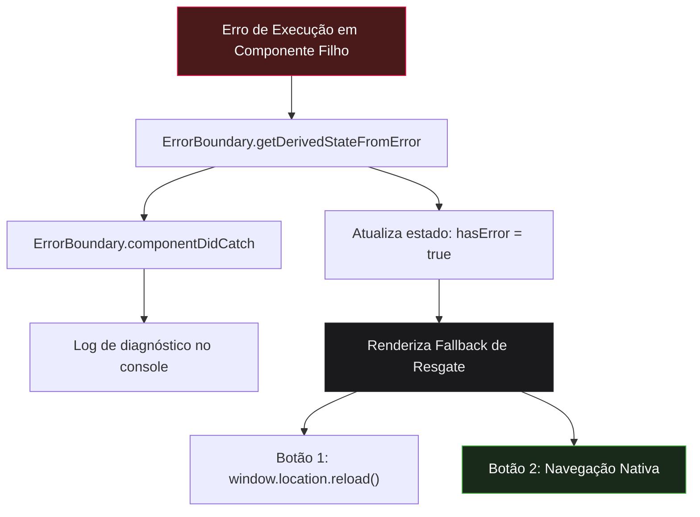
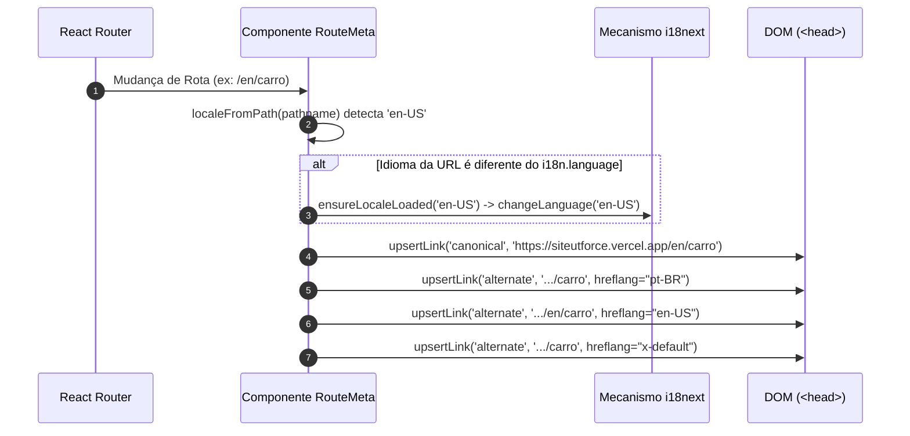

# 🛡️ Resiliência, Error Boundaries e SEO Técnico (i18n & Hreflang)

> **Módulo:** `05 - Padrões & Diretrizes`  
> **Projeto:** [[🌐 Site UTForce - Visao Geral|Site Oficial UTForce E-Racing]]  
> **Stack:** React 18, React Router DOM, i18next, DOM Head API  
> **Arquivos de Referência:** `src/components/ErrorBoundary.jsx`, `src/components/RouteMeta.jsx`, `src/lib/i18nRouting.js`

---

## 1. Visão Geral

Uma aplicação web em produção para uma equipe de Fórmula SAE de ponta não pode apresentar telas brancas em falhas de renderização nem perder indexação de busca em inglês ou português.

Este documento detalha os dois pilares de confiabilidade e descoberta do site:
1. **Padrão de Resiliência com `ErrorBoundary` de Classe**: Recuperação segura e isolamento contra corrupções de estado.
2. **Padrão de SEO Técnico e Metadados com `RouteMeta`**: Injeção dinâmica de tags canônicas e alternadas de idioma (`hreflang`).

---

## 2. Padrão de Resiliência: O `ErrorBoundary`

Localizado em `src/components/ErrorBoundary.jsx`, o componente encapsula toda a árvore de renderização do `App.jsx`.



### 2.1 Por que um Componente de Classe?
No ecossistema React 18, `getDerivedStateFromError` e `componentDidCatch` existem **apenas em componentes de classe**. O React não possui hooks nativos para interceptar exceções no ciclo de vida de renderização de nós filhos.

### 2.2 Desacoplamento de Hooks e i18n Direto
```javascript
// Importa a instância direta, pois hooks não funcionam em classes
import i18n from '../i18n/index.js'

// No método render():
<h1>{i18n.t('errorBoundary.title')}</h1>
<p>{i18n.t('errorBoundary.description')}</p>
```
Se houvesse tentativa de usar hooks ou contextos React instáveis no momento da quebra, o próprio fallback falharia. Acessar o singleton `i18n` garante mensagens traduzidas sem risco de recursão de erro.

### 2.3 Recuperação Defensiva com Tag `<a>` Nativa
Ao renderizar o botão para voltar à página inicial, o componente **não utiliza `LocalizedLink` nem `Link` do React Router**:
```jsx
{/* <a> puro — se o React Router for a causa da quebra, 
    uma navegação de página real (HTTP round-trip) restaura o estado limpo da memória */}
<a
  href="/"
  className="inline-flex items-center justify-center gap-2 border border-carbon-700 ..."
>
  <Home size="1.125rem" />
  {i18n.t('errorBoundary.home')}
</a>
```

---

## 3. Padrão de SEO Técnico e i18n: O `RouteMeta`

Localizado em `src/components/RouteMeta.jsx`, é um componente sem renderização visual (`return null`) que gerencia os efeitos colaterais de metadados diretamente no `<head>` do documento a cada transição de rota.



### 3.1 A URL como Fonte Única da Verdade (Single Source of Truth)
O sistema não guarda a preferência de idioma em `localStorage` ou `cookies` para decidir qual página abrir. O caminho da URL determina o idioma:
- `/` ou `/contato` $\rightarrow$ `pt-BR`
- `/en` ou `/en/contato` $\rightarrow$ `en-US`

Isso evita inconsistências onde motores de busca como o Googlebot indexam conteúdos misturados ou com redirecionamentos inesperados.

### 3.2 Injeção Idempotente no `<head>` (`upsertLink`)
Em Single Page Applications (SPAs), bibliotecas pesadas de Helmet podem aumentar o bundle. O projeto resolve isso com uma função enxuta de atualização no DOM nativo:

```javascript
function upsertLink(rel, href, extraAttrs = {}) {
  const selectorAttrs = Object.entries(extraAttrs)
    .map(([k, v]) => `[${k}="${v}"]`)
    .join('')
  let el = document.querySelector(`link[rel="${rel}"]${selectorAttrs}`)
  if (!el) {
    el = document.createElement('link')
    el.setAttribute('rel', rel)
    for (const [k, v] of Object.entries(extraAttrs)) el.setAttribute(k, v)
    document.head.appendChild(el)
  }
  el.setAttribute('href', href)
}
```

### 3.3 Tags Alternadas (`hreflang`) e `x-default`
Em conformidade com as diretrizes internacionais de indexação do Google:
- `pt-BR`: Aponta para a versão em português.
- `en-US`: Aponta para a versão em inglês.
- `x-default`: Aponta para a versão em português, definindo o padrão para usuários cuja região não corresponda explicitamente a nenhuma das duas opções.

---

## 🔗 Links Relacionados
- [[🌍 Sistema de Rotas e Internacionalizacao (i18n)]]
- [[🎨 Arquitetura React 18, Tailwind e Componentes UI]]
- [[🚀 Setup Local, Scripts e Deploy na Vercel]]
