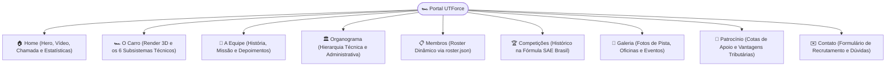

# 🌐 Site Oficial & Landing Page — UTForce E-Racing

Especificação da plataforma web institucional da equipe, construída com **React 18**, **Tailwind CSS**, **Vite** e hospedada na **Vercel** com backend de dados no **Supabase**.

---

## 📌 1. Repositório & Stack Tecnológica

* **Repositório Local:** [SiteUTForce](file:///home/lucaschristen/Documentos/UTFPR/SiteUTForce)
* **Framework:** React 18 SPA (*Single Page Application*) com Vite 5.
* **Estilização:** Tailwind CSS 3.4 (tema escuro em tons de carbono `#0b0c0e` e vermelho característico da equipe `#DF0A3B`).
* **Internacionalização:** Suporte bilíngue nativo (*pt-BR* e *en-US*) via `react-i18next`.
* **Backend Serverless:** Endpoints em Node.js (`api/*.js`) para Vercel Serverless Functions com persistência em PostgreSQL no **Supabase**.

---

## 🧭 2. Estrutura de Rotas e Páginas da Aplicação



---

## ⚡ 3. Endpoints Serverless da API (`api/`)

A pasta `api/` contém as funções executadas nas Vercel Serverless Functions para captura de leads e telemetria do site:

| Endpoint | Método | Função |
| :--- | :---: | :--- |
| `POST /api/lead` | JSON | Recebe mensagens de contato de patrocinadores e candidaturas de novos membros do processo seletivo, persistindo no Supabase (`leads`). |
| `POST /api/chat-log` | JSON | Armazena anonimamente os registros de conversa e intenções não reconhecidas para alimentar métricas de melhoria do chatbot. |
| `POST /api/chat-feedback` | JSON | Registra avaliações de "útil / não útil" (thumbs up/down) dos usuários sobre as respostas do assistente. |

---

## 💻 4. Comandos de Desenvolvimento

```bash
cd "/home/lucaschristen/Documentos/UTFPR/SiteUTForce"

# Instalar dependências
npm install

# Subir servidor de desenvolvimento local (porta 5173)
npm run dev

# Rodar suíte de testes com Vitest
npm test

# Executar avaliação automatizada do classificador do chatbot
npm run eval

# Gerar build otimizado de produção
npm run build
```

---
* 🔗 Voltar para a [[🏎️ UTForce E-Racing - Visao Geral|Visão Geral da UTForce]]
* 🔗 Ver [[🧠 Arquitetura do Chatbot Deterministico e NLG|Arquitetura do Chatbot e NLG]]
