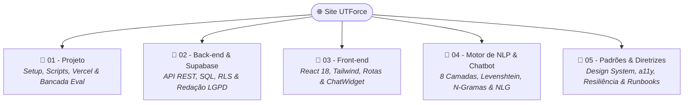

# 🌐 Site UTForce — Landing Page & Chatbot Determinístico

> Plataforma web oficial da equipe **UTForce E-Racing (Fórmula SAE Elétrico)**, composta por uma landing page institucional moderna de alto desempenho em **React 18** e um **assistente virtual inteligente de 8 camadas com NLG factual** (sem alucinação, sem custos de API e com redação de dados pessoais para conformidade com a LGPD).

---

## 📌 Informações Rápidas & Repositório
* **Repositório Local:** [SiteUTForce](file:///home/lucaschristen/Documentos/UTFPR/SiteUTForce)
* **Frontend:** React 18 SPA, Vite 5, Tailwind CSS 3.4, `lucide-react`, `i18next` (bilingue pt-BR / en-US).
* **Backend:** Vercel Serverless Functions (`api/lead.js`, `api/chat-log.js`, `api/chat-feedback.js`).
* **Banco de Dados & Storage:** PostgreSQL no Supabase com Row Level Security (RLS) estrito e bucket privado de currículos.
* **Motor de IA / NLP:** Chatbot determinístico em JavaScript puro (~3 KB), cascata de 8 camadas, distância Levenshtein escalonada, similaridade por trigramas com ponderação IDF e geração textual sobre fatos reais de `roster.json`.

---

## 🧭 Base de Documentação Técnica Detalhada



### 📁 01 - Projeto & Infraestrutura
* 🚀 [[🚀 Setup Local, Scripts e Deploy na Vercel|Setup Local, Scripts de Execução e Deploy na Vercel]]
* 🧪 [[🧪 Bancada de Avaliacao e Metricas do Chatbot (eval-chatbot)|Bancada de Avaliação Automatizada, Cobertura e Precisão de Recusa]]

### 📁 02 - Back-end & Supabase
* 🌐 [[🌐 Contrato da API Serverless e Endpoints|Contrato dos Endpoints /api/lead, /api/chat-log e /api/chat-feedback]]
* 🗄️ [[🗄️ Modelagem de Banco, Supabase SQL e RLS|Esquema Relacional, Tabelas candidaturas, chat_logs e RLS]]
* 🛡️ [[🛡️ Seguranca, Redacao LGPD e Telemetria Anonima|Redação de PII no Cliente (redact.js) e Telemetria Sem Cookies]]

### 📁 03 - Front-end & UI
* 🎨 [[🎨 Arquitetura React 18, Tailwind e Componentes UI|Design System Carbon & Crimson, Componentes e Animações]]
* 🌍 [[🌍 Sistema de Rotas e Internacionalizacao (i18n)|Rotas com React Router v6, LocalizedLink e Dicionários i18n]]
* 💬 [[💬 Componente ChatWidget e Experiencia de Conversa|Interface do ChatWidget, Máquina de Estados e Gatilhos de Ação]]

### 📁 04 - Motor de NLP & Chatbot
* 🪜 [[🪜 Cascata de Decisao de Intencoes em 8 Camadas|Arquitetura em Cascata Ordenada do matchIntent.js]]
* 📐 [[📐 Similaridade por N-Gramas, IDF e Tolerancia Levenshtein|Matemática de Trigramas, Cosseno, IDF e Levenshtein Escalonado]]
* 📝 [[📝 Geracao de Linguagem Natural (NLG) Baseada em Fatos|Geração Textual Dinâmica (facts.js e generate.js) Sem LLM]]

### 📁 05 - Padrões & Diretrizes de Engenharia
* 🎨 [[🎨 Design System, Tokens e Manual de Identidade Visual (IDV)|Manual de IDV, Tokens de Cores Oficiais, Tipografia e Blueprint Grid]]
* ♿ [[♿ Acessibilidade (a11y), Gestao de Foco e Motion Reduzido|Acessibilidade WAI-ARIA (useFocusTrap) e Suporte a prefers-reduced-motion]]
* 🛡️ [[🛡️ Resiliencia, Error Boundaries e SEO Tecnico (i18n & Hreflang)|Resiliência com ErrorBoundary e Injeção Dinâmica de Hreflang (RouteMeta)]]
* 📖 [[📖 Runbook de Custo Zero, Rotulagem e Evolucao de NLP|Runbook Operacional, Porta de Entrada de Dados e Matriz de Confiança]]
* 📐 [[📐 Padroes de Codigo, Naming Conventions e Git Flow|Convenções de Nomenclatura, Arquitetura de Pastas e Git Flow]]

---

## ⚡ Comandos Rápidos de Desenvolvimento

```bash
cd "/home/lucaschristen/Documentos/UTFPR/SiteUTForce"

# 1. Iniciar servidor local Vite (porta 5173)
npm run dev

# 2. Executar suíte de testes unitários com Vitest
npm test

# 3. Rodar a bancada de avaliação do classificador do Chatbot
npm run eval

# 4. Gerar build de produção
npm run build
```

---
* 🏎️ Voltar para a [[🏎️ UTForce E-Racing - Visao Geral|Visão Geral da UTForce E-Racing]]
* 📋 Voltar para a [[📋 Central de Meus Projetos|Central de Meus Projetos]]
* 🏠 Voltar para o [[🏠 Painel Principal|Painel Principal do Segundo Cérebro]]
