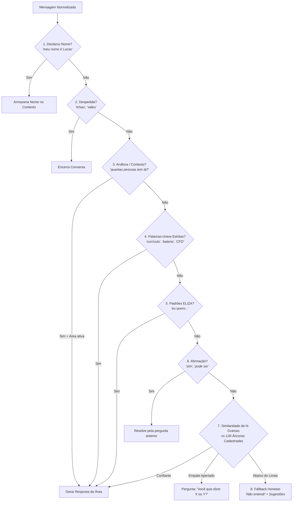

# 🧠 Chatbot Determinístico & NLG Baseado em Fatos

Especificação da arquitetura de Processamento de Linguagem Natural (**NLP**) e Geração de Linguagem Natural (**NLG**) do assistente virtual da UTForce (`SiteUTForce/src/lib/chatbot/`), projetado por Lucas Christen.

---

## 🎯 1. Filosofia de Design: Zero Custo, Zero Alucinação

Ao contrário de soluções baseadas em LLMs comerciais (OpenAI / Claude), que custam centavos por mensagem, sofrem latência de rede e alucinam sobre fatos da equipe (ex: inventar se há bolsas de estudo):
* **100% no Navegador do Cliente:** Executa em JavaScript puro com peso de **~3 KB** (sem bibliotecas externas pesadas).
* **Latência Zero:** Respostas geradas instantaneamente em menos de $1\text{ ms}$.
* **Alucinação Impossível por Construção:** Um buscador decide a intenção da pessoa e um motor de NLG monta a frase a partir de uma base estrita de fatos auditados (`facts.js`).
* **Princípio da Recusa:** Recusar com *"não sei sobre isso"* é muito melhor do que inventar informações falsas sobre a equipe.

---

## ⚙️ 2. Normalização & Tolerância Escalonada a Erros de Digitação (`text.js`)

1. **Padronização:** Minúsculas, remoção de acentos (`"Aerodinâmica"` $\rightarrow$ `aerodinamica`) e remoção de pontuação.
2. **Distância de Levenshtein Dinâmica:**
   Em português, erros de digitação ingênuos transformam uma palavra em outra palavra real existente (ex: `quer` $\leftrightarrow$ `quero`, `materia` $\leftrightarrow$ `bateria`). O limite de edições aceito escala com o comprimento da palavra:
   $$\text{Max Edits} = \begin{cases} 0, & \text{se } \text{tamanho} < 8\text{ letras} \\ 1, & \text{se } 8 \le \text{tamanho} \le 11\text{ letras} \\ 2, & \text{se } \text{tamanho} > 11\text{ letras} \end{cases}$$

---

## 🪜 3. Cascata de Decisão de Intenção em 8 Camadas (`matchIntent.js`)

A primeira camada que reconhece a mensagem com alta confiança define o fluxo de resposta:

> [!NOTE]
> **Por que Anáfora vem antes de Palavras-chave?**
> A frase *"quantas pessoas tem lá?"* contém a expressão `quantas pessoas`, que ativaria a intenção geral de membros da equipe. Como a camada de anáfora avalia primeiro, ela detecta que o usuário estava falando sobre *Telemetria* no turno anterior e responde com precisão: *"Hoje são 4 pessoas tocando a Telemetria..."*.

---

## 📝 4. Geração de Linguagem Natural (NLG) Baseada em Fatos

A resposta não é uma string estática rígida, mas um texto montado em tempo real por um pipeline clássico de NLG em 3 partes:

| Componente | Arquivo | Papel na Geração |
| :--- | :--- | :--- |
| **Content Determination** | `facts.js` | Define o que é verdade (contagem de membros, líderes, categorias extraídas diretamente de `roster.json`). |
| **Sentence Planning** | `generate.js` | Decide quais fatos entram na resposta e a ordem lógica da narrativa. |
| **Surface Realization** | `locales/*.json` | Renderiza as variantes gramaticais em português ou inglês. |

### Exemplo de Montagem Dinâmica:
Se alguém perguntar sobre a área de Telemetria:
> *"Telemetria é uma das nossas áreas técnicas! Ela faz parte da Coordenação Técnica da equipe. Hoje são 4 pessoas tocando essa área. Quer saber como participar por lá, ou já mandar seu currículo?"*
* O número **4** e a ligação com a **Coordenação Técnica** vêm do parsing em tempo real de `roster.json`. Se um novo membro for cadastrado no arquivo, a resposta do bot se atualiza automaticamente sem alteração de código.

---

## 🔬 5. Por que não Vetores de Embeddings ou LLM?

Durante o desenvolvimento, Lucas testou e mediu diferentes abordagens com 83 casos reais:
* **Transformers / Embeddings (~120 MB):** Três ordens de grandeza maiores que o bundle inteiro do site (87 KB).
* **Word2Vec Local (~50 KB):** Treinado no vocabulário do site (309 palavras), colapsou a geometria vetorial (similaridade 0.99 entre quase todas as palavras).
* **N-Gramas de Caracteres (~3 KB):** Empatou com um oráculo de sinonímia perfeita (**17 acertos em 22**), provando que adicionar modelos pesados traria apenas overhead sem benefício real.

---
* 🔗 Voltar para a [[🏎️ UTForce E-Racing - Visao Geral|Visão Geral da UTForce]]
* 🔗 Ver [[🌐 Site Oficial e Landing Page Institucional|Site Oficial da Equipe]]
