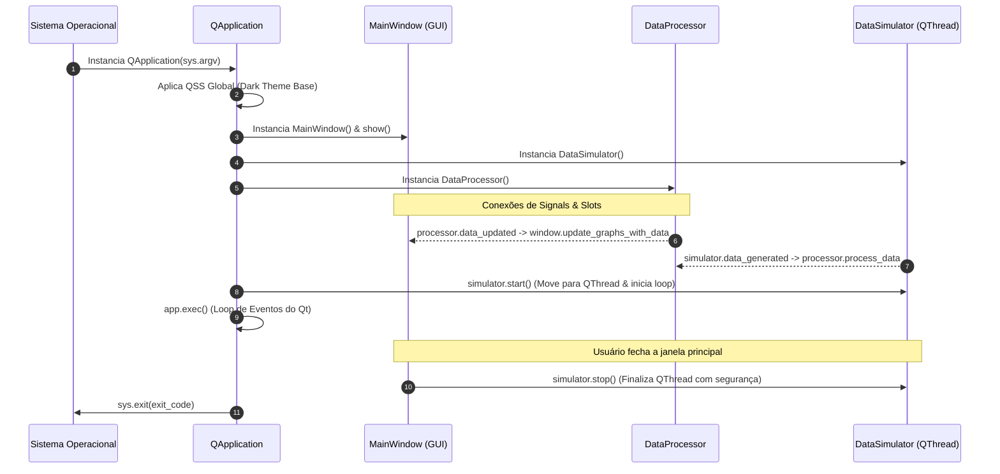

# 🚀 Setup, Dependências e Execução Local

> Guia de configuração de ambiente de desenvolvimento, resolução de dependências do ecossistema Qt 6 para Python e ciclo de inicialização do executável.

---

## 📋 Requisitos de Sistema & Stack

* **Linguagem:** Python 3.8 ou superior (Homologado no Linux Ubuntu 22.04/24.04 e Windows 10/11 com Python 3.10 a 3.13).
* **Toolkit de Interface (GUI):** `PySide6` (Bindings oficiais do Qt 6 pela The Qt Company).
* **Motor Gráfico Científico:** `pyqtgraph` (Renderização de curvas 2D em alta taxa de quadros, baseada em GraphicsView/OpenGL do Qt).
* **Cálculo Numérico:** `numpy` (Interpolação e vetorização de séries temporais de voltas).
* **Arquitetura de Concorrência:** `QThread`, `QObject` e mecanismo assíncrono de *Signals & Slots*.

---

## 📦 Arquivo de Dependências (`requirements.txt`)

O arquivo [requirements.txt](file:///home/lucaschristen/Documentos/UTFPR/Telemetria-Christen-UTFORCE/requirements.txt) mantém dependências estritas e enxutas para evitar conflitos no momento do empacotamento:

```text
PySide6
pyqtgraph
```

> [!NOTE]
> `numpy` é puxado automaticamente como dependência transitiva do `pyqtgraph`, sendo utilizado diretamente no módulo de interpolação e comparação de voltas (`comparison_view.py`).

---

## 🛠️ Passo a Passo de Instalação Local

### 1. Clonagem e Navegação
```bash
cd "/home/lucaschristen/Documentos/UTFPR/Telemetria-Christen-UTFORCE"
```

### 2. Criação e Ativação do Ambiente Virtual (venv)
É mandatória a utilização de virtualenv para isolar os binários C++ do Qt das bibliotecas globais do sistema operacional:

```bash
# Criação do ambiente virtual isolado
python3 -m venv .venv

# Ativação no Linux / macOS:
source .venv/bin/activate

# Ativação no Windows (PowerShell):
# .venv\Scripts\Activate.ps1
```

### 3. Instalação dos Pacotes
```bash
pip install --upgrade pip
pip install -r requirements.txt
```

---

## 🖥️ Ciclo de Vida da Aplicação (`main.py`)

O arquivo [main.py](file:///home/lucaschristen/Documentos/UTFPR/Telemetria-Christen-UTFORCE/main.py) orquestra a injeção de dependências, estilização CSS global e sincronização entre threads:



### Trecho Crítico de Inicialização e Encerramento:
```python
def main():
    app = QApplication(sys.argv)
    
    # Aplicação do QSS inicial
    app.setStyleSheet(...)
    
    window = MainWindow()
    window.show()
    
    simulator = DataSimulator()
    processor = DataProcessor()
    
    # Acoplamento puramente orientado a eventos
    processor.data_updated.connect(window.update_graphs_with_data)
    simulator.data_generated.connect(processor.process_data)
    
    # Disparo da thread de telemetria
    simulator.start()
    
    # Execução bloqueante do loop de eventos do Qt
    exit_code = app.exec()
    
    # Encerramento gracioso do thread secundário para evitar segfault
    simulator.stop()
    sys.exit(exit_code)
```

---

## 🐧 Resolução de Problemas no Linux (Wayland vs X11)

Ao rodar em distribuições Linux com Wayland (como Ubuntu moderno com GNOME):
* Se houver aviso de plugins de plataforma Qt (`Could not load the Qt platform plugin "xcb"`):
  ```bash
  sudo apt-get install -y libxcb-cursor0 libxcb-xinerama0 libxkbcommon-x11-0
  ```
* Para forçar a execução sob XWayland ou Wayland nativo:
  ```bash
  # Forçar backend X11/Xcb
  export QT_QPA_PLATFORM=xcb
  python main.py

  # Ou forçar backend Wayland nativo
  export QT_QPA_PLATFORM=wayland
  python main.py
  ```

---

## 🧪 Verificação Automatizada da Ingestão

Para validar se o pipeline de geração e tipagem dos dados está íntegro antes de subir a GUI:

```bash
python -m unittest tests/test_data_simulator.py
```
* **O que o teste valida:** Dispara a thread `DataSimulator`, aguarda a coleta de 5 amostras consecutivas no `QCoreApplication` e verifica com asserções estritas a presença e completude de todas as mais de 70 chaves de telemetria no payload de dicionário.

---

## 🔗 Próxima Leitura
* [[📦 Empacotamento Executavel com PyInstaller|📦 Como empacotar a aplicação em um executável autônomo (.exe)]]
* [[🔄 Simulador Multi-thread, Qt Signals e Pipeline de Dados|🔄 Entendendo a concorrência e os Qt Signals]]
