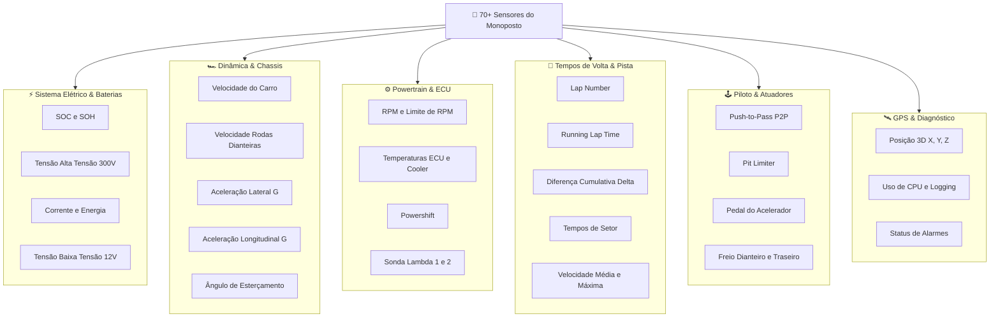

# 📊 Dicionário Completo dos 70+ Sensores Automotivos

> Catálogo técnico exaustivo das grandezas físicas, canais de aquisição e variáveis de telemetria suportadas e simuladas no software.

---

## 🧭 Visão Estrutural por Subsistemas

As variáveis de telemetria processadas pelo [data_simulator.py](file:///home/lucaschristen/Documentos/UTFPR/Telemetria-Christen-UTFORCE/data/data_simulator.py) e [sensor_selection.py](file:///home/lucaschristen/Documentos/UTFPR/Telemetria-Christen-UTFORCE/gui/sensor_selection.py) cobrem integralmente as demandas de engenharia de pista da Fórmula SAE:

---

## ⚡ 1. Sistema Elétrico & Gestão de Baterias (BMS / Tractive System)

| Chave Interna | Nome Exibido na GUI | Tipo | Faixa Típica | Unidade | Descrição Técnica |
| :--- | :--- | :--- | :--- | :--- | :--- |
| `voltage` | Voltage | Float | $0.0 \sim 300.0$ | V | Tensão total do acumulador de alta tensão (*Tractive System*). |
| `current` | Current | Float | $0.0 \sim 100.0$ | A | Corrente elétrica instantânea demandada pelo inversor trativo. |
| `SOC` | Soc | Float | $0.0 \sim 100.0$ | % | *State of Charge* (Nível percentual de carga restante da bateria Li-Ion). |
| `SOH` | Soh | Float | $0.0 \sim 100.0$ | % | *State of Health* (Estado de saúde e degradação celular das células). |
| `energy used` | Energy used | Float | $-80.0 \sim 80.0$ | kW | Balanço de potência instantânea consumida ou regenerada via frenagem. |
| `box_voltage` | Box voltage | Float | $12.0 \sim 14.0$ | V | Tensão do barramento de baixa tensão (Bateria LV de alimentação de instrumentação). |
| `ecu_voltage` | Ecu voltage | Float | $0.0 \sim 14.0$ | V | Tensão de alimentação elétrica percebida diretamente na régua da ECU. |

---

## 🏎️ 2. Dinâmica Veicular, Rodas e Pneus

| Chave Interna | Nome Exibido na GUI | Tipo | Faixa Típica | Unidade | Descrição Técnica |
| :--- | :--- | :--- | :--- | :--- | :--- |
| `speed` | Speed | Float | $0.0 \sim 300.0$ | km/h | Velocidade absoluta do protótipo no solo. |
| `front_left_wheel_speed` | Front left wheel speed | Float | $0.0 \sim 300.0$ | km/h | Velocidade angular convertida da roda dianteira esquerda. |
| `front_right_wheel_speed` | Front right wheel speed | Float | $0.0 \sim 300.0$ | km/h | Velocidade angular convertida da roda dianteira direita. |
| `lateral_g` | Lateral g | Float | $-3.0 \sim +3.0$ | G | Aceleração lateral em curvas medida pelo acelerômetro da IMU. |
| `longitudinal_g` | Longitudinal g | Float | $-3.0 \sim +3.0$ | G | Aceleração longitudinal (frenagens e acelerações em linha reta). |
| `steering` | Steering | Float | $-45.0 \sim +45.0$ | Graus | Ângulo de esterçamento do volante medido por encoder na coluna. |
| `stance` | Stance | Float | $0.0 \sim 100.0$ | % | Índice de postura e atitude dinâmica da suspensão. |
| `correct_stance` | Correct stance | Binário | $0 \text{ ou } 1$ | - | Validação se o chassi está dentro dos limites geométricos admissíveis. |
| `correct_speed` | Correct speed | Binário | $0 \text{ ou } 1$ | - | Indicador de velocidade dentro da janela ótima de tração. |

---

## ⚙️ 3. Powertrain, ECU e Motor

| Chave Interna | Nome Exibido na GUI | Tipo | Faixa Típica | Unidade | Descrição Técnica |
| :--- | :--- | :--- | :--- | :--- | :--- |
| `ecu_rpm` | Ecu rpm | Float | $0 \sim 12000$ | RPM | Rotações por minuto do motor / gerador elétrico. |
| `ecu_rpm_limit` | Ecu rpm limit | Float | $3000 \sim 10000$ | RPM | Ponto de corte dinâmico ou limite eletrônico de rotação. |
| `ecu_gear` | Ecu gear | Inteiro | $1 \sim 8$ | Marcha | Marcha engatada ou relação de transmissão do conjunto redutor. |
| `ecu_gear_voltage` | Ecu gear voltage | Float | $0.0 \sim 5.0$ | V | Tensão do sensor potenciométrico de marcha do câmbio sequencial. |
| `ecu_throttle_pedal` | Ecu throttle pedal | Float | $0.0 \sim 100.0$ | % | Curso do pedal do acelerador (Sensor TPS / APPS duplo redundante). |
| `ecu_cooler_temp` | Ecu cooler temp | Float | $0.0 \sim 100.0$ | °C | Temperatura do fluido de arrefecimento do radiador. |
| `ecu_airbox_temp` | Ecu airbox temp | Float | $-40.0 \sim 150.0$ | °C | Temperatura do ar na admissão / plenum. |
| `ecu_fan` | Ecu fan | Binário | $0 \text{ ou } 1$ | - | Status de acionamento das ventoinhas de refrigeração ativa. |
| `ecu_syncro` | Ecu syncro | Binário | $0 \text{ ou } 1$ | - | Sinal de sincronismo e fase de ignição do encoder de virabrequim. |
| `ecu_kl15` | Ecu kl15 | Binário | $0 \text{ ou } 1$ | - | Linha 15 padrão automotivo (ignição pós-chave acionada). |
| `ecu_lambida_1` / `2` | Ecu lambida 1 / 2 | Float | $0.0 \sim 100.0$ | % | Proporção ar/combustível e leitura de oxigênio das sondas de escape. |
| `ecu_oil_pressure` | Ecu oil pressure | Float | $20.0 \sim 100.0$ | psi | Pressão de lubrificação de cárter e rolamentos. |
| `ecu_oil_temp` | Ecu oil temp | Float | $-40.0 \sim 150.0$ | °C | Temperatura do óleo de lubrificação mecânica. |
| `ecu_oil_lamp` | Ecu oil lamp | Binário | $0 \text{ ou } 1$ | - | Lâmpada de alerta de perda de pressão de óleo no cockpit. |
| `oil_temp` | Oil temp | Float | $-40.0 \sim 150.0$ | °C | Leitura secundária do sensor térmico de fluido viscoso. |
| `temperature` | Temperature | Float | $0.0 \sim 100.0$ | °C | Temperatura ambiente externa nos boxes de pista. |

---

## 🕹️ 4. Controles do Piloto & Modos de Desempenho

| Chave Interna | Nome Exibido na GUI | Tipo | Faixa Típica | Unidade | Descrição Técnica |
| :--- | :--- | :--- | :--- | :--- | :--- |
| `ecu_push_to_pass_on` | Ecu push to pass on | Binário | $0 \text{ ou } 1$ | - | Status do boost de potência máxima (*Push-to-Pass* ativo). |
| `ecu_push_to_pass_button` | Ecu push to pass button | Binário | $0 \text{ ou } 1$ | - | Pressionamento físico do botão no volante do piloto. |
| `ecu_push_to_pass_remain` | Ecu push to pass remain | Float | $0.0 \sim 10.0$ | s | Segundos restantes da janela de boost ativa. |
| `ecu_push_to_pass_timer` | Ecu push to pass timer | Float | $0.0 \sim 60.0$ | s | Cronômetro regressivo para o próximo acionamento permitido de P2P. |
| `ecu_push_to_pass_delay` | Ecu push to pass delay | Float | $0.0 \sim 10.0$ | s | Intervalo regulamentar de desaceleração pós-boost. |
| `ecu_push_to_pass_lamp` | Ecu push to pass lamp | Binário | $0 \text{ ou } 1$ | - | Luz indicadora no painel frontal de liberação do recurso. |
| `ecu_push_to_pass_block` | Ecu push to pass block | Binário | $0 \text{ ou } 1$ | - | Trava de segurança por sobreaquecimento ou bateria crítica. |
| `ecu_pit_limit_button` | Ecu pit limit button | Binário | $0 \text{ ou } 1$ | - | Botão do limitador de velocidade de pit-lane no volante. |
| `ecu_pit_limit_on` | Ecu pit limit on | Binário | $0 \text{ ou } 1$ | - | Estado de limitação eletrônica de velocidade em boxes. |
| `ecu_powershift_on` | Ecu powershift on | Binário | $0 \text{ ou } 1$ | - | Habilitação do corte automático de torque para troca de marchas. |
| `ecu_powershift_sensor` | Ecu powershift sensor | Float | $0.0 \sim 100.0$ | % | Sinal do sensor de célula de carga na haste de marchas. |
| `front_brake` | Front brake | Binário | $0 \text{ ou } 1$ | - | Detecção de acionamento da linha hidráulica dianteira de freio. |
| `rear_brake` | Rear brake | Binário | $0 \text{ ou } 1$ | - | Detecção de acionamento da linha hidráulica traseira de freio. |

---

## 🏁 5. Tempos de Volta, Setores e Telemetria de Pista

| Chave Interna | Nome Exibido na GUI | Tipo | Faixa Típica | Unidade | Descrição Técnica |
| :--- | :--- | :--- | :--- | :--- | :--- |
| `lap_number` | Lap number | Inteiro | $1 \sim 100$ | Volta | Contador numérico da volta atual do stint. |
| `running_lap_time` | Running lap time | Float | $60.0 \sim 300.0$ | s | Cronômetro progressivo da volta em curso. |
| `elipse_lap_time` | Elipse lap time | Float | $60.0 \sim 300.0$ | s | Tempo fechado da última volta completa registrada. |
| `elipse_time` | Elipse time | Float | $0.0 \sim 1000.0$ | s | Tempo acumulado da sessão de pista. |
| `cumulative_time` | Cumulative time | Float | $0.0 \sim 1000.0$ | s | Tempo total de ignição e deslocamento em pista. |
| `cumulative_diff` | Cumulative diff | Float | $-5.0 \sim +5.0$ | s | Delta acumulado contra a melhor volta de referência do stint. |
| `section_time` | Section time | Float | $0.0 \sim 1000.0$ | s | Tempo percorrido no setor atual do circuito (Split 1, 2, 3). |
| `section_diff` | Section diff | Float | $-5.0 \sim +5.0$ | s | Delta específico do setor atual em relação à volta rápida. |
| `avg_lap_speed` | Avg lap speed | Float | $150.0 \sim 200.0$ | km/h | Velocidade média ponderada ao longo do traçado. |
| `max_straight_speed` | Max straight speed | Float | $200.0 \sim 300.0$ | km/h | Pico de velocidade aferido na maior reta do autódromo. |
| `minimal_corner_speed` | Minimal corner speed | Float | $100.0 \sim 200.0$ | km/h | Velocidade mínima de tangência na curva mais lenta do traçado. |
| `beacon_code` | Beacon code | Inteiro | $1000 \sim 9999$ | ID | Identificador do transmissor óptico/IR de cronometragem de linha. |

---

## 🛰️ 6. Posicionamento Espacial, Combustível/Autonomia e Diagnóstico

| Chave Interna | Nome Exibido na GUI | Tipo | Faixa Típica | Unidade | Descrição Técnica |
| :--- | :--- | :--- | :--- | :--- | :--- |
| `map_position_x` | Map position x | Float | $0.0 \sim 1000.0$ | m | Coordenada métrica UTM no eixo X do circuito. |
| `map_position_y` | Map position y | Float | $0.0 \sim 1000.0$ | m | Coordenada métrica UTM no eixo Y do circuito. |
| `map_position_z` | Map position z | Float | $0.0 \sim 1000.0$ | m | Altitude barométrica / GPS em relação ao nível do mar. |
| `map_position_d` | Map position d | Float | $0.0 \sim 100.0$ | % | Percentual de distância percorrida do circuito. |
| `ecu_fuel_pressure` | Ecu fuel pressure | Float | $0.0 \sim 100.0$ | bar/psi | Pressão na linha de injeção auxiliar. |
| `ecu_fuel_pump` | Ecu fuel pump | Binário | $0 \text{ ou } 1$ | - | Status do relé elétrico da bomba de fluido. |
| `ecu_fuel_temp` | Ecu fuel temp | Float | $-40.0 \sim 150.0$ | °C | Temperatura do fluido no retorno do tanque. |
| `ecu_fuel_total` | Ecu fuel total | Float | $0.0 \sim 1000.0$ | ml | Volume acumulado consumido na sessão. |
| `fuel_economy` | Fuel economy | Float | $0.0 \sim 20.0$ | km/l | Rendimento e eficiência de consumo instantâneo. |
| `lap_fuel_left` | Lap fuel left | Float | $0.0 \sim 100.0$ | % | Nível restante de combustível na volta. |
| `tank_fuel` | Tank fuel | Float | $0.0 \sim 100.0$ | l | Nível volumétrico absoluto no tanque. |
| `tank_fuel_used` | Tank fuel used | Float | $0.0 \sim 100.0$ | l | Litros consumidos desde o abastecimento. |
| `alarme_status` | Alarme status | Binário | $0 \text{ ou } 1$ | - | Sinalização de intertravamento do circuito de segurança (IMD/BMS/Shutdown). |
| `cpu_usage` | Cpu usage | Float | $0.0 \sim 100.0$ | % | Uso de processamento do computador de bordo (Raspberry Pi/STM32). |
| `logging` | Logging | Binário | $0 \text{ ou } 1$ | - | Flag indicando se a telemetria está sendo persistida no cartão SD interno. |
| `network_time` | Network time | Float | Timestamp | Epoch | Timestamp de sincronismo NTP/GPS para alinhamento de telemetria. |
| `pi_ecu_mode` | Pi ecu mode | Binário | $0 \text{ ou } 1$ | - | Modo de operação do nó de telemetria Raspberry Pi da ECU. |
| `ecu_engine_safe_hard` | Ecu engine safe hard | Binário | $0 \text{ ou } 1$ | - | Modo Limp-Home Severo (Corte forçado por falha crítica). |
| `ecu_engine_safe_soft` | Ecu engine safe soft | Binário | $0 \text{ ou } 1$ | - | Redução suave de potência por excesso de temperatura. |

---

## 🔗 Próxima Leitura
* [[📈 Monitoramento em Tempo Real e Graficos Draggable (pyqtgraph)|📈 Como esses sensores são plotados e reorganizados na tela]]
* [[⏱️ Comparacao de Voltas, Delta T e Interpolacao Linear|⏱️ Comparador de voltas entre stints de pista]]
