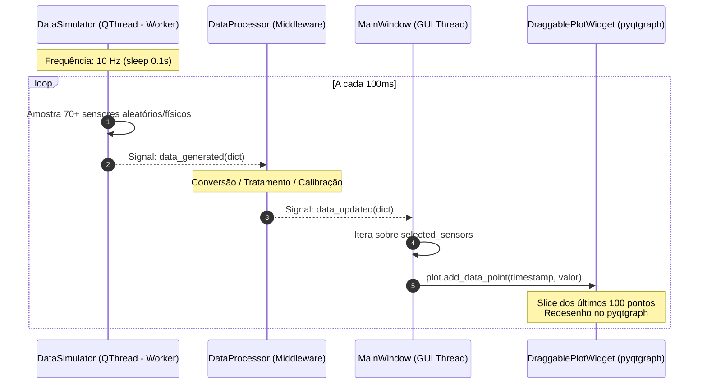

# 🔄 Simulador Multi-thread, Qt Signals e Pipeline de Dados

> Análise da arquitetura de concorrência com separação estrita entre a thread de ingestão de telemetria e a thread principal de renderização gráfica do Qt 6.

---

## 🛑 O Desafio de Desempenho em Aplicações de Telemetria

Em aplicações desktop de telemetria automotiva, dados de sensores chegam em alta frequência (10 Hz a 100 Hz). Se o loop de leitura (ou simulação) rodasse na **Main Thread** (GUI Thread), a interface gráfica sofreria congelamentos imediatos (*UI Freezing*), os botões deixariam de responder e a taxa de renderização de 60 FPS dos gráficos seria destruída.

Para resolver isso, Lucas Christen adotou o padrão clássico do Qt: **Worker Object com `moveToThread` e barramento orientado a sinais (`Signals & Slots`)**.

---

## 🧵 Arquitetura Produtor-Consumidor Concorrente



---

## 🔬 Análise Técnica do `DataSimulator` (`data/data_simulator.py`)

A classe [DataSimulator](file:///home/lucaschristen/Documentos/UTFPR/Telemetria-Christen-UTFORCE/data/data_simulator.py) herda de `QObject` e gerencia seu próprio ciclo de vida dentro de uma `QThread`:

```python
from PySide6.QtCore import QObject, QThread, Signal
import random
import time

class DataSimulator(QObject):
    # Sinal Qt tipado emitindo o dicionário com todas as métricas
    data_generated = Signal(dict)
    
    def __init__(self, parent=None):
        super().__init__(parent)
        self.running = False
    
    def start(self):
        self.running = True
        self.thread = QThread()
        # Move o objeto simulador para o contexto de execução do thread secundário
        self.moveToThread(self.thread)
        self.thread.started.connect(self.run)
        self.thread.start()
    
    def run(self):
        while self.running:
            # Geração do payload dos 70+ sensores
            sensor_data = {
                "alarme_status": random.choice([0, 1]),
                "avg_lap_speed": random.uniform(150.0, 200.0),
                "speed": random.uniform(0.0, 300.0),
                "lateral_g": random.uniform(-3.0, 3.0),
                "longitudinal_g": random.uniform(-3.0, 3.0),
                "SOC": random.uniform(0.0, 100.0),
                "SOH": random.uniform(0.0, 100.0),
                "network_time": time.time(),
                # ... mais de 70 sensores
            }
            # Emissão thread-safe para a fila de eventos do Qt
            self.data_generated.emit(sensor_data)
            time.sleep(0.1)  # 10 Hz de amostragem
    
    def stop(self):
        self.running = False
        if self.thread.isRunning():
            self.thread.quit()
            self.thread.wait()
```

### Por que `moveToThread` é superior a herdar de `QThread`?
1. **Evita vazamento de contexto:** O objeto continua sendo um `QObject` puro com seus slots executando dentro do loop de eventos da nova thread.
2. **Desligamento limpo:** O método `stop()` desativa o loop `while self.running`, solicita o encerramento do thread com `self.thread.quit()` e bloqueia graciosamente até a finalização com `self.thread.wait()`, prevenindo *core dumps* ou terminação abrupta.

---

## ⚙️ O Pipeline Intermediário (`data/data_processor.py`)

A classe [DataProcessor](file:///home/lucaschristen/Documentos/UTFPR/Telemetria-Christen-UTFORCE/data/data_processor.py) foi posicionada como a camada de negócio e filtro de dados:

```python
from PySide6.QtCore import QObject, Signal

class DataProcessor(QObject):
    data_updated = Signal(dict)
    
    def __init__(self, parent=None):
        super().__init__(parent)
    
    def process_data(self, raw_data):
        """
        Ponto de extensão para processamento, calibração,
        conversão de unidades CAN e filtros passa-baixa.
        """
        processed_data = raw_data
        self.data_updated.emit(processed_data)
```

> [!TIP]
> Essa separação arquitetural permite que o software receba telemetria de um simulador sintético ou diretamente da porta serial/CAN bus (via interface USB-CAN Kvaser ou Peak) sem alterar uma única linha de código da interface gráfica.

---

## 📈 Consumo e Gerenciamento de Memória na GUI

Na interface gráfica ([main_window.py](file:///home/lucaschristen/Documentos/UTFPR/Telemetria-Christen-UTFORCE/gui/main_window.py)), a chegada de dados aciona o slot `update_graphs_with_data`:

```python
def update_graphs_with_data(self, sensor_data):
    current_time = time.time()
    for sensor in self.selected_sensors:
        if sensor in sensor_data:
            value = sensor_data[sensor]
            plot = self.graph_widgets.get(sensor)
            if plot:
                plot.add_data_point(current_time, value)
```

E no widget de gráfico (`DraggablePlotWidget`), há uma proteção estrita contra estouro de memória através de um **Ring Buffer de 100 pontos**:

```python
def add_data_point(self, x, y):
    self.data_x.append(x)
    self.data_y.append(y)
    # Limita o array aos últimos 100 pontos temporais
    if len(self.data_x) > 100:
        self.data_x = self.data_x[-100:]
        self.data_y = self.data_y[-100:]
    self.update_chart()
```

Essa contenção garante que o consumo de memória RAM do processo permaneça estável em torno de **80 MB a 120 MB**, mesmo após horas de testes ininterruptos na bancada.

---

## 🔗 Próxima Leitura
* [[📊 Dicionario Completo dos 70+ Sensores Automotivos|📊 Catálogo completo dos 70+ sensores]]
* [[📈 Monitoramento em Tempo Real e Graficos Draggable (pyqtgraph)|📈 Renderização e movimentação dos gráficos]]
