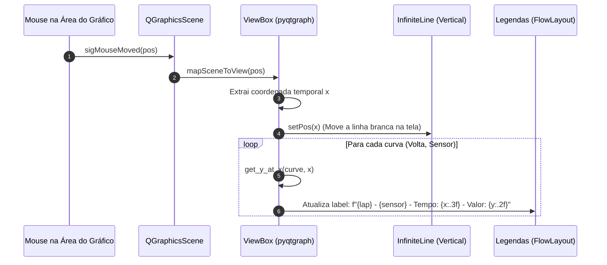

# ⏱️ Comparação de Voltas, Delta T e Interpolação Linear

> Módulo analítico para sobreposição de curvas de telemetria entre voltas distintas, cálculo de deltas temporais e interpolação linear contínua via cursor síncrono.

---

## 🎯 A Importância da Análise Comparativa de Voltas

No automobilismo de competição, a melhoria de tempo de volta decorre da comparação milimétrica entre voltas do mesmo piloto ou entre pilotos distintos no mesmo trecho da pista.

O módulo [ComparisonView](file:///home/lucaschristen/Documentos/UTFPR/Telemetria-Christen-UTFORCE/gui/comparison_view.py) permite:
1. Selecionar qualquer combinação de sensores (ex: *Velocidade*, *Acelerador*, *G Lateral*).
2. Selecionar até 20 voltas distintas do stint através de uma matriz de caixas de seleção.
3. Sobrepor as séries temporais em um mesmo sistema de eixos com cores contrastantes geradas dinamicamente.
4. Rastrear o cursor do mouse e inspecionar a grandeza de **todas as curvas no exato mesmo instante de tempo $x$**.

---

## 📐 Algoritmo de Interpolação Linear (`PlotMixin`)

Como os sensores automotivos possuem frequências de amostragem discretas (ex: 10 Hz ou 100 Hz), é improvável que o cursor do mouse coincida exatamente com a coordenada $x_i$ de um ponto amostrado.

Para evitar leituras nulas ou truncamentos grosseiros por vizinho mais próximo (*nearest-neighbor*), a classe base `PlotMixin` implementa **Interpolação Linear Contínua**:

$$\forall x \in [x_i, x_{i+1}], \quad y(x) = y_i + (y_{i+1} - y_i) \cdot \frac{x - x_i}{x_{i+1} - x_i}$$

```python
class PlotMixin:
    def get_y_at_x(self, curve, x):
        """
        Retorna o valor y correspondente ao ponto x na curva,
        interpolando linearmente se necessário.
        """
        x_data = curve.x_data
        y_data = curve.y_data
        
        # Fora dos limites temporais da volta
        if x < x_data[0] or x > x_data[-1]:
            return None

        # Busca binária/linear pelo segmento delimitador
        for i in range(len(x_data) - 1):
            if x_data[i] <= x <= x_data[i + 1]:
                x0, y0 = x_data[i], y_data[i]
                x1, y1 = x_data[i + 1], y_data[i + 1]
                
                # Prevenção contra divisão por zero
                if x1 - x0 == 0:
                    return y0
                    
                # Cálculo da reta de interpolação
                return y0 + (y1 - y0) * (x - x0) / (x1 - x0)
                
        return None
```

---

## 🖱️ Cursor Vertical Síncrono (`InfiniteLine` & `sigMouseMoved`)

Durante o movimento do cursor sobre o gráfico, o evento de cena do Qt é capturado e mapeado para o sistema de coordenadas de dados do `ViewBox`:



### Implementação do Tracker:
```python
def on_mouse_moved(self, pos):
    if self.plot_widget.sceneBoundingRect().contains(pos):
        mouse_point = self.plot_widget.plotItem.vb.mapSceneToView(pos)
        x = mouse_point.x()

        # Mover a linha vertical de medição síncrona
        self.vLine.setPos(x)

        # Iterar sobre todas as curvas ativas
        for (lap, sensor), curve in self.curves.items():
            y = self.get_y_at_x(curve, x)
            if y is not None:
                self.legend_labels[(lap, sensor)].setText(
                    f"{lap} - {sensor.replace('_', ' ').title()} - Tempo: {x:.3f} - Valor: {y:.2f}"
                )
            else:
                self.legend_labels[(lap, sensor)].setText(
                    f"{lap} - {sensor.replace('_', ' ').title()} - Tempo: N/A - Valor: N/A"
                )
    else:
        # Quando o mouse sai da área útil, reseta a régua
        self.vLine.setPos(None)
```

---

## 🏷️ Legenda Responsiva com `FlowLayout` e Troca de Cor

Para acomodar um número variável de voltas e sensores sem estourar o layout da janela, Lucas Christen implementou um gerenciador de layout personalizado: o [FlowLayout](file:///home/lucaschristen/Documentos/UTFPR/Telemetria-Christen-UTFORCE/gui/flow_layout.py).

* **Quebra automática de linha:** Os rótulos e botões fluem horizontalmente e quebram de linha dinamicamente quando a largura da janela é reduzida.
* **Botão de Cor Individual:** Cada curva gerada recebe um botão `🔴` colorido. Ao clicar, o engenheiro pode invocar o `QColorDialog` para alterar a cor da curva em tempo real:
  ```python
  def change_line_color(self, sensor_tuple):
      color = QColorDialog.getColor()
      if color.isValid():
          color_hex = color.name()
          curve = self.curves[sensor_tuple]
          curve.setPen(mkPen(color=color_hex, width=2))
          curve.setSymbolBrush(pg.mkBrush(color_hex))
          self.color_buttons[sensor_tuple].setStyleSheet(
              f"background-color: {color_hex}; border: none;"
          )
  ```

---

## 🖥️ Modo de Análise em Tela Cheia (`FullscreenPlotWindow`)

Para apresentações no telão dos boxes ou análise profunda na cabine de telemetria, o software oferece o modo de **Tela Cheia Imersiva**:
* Instancia uma nova janela desacoplada com as flags `Qt.Window` e executa `showFullScreen()`.
* Replica integralmente as curvas, cores personalizadas e o `PlotMixin` de interpolação linear.
* Ajusta a tipografia e o contraste de eixos automaticamente.

---

## 🔗 Próxima Leitura
* [[🏎️ Status Visual do Carro e Alertas Termicos|🏎️ Blueprint do carro com diagnóstico térmico e de pressão]]
* [[🔧 Setup Dinamico e Parametros de Suspensao|🔧 Análise e calibração de setup mecânico do carro]]
