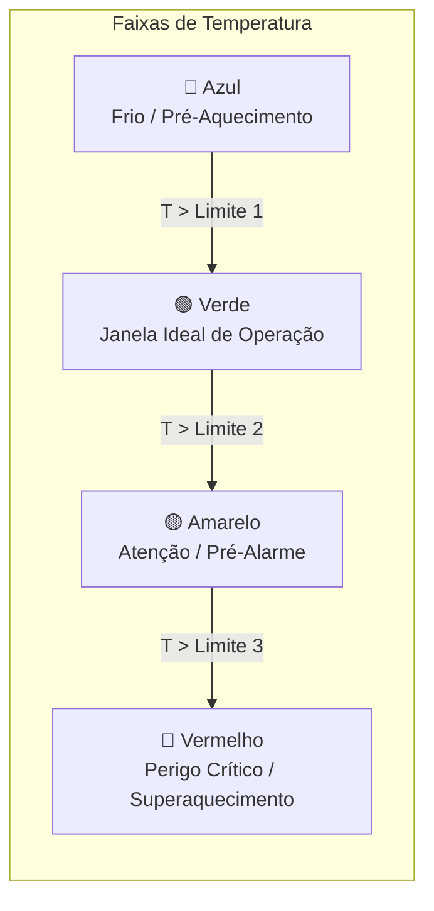

# 🏎️ Status Visual do Carro e Alertas Térmicos

> Visualização esquemática de subsistemas críticos sobre o diagrama do veículo, sistema de alertas colorimétricos em 4 níveis e janelas modais de histórico com retículo bidimensional.

---

## 🎯 O Conceito de Monitoramento Situacional

Durante uma sessão de treinos livres ou prova de endurance do Fórmula SAE, os engenheiros de box precisam de um diagnóstico visual instantâneo dos componentes mais suscetíveis a falhas catastróficas por sobreaquecimento:
* **Banco de Baterias (*Accumulator Box*):** Não pode ultrapassar 60 °C pelo regulamento da prova.
* **Motor Elétrico (*Electric Engine*):** Degradação de torque e queima de isolamento de verniz térmico se ultrapassar limites.
* **Discos de Freio Dianteiro e Traseiro:** Chegam a mais de 400 °C em frenagens severas de final de reta.
* **Pressão e Temperatura dos 4 Pneus:** Vitais para a aderência mecânica e balanço aerodinâmico.

O módulo [CarMonitoringView](file:///home/lucaschristen/Documentos/UTFPR/Telemetria-Christen-UTFORCE/gui/car_monitoring_view.py) substitui números frios por um **gêmeo digital visual e interativo do protótipo**.

---

## 🗺️ Mapeamento Espacial de Pinos sobre o Blueprint

O chassi é ilustrado através da imagem `assets/images/car_diagram.png` centralizada na tela. Sobre ela, pinos clicáveis (`QPushButton`) de $20 \times 20$ pixels são ancorados em coordenadas absolutas $(x, y)$:

```python
self.ball_positions = {
    "Combustion Engine": (200, 300),
    "Front Left Tire":   (545, 120),
    "Front Right Tire":  (545, 470),
    "Rear Left Tire":    (200, 110),
    "Rear Right Tire":   (200, 480),
    "Front Brake":       (580, 350),
    "Rear Brake":        (200, 350),
    "Eletric Engine":    (545, 300),
    "Accumulator Box":   (350, 400),
}
```

Cada pino é acompanhado de uma etiqueta flutuante cinza escuro (`QLabel`) posicionada em $(x+25, y)$ exibindo o valor numérico em tempo real (ex: `65.4 °C, 2.2 bar`).

---

## 🚦 Máquina de Estados Térmicos (4 Faixas de Alerta)

A cor de cada pino é determinada dinamicamente através do método `get_button_style`:



### Algoritmo de Classificação Colorimétrica:
```python
def get_button_style(self, value, component):
    thresholds = self.thresholds.get(component, [100, 200, 300, 400])
    colors = ["blue", "green", "yellow", "red"]

    color = colors[-1]  # Default para crítico se ultrapassar todos
    for t, c in zip(thresholds, colors):
        if value <= t:
            color = c
            break

    return f"""
        QPushButton {{
            background-color: {color};
            border-radius: 10px;
            width: 20px;
            height: 20px;
        }}
    """
```

### Tabela de Limites Homologados Padrão:
| Componente | Limite 1 (Azul $\to$ Verde) | Limite 2 (Verde $\to$ Amarelo) | Limite 3 (Amarelo $\to$ Vermelho) | Unidade |
| :--- | :---: | :---: | :---: | :---: |
| **Bateria (Accumulator Box)** | 40 °C | 60 °C (Limite SAE) | 80 °C (Corte Crítico) | °C |
| **Motor Elétrico** | 40 °C | 60 °C | 80 °C | °C |
| **Discos de Freio (Front/Rear)** | 100 °C | 200 °C | 300 °C / 400 °C | °C |
| **Pneus (FL, FR, RL, RR)** | 70 °C | 90 °C | 100 °C | °C |

> [!TIP]
> Os limites podem ser alterados em tempo real na pista através do botão **"Configurar Escalas"**, que abre um diálogo modal com `QSpinBox` para reajuste conforme as condições climáticas e compostos de borracha utilizados no dia.

---

## 🔍 Interatividade Cruzada e Janela Modal de Histórico

### 1. Hover Cruzado (Pino $\leftrightarrow$ Legenda)
Ao passar o mouse sobre qualquer pino no diagrama do carro, os eventos `enterEvent` e `leaveEvent` ativam negrito e destaque automático no item correspondente da lista de pesquisa à esquerda:
```python
button.enterEvent = lambda event, c=component: self.highlight_legend(c)
button.leaveEvent = lambda event, c=component: self.unhighlight_legend(c)
```

### 2. Inspeção Detalhada por Clique
Ao clicar em qualquer pino do chassi, a aplicação abre a janela independente `Histórico: {component}` contendo:
* Histórico dos últimos ciclos de amostragem.
* Opção de alternar entre gráfico de linha contínua ou gráfico de barras (`BarGraphItem`).
* **Retículo de Medição 2D Síncrono:** Uma linha vertical `vline` e uma linha horizontal `hline` brancas do tipo `InfiniteLine` que acompanham o cursor do mouse e projetam o valor exato no label inferior:
  ```python
  self.vline = InfiniteLine(angle=90, movable=False, pen=mkPen('w', width=1))
  self.hline = InfiniteLine(angle=0, movable=False, pen=mkPen('w', width=1))
  ```

---

## ⏱️ Atualização em Tempo Real via `QTimer`

Para garantir suavidade visual sem engasgos de interface, o `CarMonitoringView` emprega um `QTimer` dedicado disparando a cada 500 ms (`self.timer.start(500)`):
1. Atualiza as temperaturas e pressões com variabilidade física simulada.
2. Atualiza os arrays de histórico circular mantendo os 10 últimos registros.
3. Atualiza os textos da lista de legenda lateral.
4. Repinta o estilo dos botões apenas quando há transição de estado térmico.

---

## 🔗 Próxima Leitura
* [[🔧 Setup Dinamico e Parametros de Suspensao|🔧 Análise da aba de parametrização mecânica e aerodinâmica]]
* [[🚀 Setup, Dependencias e Execucao Local|🚀 Como rodar o projeto localmente]]
