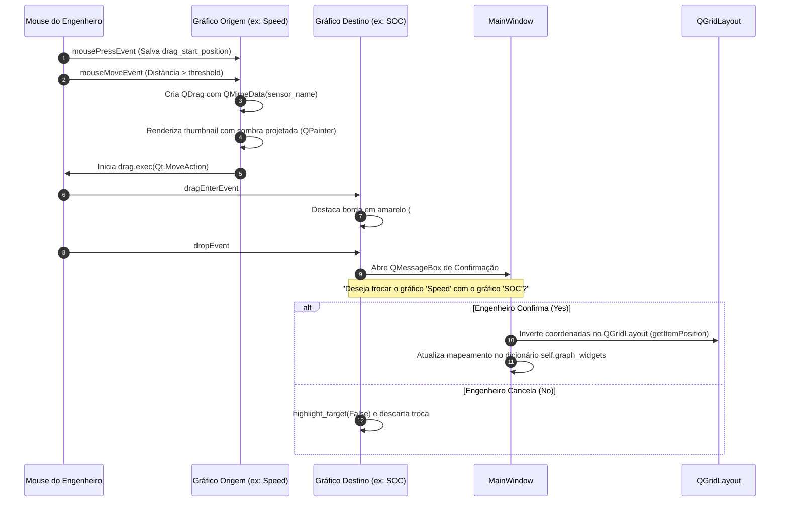

# 📈 Monitoramento em Tempo Real e Gráficos Draggable (pyqtgraph)

> Engenharia de interface gráfica para a aba primária de monitoramento, abordando a matemática de dimensionamento de grade, personalização visual e o mecanismo nativo de *Drag-and-Drop* para troca de posições de gráficos.

---

## 🖥️ Visão Geral da Tela de Monitoramento

A primeira aba da aplicação, [gui/main_window.py](file:///home/lucaschristen/Documentos/UTFPR/Telemetria-Christen-UTFORCE/gui/main_window.py), foi projetada para oferecer visibilidade instantânea das grandezas críticas do carro enquanto ele corre na pista:

```
┌──────────────────────────────────────────────────────────────────────────────────┐
│  [Configurar Gráficos]                               [Tema Escuro] [Tema Claro]  │
├─────────────────┬────────────────────────────────────────────────────────────────┤
│ Seleção Sensores│  Grade Dinâmica de Gráficos (pyqtgraph)                        │
│ [x] Speed       │  ┌───────────────────────────┐  ┌───────────────────────────┐  │
│ [x] Lateral G   │  │ Speed (km/h)              │  │ Lateral G (G)             │  │
│ [ ] Longitudinal│  │ ~~~~~~~~~~\/\/\~~~~~~~~~~ │  │ ------------\/\/\-------- │  │
│ [x] SOC         │  └───────────────────────────┘  └───────────────────────────┘  │
│ [x] Voltage     │  ┌───────────────────────────┐  ┌───────────────────────────┐  │
│ ...             │  │ SOC (%)                   │  │ Voltage (V)               │  │
│ [Aplicar]       │  │ \------------------------ │  │ ========================= │  │
│                 │  └───────────────────────────┘  └───────────────────────────┘  │
└─────────────────┴────────────────────────────────────────────────────────────────┘
```

* **Painel Esquerdo (Stretch 1):** `SensorSelectionWidget` com a lista pesquisável e checkboxes dos mais de 70 sensores com formatação amigável (`format_sensor_name`).
* **Painel Direito (Stretch 4):** `QGridLayout` responsivo contendo as instâncias de `DraggablePlotWidget`.

---

## 📐 Matemática da Grade Dinâmica ($N \times M$)

Ao selecionar qualquer quantidade arbitrária de sensores e clicar em *Aplicar Seleções*, o método `setup_graphs` calcula a melhor distribuição geométrica retangular para ocupar o espaço sem distorcer o aspect ratio:

$$\text{rows} = \lceil \sqrt{N} \rceil \qquad \text{cols} = \left\lceil \frac{N}{\text{rows}} \right\rceil$$

```python
rows = math.ceil(math.sqrt(num_sensors))
cols = math.ceil(num_sensors / rows)

for index, sensor in enumerate(selected_sensors_list):
    row = index // cols
    col = index % cols
    plot = DraggablePlotWidget(title=sensor, main_window=self, parent=self.graph_grid_widget)
    self.graph_grid_layout.addWidget(plot, row, col, 1, 1)
    self.graph_widgets[sensor] = plot
```

### Exemplos de Arranjo Automático:
* **1 sensor:** Grade $1 \times 1$ (ocupa a tela inteira).
* **2 a 4 sensores:** Grade $2 \times 2$.
* **5 a 6 sensores:** Grade $2 \times 3$ ou $3 \times 2$.
* **7 a 9 sensores:** Grade $3 \times 3$.
* **O método `adjust_grid_stretch(rows, cols)`** redefine o fator de expansão de todas as linhas e colunas ativas para `1`, garantindo que todos os gráficos dividam o espaço disponível com proporções idênticas.

---

## 🔄 Mecanismo de Drag-and-Drop Nativo (`DraggablePlotWidget`)

Uma das características mais inovadoras implementadas por Lucas Christen é a possibilidade de **reorganizar a posição dos gráficos arrastando um gráfico diretamente sobre outro**.



### 1. Detecção do Arrasto e Renderização da Miniatura
```python
def mouseMoveEvent(self, event):
    if not (event.buttons() & Qt.LeftButton) or self.drag_start_position is None:
        return
    distance = (event.position() - self.drag_start_position).manhattanLength()
    if distance < QApplication.startDragDistance():
        return

    drag = QDrag(self)
    mime_data = QMimeData()
    mime_data.setText(self.objectName())
    drag.setMimeData(mime_data)

    # Cria thumbnail transparente com cantos arredondados e sombra
    pixmap = self.grab()
    shadow = QPixmap(pixmap.size())
    shadow.fill(Qt.transparent)
    painter = QPainter(shadow)
    painter.setBrush(QBrush(QColor(0, 0, 0, 100)))
    painter.drawRoundedRect(shadow.rect(), 10, 10)
    painter.end()

    drag.setPixmap(pixmap.scaled(200, 150, Qt.KeepAspectRatio, Qt.SmoothTransformation))
    drag.exec(Qt.MoveAction)
```

### 2. Confirmação de Troca para Segurança em Pista
Em ambiente de pit-lane com vibrações mecânicas, toques acidentais no touchpad poderiam desordenar a telemetria do piloto. Por isso, a troca conta com um diálogo de confirmação seguro:

```python
def dropEvent(self, event):
    if event.mimeData().hasText():
        source_sensor = event.mimeData().text()
        target_sensor = self.objectName()
        confirm = QMessageBox.question(
            self,
            "Confirmar Troca",
            f"Deseja trocar o gráfico '{source_sensor}' com o gráfico '{target_sensor}'?",
            QMessageBox.Yes | QMessageBox.No
        )
        if confirm == QMessageBox.Yes:
            self.main_window.swap_plots(source_sensor, target_sensor)
        self.highlight_target(False)
        event.acceptProposedAction()
```

---

## 🎨 Tipos de Gráficos e Estilização (`GraphConfigurationDialog`)

O botão **"Configurar Gráficos"** abre um modal que permite customizar individualmente cada sensor:
1. **Tipo de Representação:**
   * **`line` (Padrão):** Curva contínua renderizada via `mkPen(color, width=2)`.
   * **`bar`:** Gráfico de colunas com `pg.BarGraphItem(x, height, width=0.5)`.
   * **`radial`:** Curva pontilhada via `pg.PlotCurveItem(style=Qt.DashLine)`.
2. **Seletor de Cores:** `QColorDialog` para escolher a cor da linha/barras e a cor de fundo do canvas de cada gráfico.

---

## 🌓 Alternância de Temas (Dark & Light)

A barra superior possui botões flutuantes para alternar temas instantaneamente:
* **Tema Escuro (`DARK_THEME`):** Fundo cinza grafite `#2E2E2E` / `#212121`, bordas carmesim `#fb0e0e` e texto branco.
* **Tema Claro (`LIGHT_THEME`):** Fundo suave avermelhado `#ffe0e0` / `#ffe6e6`, bordas em vermelho escuro `#bd0000` e texto em preto puro.
* **Repelência de Redimensionamento:** O método `resizeEvent` reposiciona os botões no canto superior direito para evitar sobreposição aos títulos das abas:
  ```python
  self.configure_graph_button.move(self.width() - 380, 10)
  self.dark_theme_button.move(self.width() - 220, 10)
  self.light_theme_button.move(self.width() - 110, 10)
  ```

---

## 💾 Persistência de Layout (`graph_layout_config.json`)

As posições dos sensores podem ser persistidas no arquivo [graph_layout_config.json](file:///home/lucaschristen/Documentos/UTFPR/Telemetria-Christen-UTFORCE/graph_layout_config.json):

```json
{
    "ecu_push_to_pass_on": {
        "row": 0,
        "column": 0,
        "rowSpan": 1,
        "colSpan": 1
    },
    "ecu_push_to_pass_remain": {
        "row": 0,
        "column": 1,
        "rowSpan": 1,
        "colSpan": 1
    },
    "ecu_push_to_pass_timer": {
        "row": 1,
        "column": 0,
        "rowSpan": 1,
        "colSpan": 1
    }
}
```

---

## 🔗 Próxima Leitura
* [[⏱️ Comparacao de Voltas, Delta T e Interpolacao Linear|⏱️ Comparação analítica entre diferentes voltas do carro]]
* [[🏎️ Status Visual do Carro e Alertas Termicos|🏎️ Blueprint esquemático com monitoramento térmico dos componentes]]
