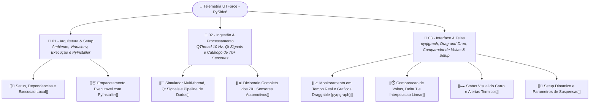

# 📡 Software de Telemetria UTForce E-Racing — Visão Geral

> **Sistema Desktop de Alta Performance para Telemetria em Tempo Real, Análise de Voltas e Calibração Dinâmica de Setup**, projetado e desenvolvido integralmente por **Lucas Fernandes Christen** para a equipe **UTForce E-Racing** (UTFPR Ponta Grossa).

---

## 📌 Identificação do Projeto & Repositório

* **Autor & Arquiteto:** Lucas Fernandes Christen
* **Data da Criação Inicial:** 02/01/2025 (Atualizado com proteção de IP e licença proprietária)
* **Repositório Local:** [Telemetria-Christen-UTFORCE](file:///home/lucaschristen/Documentos/UTFPR/Telemetria-Christen-UTFORCE)
* **Repositório GitHub:** [Lucas-Christen/Telemetria-Christen-UTFORCE](https://github.com/Lucas-Christen/Telemetria-Christen-UTFORCE)
* **Binário Autônomo:** Executável compilado via PyInstaller disponível em `dist/main.exe`
* **Licença:** Software Proprietário & Confidencial — Equipe UTForce E-Racing / Lucas Fernandes Christen.

---

## 🧭 Mapa da Documentação Técnica no Obsidian



### 📁 01 - Arquitetura & Setup
1. [[🚀 Setup, Dependencias e Execucao Local|🚀 Setup, Dependências e Execução Local]]: Requisitos de sistema, criação de venv, instalação de PySide6 e pyqtgraph, ciclo de inicialização do Qt.
2. [[📦 Empacotamento Executavel com PyInstaller|📦 Empacotamento Executável com PyInstaller]]: Análise do `main.spec`, resolução de caminhos com `sys._MEIPASS` em runtime, compressão UPX e distribuição portátil.

### 📁 02 - Ingestão & Processamento
1. [[🔄 Simulador Multi-thread, Qt Signals e Pipeline de Dados|🔄 Simulador Multi-thread, Qt Signals e Pipeline de Dados]]: Arquitetura produtor-consumidor desacoplada; thread dedicada `QThread` rodando a 10 Hz sem bloquear a GUI; comunicação por Qt Signals/Slots com `data_generated` e `data_updated`.
2. [[📊 Dicionario Completo dos 70+ Sensores Automotivos|📊 Dicionário Completo dos 70+ Sensores Automotivos]]: Catálogo técnico dos mais de 70 parâmetros veiculares simulados e processados (ECU, Powertrain, BMS/SOC/SOH, Dinâmica Lateral/Longitudinal, GPS, Tempos e Setores).

### 📁 03 - Interface & Telas
1. [[📈 Monitoramento em Tempo Real e Graficos Draggable (pyqtgraph)|📈 Monitoramento em Tempo Real e Gráficos Draggable (pyqtgraph)]]: Grid dinâmico com cálculo de proporção $N \times M$, personalização visual, arrasto e troca interativa de gráficos (*Drag-and-Drop* nativo Qt com confirmação modal) e persistência em `graph_layout_config.json`.
2. [[⏱️ Comparacao de Voltas, Delta T e Interpolacao Linear|⏱️ Comparação de Voltas, Delta T e Interpolação Linear]]: Stint analysis com sobreposição de voltas, cursor vertical síncrono (`InfiniteLine`), interpolação linear contínua para cálculo preciso de grandezas em qualquer instante temporal e modo tela cheia.
3. [[🏎️ Status Visual do Carro e Alertas Termicos|🏎️ Status Visual do Carro e Alertas Térmicos]]: Blueprint esquemático do protótipo com pinos colorimétricos interativos (4 faixas de temperatura: Azul $\to$ Verde $\to$ Amarelo $\to$ Vermelho), visualizador modal de histórico de componentes e calibração de limites.
4. [[🔧 Setup Dinamico e Parametros de Suspensao|🔧 Setup Dinâmico e Parâmetros de Suspensão]]: Matriz com 14 parâmetros de geometria de suspensão, aerodinâmica e chassis (Pushrod, Preload, Rake, Inclinação de Asa, Calibração de Pneus, Balanço) e algoritmo para isolar o setup da melhor volta (*fastest lap*).

---

## 🏗️ Arquitetura Geral do Sistema

O software foi concebido com uma clara separação de responsabilidades entre ingestão, regras de negócio e apresentação visual:

```
                  ┌─────────────────────────────────────┐
                  │    Hardware CAN / Simulador Dados   │
                  │        (data_simulator.py)          │
                  └──────────────────┬──────────────────┘
                                     │ Qt Signal: data_generated(dict) [10 Hz]
                                     ▼
                  ┌─────────────────────────────────────┐
                  │      Processador de Telemetria      │
                  │        (data_processor.py)          │
                  └──────────────────┬──────────────────┘
                                     │ Qt Signal: data_updated(dict)
                                     ▼
        ┌─────────────────────────────────────────────────────────┐
        │            Interface Gráfica PySide6                    │
        │              (gui/main_window.py)                       │
        ├─────────────────┬──────────────────┬────────────────────┤
        │ 📈 Monitoramento│ ⏱️ Comparação     │ 🏎️ Status Carro    │
        │    Tempo Real   │    de Voltas     │    & Alertas       │
        │ (pyqtgraph Grid)│ (InfiniteLine)   │ (Blueprint Pinos)  │
        └─────────────────┴──────────────────┴────────────────────┘
```

---

## ⚡ Comandos Rápidos de Operação

```bash
# 1. Navegar até a raiz do projeto
cd "/home/lucaschristen/Documentos/UTFPR/Telemetria-Christen-UTFORCE"

# 2. Criar e ativar o ambiente virtual (se necessário)
python3 -m venv venv
source venv/bin/activate

# 3. Instalar dependências de telemetria
pip install -r requirements.txt

# 4. Executar os testes automatizados da pipeline de sensores
python -m unittest tests/test_data_simulator.py

# 5. Inicializar o aplicativo desktop
python main.py
```

---

## 🔗 Navegação Cruzada
* 🏎️ Visão Geral da Equipe: [[🏎️ UTForce E-Racing - Visao Geral]]
* 📡 Aquisição de Dados & Sensores: [[📡 Telemetria, Sensores e Aquisicao de Dados]]
* 📋 Central de Projetos Pessoais: [[📋 Central de Meus Projetos]]
* 🌟 Hub de Portfólio Pessoal do Projeto: [[📡 Telemetria UTForce - Hub Pessoal & Portfolio]]
