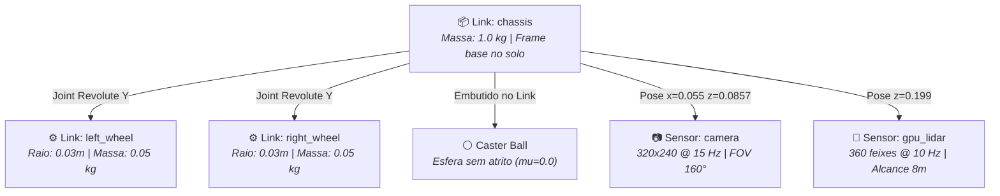

# 📦 Modelo SDF 1.9 e Física DART do Robô

> Modelagem matemática, parametrização inercial, sensores embarcados (Câmera e GPU LiDAR) e plugin de tração diferencial no arquivo `model.sdf`.

---

## 📐 Estrutura Cinemática do JetBot

O robô móvel é modelado através da especificação [model.sdf](file:///home/lucaschristen/Documentos/jetbot_ros-master/gazebo_gz/models/jetbot/model.sdf) sob o formato **SDF 1.9**. O sistema mecânico adota a configuração clássica de **tração diferencial com rodízio traseiro passivo (Caster Ball)**:



---

## ⚙️ Parametrização dos Links e Malhas 3D

### 1. Link Principal (`chassis`)
* **Frame de Referência:** Localizado no plano do solo, centro geométrico entre as rodas, com eixo $+X$ orientado para frente e $+Z$ apontado para cima.
* **Massa:** $1.0\text{ kg}$ com matriz de inércia diagonal balanceada:
  $$I_{xx} = 0.00177, \quad I_{yy} = 0.00242, \quad I_{zz} = 0.00252 \quad [\text{kg}\cdot\text{m}^2]$$
* **Malha Visual Oficial:** `JetBot-v3-Chassis.dae`. Como os arquivos CAD originais utilizavam orientação Y-up/Z-forward e unidades em milímetros, Lucas Christen aplicou a compensação precisa:
  ```xml
  <visual name="chassis_visual">
    <pose>0 0 0.043 1.57079632679 0 1.57079632679</pose>
    <geometry>
      <mesh>
        <scale>0.001 0.001 0.001</scale>
        <uri>model://jetbot/meshes/JetBot-v3-Chassis.dae</uri>
      </mesh>
    </geometry>
  </visual>
  ```
* **Geometria de Colisão:** Caixa simplificada ($0.1376 \times 0.1058 \times 0.079\text{ m}$) suspensa a $0.0595\text{ m}$ do chão para permitir cálculo rápido de contato no motor de física DART.

---

## 💡 A Sacada de Engenharia: Contato Esférico nas Rodas Trativas

No simulador Gazebo com o motor de física **DART**, modelar as rodas como cilindros perfeitos introduz instabilidade numérica severa: as bordas planas do cilindro colidem com o solo durante curvas, gerando torques espúrios de arrasto e degradando completamente a precisão da odometria integrada.

Para solucionar essa divergência física, Lucas modelou a superfície de colisão das rodas como **esferas perfeitas de contato pontual**:

```xml
<link name="left_wheel">
  <pose>0.03 0.0553 0.03 0 0 0</pose>
  <collision name="collision">
    <!-- Esfera: contato único no centro da roda -> odometria exata -->
    <geometry><sphere><radius>0.03</radius></sphere></geometry>
    <surface><friction><ode><mu>1.0</mu><mu2>1.0</mu2></ode></friction></surface>
  </collision>
  <visual name="visual">
    <pose>0 -0.004 0 0 0 1.57079632679</pose>
    <geometry>
      <mesh><scale>0.001 0.001 0.001</scale><uri>model://jetbot/meshes/JetBot-v3-Wheel.stl</uri></mesh>
    </geometry>
  </visual>
</link>
```

* O visual mantém a roda estriada realista (`JetBot-v3-Wheel.stl`), mas o resolvedor físico colide uma esfera pura de raio $r = 0.03\text{ m}$ com coeficiente de atrito estático e dinâmico $\mu = 1.0$.

---

## 👁️ Pacote Sensorial Embarcado

### 1. Câmera Grande-Angular Frontal (`camera`)
* **Tipo:** Sensor RGB nativo do Gazebo (`type="camera"`).
* **Posicionamento:** Elevada a $85.7\text{ mm}$ do chassi, inclinada em pitch de $0.25\text{ rad}$ ($\approx 14.3^\circ$) apontando para o asfalto à frente.
* **Resolução:** $320 \times 240$ pixels @ $15\text{ FPS}$.
* **Campo de Visão Horizontal (FOV):** $2.79253\text{ rad}$ ($\approx 160^\circ$ olho de peixe), ideal para detecção de cones periféricos nas curvas de Fórmula SAE.
* **Tópico ROS 2 gerado:** `/jetbot/camera/image_raw`.

### 2. GPU LiDAR 360° (`gpu_lidar`)
* **Tipo:** Scanner planar a laser acelerado por GPU (`type="gpu_lidar"` com render engine `ogre2`).
* **Posição:** Montado no topo de uma torre cilíndrica a $0.199\text{ m}$ de altura em relação ao solo.
* **Amostragem Angular:** $360$ feixes radiais (Resolução angular de $1^\circ$ cobrindo $-180^\circ \sim +180^\circ$).
* **Alcance Métrico:** $0.12\text{ m}$ a $8.0\text{ m}$ de distância.
* **Taxa de Varredura:** $10\text{ Hz}$ emitindo no tópico `/jetbot/scan`.

---

## ⚡ Plugin de Tração Diferencial (`DiffDrive`)

O controle cinemático é processado pelo plugin oficial do Gazebo Harmonic `gz-sim-diff-drive-system`:

```xml
<plugin filename="gz-sim-diff-drive-system" name="gz::sim::systems::DiffDrive">
  <left_joint>left_wheel_joint</left_joint>
  <right_joint>right_wheel_joint</right_joint>
  <wheel_separation>0.1106</wheel_separation>
  <wheel_radius>0.03</wheel_radius>
  <topic>/jetbot/cmd_vel</topic>
  <odom_topic>/jetbot/odom</odom_topic>
  <tf_topic>/jetbot/tf</tf_topic>
  <frame_id>odom</frame_id>
  <child_frame_id>chassis</child_frame_id>
  <odom_publish_frequency>50</odom_publish_frequency>
  <max_linear_acceleration>2.0</max_linear_acceleration>
  <max_angular_acceleration>6.0</max_angular_acceleration>
</plugin>
```

### Principais Constantes Físicas:
* **Bitola / Separação entre Rodas ($L$):** $0.1106\text{ m}$ ($110.6\text{ mm}$).
* **Raio da Roda ($R$):** $0.03\text{ m}$ ($30\text{ mm}$).
* **Taxa de Odometria:** $50\text{ Hz}$ com publicação de transformadas TF (`odom -> chassis`).
* **Limites Dinâmicos:** Aceleração linear máxima de $2.0\text{ m/s}^2$ e angular de $6.0\text{ rad/s}^2$ para simular a inércia dos motores elétricos DC reais.

---

## 🔗 Próxima Leitura
* [[🌐 Orquestrador de Launch Unificado (jetbot.launch.py)|🌐 Como lançar o modelo no simulador com argumentos dinâmicos]]
* [[🌉 Configuracao da Ponte ros_gz_bridge (bridge.yaml)|🌉 Tradução dos tópicos GZ para o ecossistema ROS 2]]
