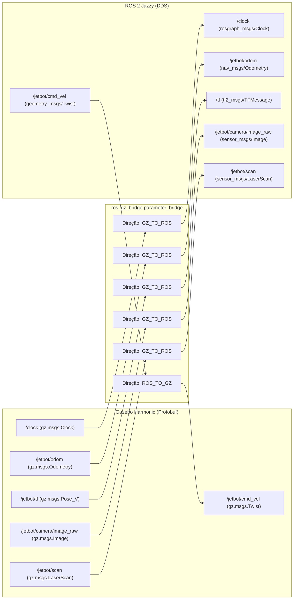

# 🌉 Configuração da Ponte ros_gz_bridge (`bridge.yaml`)

> Mapeamento de mensagens e tipos de dados bidirecionais entre o Gazebo Harmonic e o ecossistema de nós do ROS 2 Jazzy.

---

## 🎯 O Papel do `ros_gz_bridge`

No Gazebo Harmonic, o simulador não roda nós ROS 2 internamente. Ele possui seu próprio middleware baseado no **Ignition Transport (GZ Transport)** com serialização Protobuf (`gz.msgs`).

O pacote [ros_gz_bridge](https://github.com/gazebosim/ros_gz) atua como o tradutor de alta performance entre os dois mundos. O arquivo [gazebo_gz/config/bridge.yaml](file:///home/lucaschristen/Documentos/jetbot_ros-master/gazebo_gz/config/bridge.yaml) define estritamente quais canais devem ser convertidos, garantindo **baixo overhead de CPU e latência mínima de serialização**.



---

## 📜 Especificação Completa do Mapeamento

```yaml
# 1. Relógio de Simulação (Sincronização estrita de timestamp)
- ros_topic_name: "/clock"
  gz_topic_name: "/clock"
  ros_type_name: "rosgraph_msgs/msg/Clock"
  gz_type_name: "gz.msgs.Clock"
  direction: GZ_TO_ROS

# 2. Comando de Velocidade Linear e Angular dos Motores
- ros_topic_name: "/jetbot/cmd_vel"
  gz_topic_name: "/jetbot/cmd_vel"
  ros_type_name: "geometry_msgs/msg/Twist"
  gz_type_name: "gz.msgs.Twist"
  direction: ROS_TO_GZ

# 3. Odometria Integrada do DiffDrive
- ros_topic_name: "/jetbot/odom"
  gz_topic_name: "/jetbot/odom"
  ros_type_name: "nav_msgs/msg/Odometry"
  gz_type_name: "gz.msgs.Odometry"
  direction: GZ_TO_ROS

# 4. Transformadas Dinâmicas da Árvore de Coordenadas
- ros_topic_name: "/tf"
  gz_topic_name: "/jetbot/tf"
  ros_type_name: "tf2_msgs/msg/TFMessage"
  gz_type_name: "gz.msgs.Pose_V"
  direction: GZ_TO_ROS

# 5. Fluxo de Vídeo RGB da Câmera Frontal
- ros_topic_name: "/jetbot/camera/image_raw"
  gz_topic_name: "/jetbot/camera/image_raw"
  ros_type_name: "sensor_msgs/msg/Image"
  gz_type_name: "gz.msgs.Image"
  direction: GZ_TO_ROS

# 6. Metadados e Matriz de Calibração Intrínsica da Câmera
- ros_topic_name: "/jetbot/camera/camera_info"
  gz_topic_name: "/jetbot/camera/camera_info"
  ros_type_name: "sensor_msgs/msg/CameraInfo"
  gz_type_name: "gz.msgs.CameraInfo"
  direction: GZ_TO_ROS

# 7. Varredura Planar 360° do GPU LiDAR
- ros_topic_name: "/jetbot/scan"
  gz_topic_name: "/jetbot/scan"
  ros_type_name: "sensor_msgs/msg/LaserScan"
  gz_type_name: "gz.msgs.LaserScan"
  direction: GZ_TO_ROS
```

---

## ⚙️ Decisões Críticas de Arquitetura

### 1. `use_sim_time: True` Obrigatório
Como o tópico `/clock` é transmitido para o ROS 2 com direção `GZ_TO_ROS`, todos os nós clientes (`race_follower.py`, `rviz2`, `tf2_ros`) executam com o parâmetro `use_sim_time:=true`.
* **Benefício:** Se o computador sofrer lentidão e o simulador rodar a $0.5\times$ da velocidade real (*Real Time Factor* reduzido), o controlador de corrida, os cálculos de odometria e os filtros de LaserScan continuam perfeitamente sincronizados sem distorção temporal.

### 2. Direção Unidirecional Específica
Diferente de pontes bidirecionais ingênuas (`BIDIRECTIONAL`), a declaração estrita (`GZ_TO_ROS` ou `ROS_TO_GZ`) impede loops infinitos de retransmissão e reduz o consumo de banda de rede de loopback.

---

## 🔗 Próxima Leitura
* [[🗺️ Gerador Procedural de Circuitos Fechados (gen_track.py)|🗺️ Como circuitos fechados são gerados parametricamente]]
* [[👁️ Cenas e Mundos de Simulacao (Worlds SDF)|👁️ Catálogo de mundos e pistas disponíveis]]
