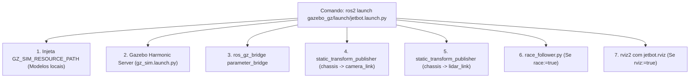

# 🌐 Orquestrador de Launch Unificado (`jetbot.launch.py`)

> Análise técnica do arquivo de inicialização em Python responsável por subir o motor físico do Gazebo, a ponte de comunicação de tópicos, as transformadas TF estáticas, o visualizador RViz2 e o nó de corrida autônoma.

---

## 🎯 Arquitetura do Arquivo de Launch

O arquivo [gazebo_gz/launch/jetbot.launch.py](file:///home/lucaschristen/Documentos/jetbot_ros-master/gazebo_gz/launch/jetbot.launch.py) consolida em um único ponto de entrada toda a orquestração do ecossistema de simulação:



---

## 🎛️ Tabela de Argumentos de Linha de Comando

O script declara 7 argumentos flexíveis via `DeclareLaunchArgument`:

| Argumento | Padrão | Tipo | Descrição |
| :--- | :---: | :---: | :--- |
| **`world`** | `jetbot_empty.sdf` | String | Arquivo de mundo localizado na pasta `gazebo_gz/worlds/` (ex: `track.sdf`, `monaco.sdf`, `maze.sdf`). |
| **`rviz`** | `true` | Booleano | Se verdadeiro, abre o RViz2 com o perfil pré-configurado de sensores. |
| **`gui`** | `true` | Booleano | Se falso, roda o Gazebo em modo **headless** (`-s`), economizando CPU/GPU para treinos rápidos. |
| **`race`** | `false` | Booleano | Se verdadeiro, inicializa o nó autônomo de corrida [race_follower.py](file:///home/lucaschristen/Documentos/jetbot_ros-master/gazebo_gz/scripts/race_follower.py). |
| **`min_lap_distance`** | `10.0` | Float | Distância mínima em metros para validar uma volta fechada via odometria. |
| **`v_max`** | `0.8` | Float | Limite de velocidade linear máxima do robô durante a corrida ($0.8\text{ m/s} \approx 2.88\text{ km/h}$). |
| **`v_start`** | `0.3` | Float | Velocidade linear inicial de exploração na primeira volta da pista ($0.3\text{ m/s}$). |

---

## 🔍 Detalhamento dos Componentes do Launch

### 1. Injeção de Recursos Locais
Para que diretivas como `<uri>model://jetbot</uri>` ou `<uri>model://monaco_track</uri>` sejam resolvidas sem necessidade de instalar modelos na pasta global do sistema:
```python
AppendEnvironmentVariable('GZ_SIM_RESOURCE_PATH', os.path.join(GZ_DIR, 'models'))
```

### 2. Suporte Transparente a Modo Headless
O launch avalia o parâmetro `gui` através de condições `IfCondition` e `UnlessCondition`:
* Com GUI (`gui:=true`): passa os argumentos `['-r ', world_path]` (executa com renderizador gráfico 3D).
* Sem GUI (`gui:=false`): passa `['-r -s ', world_path]`, desativando a janela do Gazebo para execução em servidores remotos ou pipelines de CI/CD.

### 3. Publicação de Transformadas Estáticas (TF2)
Garante que a árvore de coordenadas (`tf_tree`) esteja matematicamente conectada para o RViz e o algoritmo de navegação:
```python
# Câmera: montada a 55mm à frente e 85.7mm acima do centro, pitch de 0.25 rad
Node(
    package='tf2_ros',
    executable='static_transform_publisher',
    name='tf_chassis_camera',
    arguments=['--x', '0.055', '--y', '0', '--z', '0.0857',
               '--roll', '0', '--pitch', '0.25', '--yaw', '0',
               '--frame-id', 'chassis', '--child-frame-id', 'camera_link'],
    parameters=[{'use_sim_time': True}],
)

# LiDAR: montado no centro exato do chassi, 199mm acima do solo
Node(
    package='tf2_ros',
    executable='static_transform_publisher',
    name='tf_chassis_lidar',
    arguments=['--x', '0', '--y', '0', '--z', '0.199',
               '--roll', '0', '--pitch', '0', '--yaw', '0',
               '--frame-id', 'chassis', '--child-frame-id', 'lidar_link'],
    parameters=[{'use_sim_time': True}],
)
```

### 4. Extração Dinâmica do ID da Pista para o Controlador de Corrida
O launch extrai o identificador da pista do argumento `world` (ex: `track.sdf` $\to$ `track`) para que o `race_follower` salve e recarregue o perfil de velocidade correto no diretório `~/.jetbot_race/`:
```python
ExecuteProcess(
    cmd=['python3', os.path.join(GZ_DIR, 'scripts', 'race_follower.py'), '--ros-args',
         '-p', 'use_sim_time:=true',
         '-p', ['min_lap_distance:=', LaunchConfiguration('min_lap_distance')],
         '-p', ['v_max:=', LaunchConfiguration('v_max')],
         '-p', ['v_start:=', LaunchConfiguration('v_start')],
         '-p', ['track_id:=', PythonExpression(["'", world, "'.rsplit('.', 1)[0]"])]],
    condition=IfCondition(race),
    output='screen',
)
```

---

## ⚡ Exemplos Práticos de Uso

```bash
# 1. Modo Estudo / Teleoperação manual:
ros2 launch gazebo_gz/launch/jetbot.launch.py world:=track.sdf
# Em outro terminal:
ros2 run teleop_twist_keyboard teleop_twist_keyboard --ros-args -r /cmd_vel:=/jetbot/cmd_vel

# 2. Modo Corrida Autônoma em Mônaco com velocidade agressiva:
ros2 launch gazebo_gz/launch/jetbot.launch.py world:=monaco.sdf race:=true v_max:=1.0 min_lap_distance:=50.0

# 3. Modo Treino em Background (Sem janelas de GUI para economizar 100% de GPU):
ros2 launch gazebo_gz/launch/jetbot.launch.py world:=track2.sdf gui:=false rviz:=false race:=true
```

---

## 🔗 Próxima Leitura
* [[🌉 Configuracao da Ponte ros_gz_bridge (bridge.yaml)|🌉 Como os tópicos são traduzidos pelo parameter_bridge]]
* [[🏎️ Controlador de Corrida Autonoma (race_follower.py)|🏎️ Como o algoritmo de corrida controla o veículo em pista fechada]]
