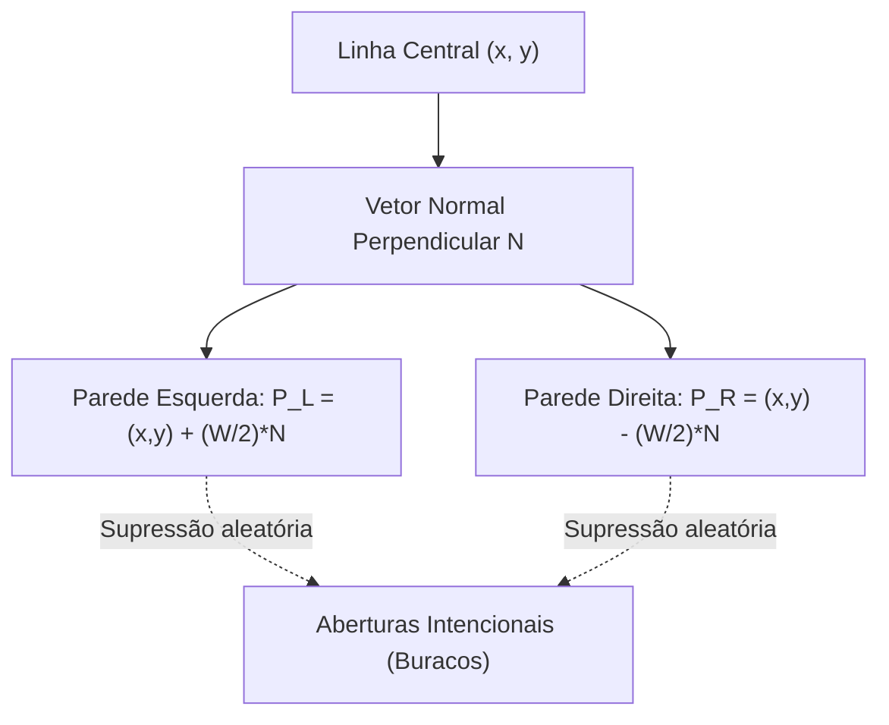

# 🗺️ Gerador Procedural de Circuitos Fechados (`gen_track.py`)

> Algoritmo matemático para síntese automática de autódromos em formato SDF com pistas aleatórias por séries de Fourier, réplica em escala do Circuito de Mônaco e desníveis tridimensionais.

---

## 🎯 O Desafio de Generalização em Driverless

No regulamento do **Formula Student Driverless (FSD)**, o traçado da prova dinâmica é **completamente desconhecido** até o momento da largada. Se os algoritmos de controle forem testados em apenas uma pista fixa, eles sofrerão sobreajuste (*overfitting*).

O script [gazebo_gz/scripts/gen_track.py](file:///home/lucaschristen/Documentos/jetbot_ros-master/gazebo_gz/scripts/gen_track.py) resolve esse problema gerando instantaneamente infinitas variações de autódromos fechados com paredes delimitadoras, largada alinhada, rampas e aberturas controladas.

---

## 📐 Síntese Matemática da Linha Central

O gerador suporta dois modos fundamentais de criação da geometria central:

### 1. Curvas Fechadas por Harmônicos Baixos de Fourier (`--layout random`)
Para garantir uma curva contínua fechada $C^2$ que nunca se autointercepta, o raio polar $r(t)$ é modelado pela superposição de harmônicos baixos sobre um raio base $R$:

$$r(t) = R \cdot \left( 1 + \sum_{k=2}^{4} A_k \cdot \cos(k \cdot t + \phi_k) \right), \quad t \in [0, 2\pi]$$

* $A_k \sim \text{Uniform}\left(\frac{0.05}{k-1}, \frac{0.22}{k-1}\right)$: Amplitudes decrescentes com a ordem harmônica para manter a pista suave e dirigível.
* $\phi_k \sim \text{Uniform}(0, 2\pi)$: Fases aleatórias derivadas da `--seed`.
* As coordenadas cartesianas $(x, y)$ são extraídas e discretizadas em $N$ pontos equidistantes:
  $$x(t) = r(t) \cdot \cos(t), \quad y(t) = r(t) \cdot \sin(t)$$

### 2. Layout Clássico de Mônaco em Escala (`--layout monaco`)
O gerador embute uma tabela de waypoints históricos do lendário circuito de rua de Mônaco (Mirabeau, Fairmont Hairpin, Túnel, Chicane do Porto, Rascasse). Os pontos são suavizados por interpolação de splines cúbicos e normalizados para a escala do JetBot com comprimento configurável (ex: $60\text{ metros}$).

---

## 🧱 Construção das Paredes e Testes de Abertura

A partir da linha central $(x_i, y_i)$, o algoritmo calcula o vetor tangente unitário $\vec{T}_i$ e o vetor normal $\vec{N}_i$:

$$\vec{N}_i = (-T_{y,i}, \, T_{x,i})$$

As paredes laterais esquerda ($P_L$) e direita ($P_R$) são posicionadas a meia largura da pista ($W/2$):

$$P_{L,i} = (x_i, y_i) + \frac{W}{2} \cdot \vec{N}_i \qquad P_{R,i} = (x_i, y_i) - \frac{W}{2} \cdot \vec{N}_i$$



### O Desafio das Aberturas (`--openings`):
O gerador permite criar falhas aleatórias nas paredes. Isso é crucial para treinar o algoritmo [[🏎️ Controlador de Corrida Autonoma (race_follower.py)|race_follower]]:
* Quando há um buraco na parede, os feixes do LiDAR leem alcance infinito.
* Se o robô fosse guiado ingenuamente para o "espaço mais vazio", ele sairia da pista!
* O algoritmo precisa ignorar a abertura e manter a direção média do corredor via memória de rumo.

---

## 🏔️ Terreno 3D e Elevações (`--elevation`)

Com o argumento `--elevation H` ($H > 0$), a pista deixa de ser plana e ganha desníveis de subida e descida:
* As caixas das paredes e do asfalto são inclinadas no ângulo de pitch correspondente à derivada vertical $dz/ds$.
* Isso submete a suspensão diferencial e a odometria do robô aos efeitos de transferência longitudinal de peso e gravidade real.

---

## ⚡ Comandos para Geração de Pistas

```bash
cd "/home/lucaschristen/Documentos/jetbot_ros-master/gazebo_gz/scripts"

# 1. Pista aleatória padrão (Seed 1, largura 1.2m, 4 aberturas):
python3 gen_track.py --seed 1 --width 1.2 --openings 4 --out ../worlds/track.sdf

# 2. Pista ampla e de alta velocidade (Raio 5m, largura 1.8m):
python3 gen_track.py --seed 7 --radius 5 --width 1.8 --openings 0 --out ../worlds/track_fast.sdf

# 3. Réplica do Circuito de Mônaco com 60 metros de extensão e desnível de 60cm:
python3 gen_track.py --layout monaco --length 60 --width 0.9 --openings 0 --elevation 0.6 --out ../worlds/monaco.sdf
```

O script calcula e imprime automaticamente:
* **Comprimento total da linha central** (ex: `Linha central ~ 24.35 m`).
* **Sugestão de `min_lap_distance`** (ex: `Sugestão min_lap_distance: 12.18 m`) para alimentar diretamente o `jetbot.launch.py`.

---

## 🔗 Próxima Leitura
* [[👁️ Cenas e Mundos de Simulacao (Worlds SDF)|👁️ Os mundos pré-compilados disponíveis na plataforma]]
* [[🏎️ Controlador de Corrida Autonoma (race_follower.py)|🏎️ Como o robô navega pelas pistas geradas]]
