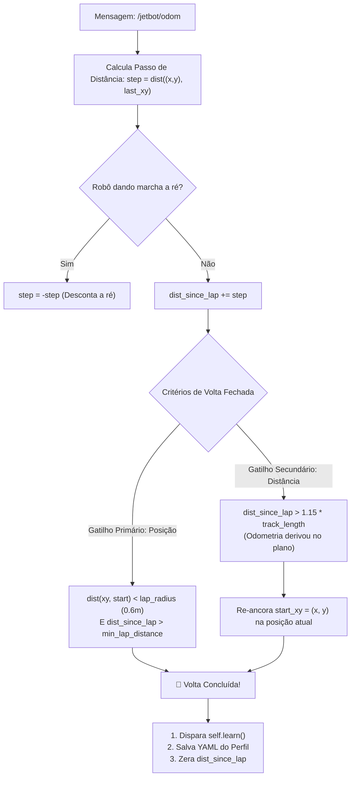

# 🎯 Estimativa de Odometria e Contador de Voltas

> Sistema de cronometragem, fusão odometria-distância e detecção redundante de linha de chegada com reancoragem automática contra deriva de esteiras.

---

## 🛑 O Desafio da Deriva Ododétrica em Robôs Reais

Em veículos autônomos sem balizas ópticas externas ou GPS RTK milimétrico, a posição estimada do robô $(x, y)$ é calculada pela integração da rotação dos encoders das rodas:

$$x(t) = \int v(t) \cdot \cos(\theta(t)) \, dt \qquad y(t) = \int v(t) \cdot \sin(\theta(t)) \, dt$$

Ao longo de várias voltas, o escorregamento microscópico dos pneus acumula um erro contínuo de posição conhecido como **deriva ododétrica (*odometry drift*)**. 
* Se um sistema depender exclusivamente de voltar às coordenadas originais $(0, 0)$ para fechar a volta, após 3 ou 4 voltas o carro pode passar exatamente pelo pórtico físico de largada, mas o computador acreditará que está a $1.5\text{ metros}$ de distância!
* Como consequência, o sistema nunca fecharia a volta e travaria o aprendizado.

Para superar essa limitação, Lucas Christen projetou um **Mecanismo Duplo e Redundante de Detecção de Volta**.

---

## 🔄 Mecanismo Duplo de Gatilho de Volta

O callback `on_odom` avalia dois critérios mutuamente independentes em cada leitura da mensagem [nav_msgs/Odometry](file:///home/lucaschristen/Documentos/jetbot_ros-master/gazebo_gz/scripts/race_follower.py):



---

## 📐 Análise Detalhada dos Gatilhos

### 1. Gatilho Primário por Proximidade Espacial (`by_pos`)
* **Estado de Afastamento (`away_from_start`):** O robô só pode fechar a volta após ter se afastado a mais de duas vezes o raio de tolerância da largada ($d > 2 \cdot R$, com $R = 0.6\text{ m}$). Isso impede disparos falsos nos primeiros metros da arrancada.
* **Retorno ao Raio:** Quando a distância Euclidiana $d = \sqrt{(x - x_0)^2 + (y - y_0)^2} < R$ e a distância percorrida na volta for superior a `min_lap_distance` (para não confundir retornos em ré), a volta é completada.

### 2. Gatilho Secundário por Fallback de Distância (`by_dist`)
Na primeira volta, o robô memoriza o comprimento real da pista:
$$\text{track\_length} = s_{\text{volta 1}}$$
Se nas voltas subsequentes a odometria derivar e a coordenada de retorno nunca entrar no círculo de $0.6\text{ m}$ da largada, o gatilho de distância desarma o travamento:
$$s_{\text{volta}} > 1.15 \times \text{track\_length}$$
* **A Sacada da Reancoragem Dinâmica:**
  Quando a volta fecha por distância, o código executa:
  ```python
  self.start_xy = (x, y)  # Re-ancora a largada na posição atual
  ```
  Isso recalibra o centroide da largada para a posição presente, absorvendo toda a deriva acumulada nas voltas seguintes sem perda de continuidade!

---

## ⏪ Compensação de Marcha a Ré

Durante manobras de emergência em colisões ou becos sem saída, se o robô simplesmente somasse a distância percorrida em ré, ele acreditaria ter percorrido mais pista do que a realidade física:

```python
step = math.dist((x, y), self.last_xy)
if msg.twist.twist.linear.x < 0:
    step = -step  # Ré desconta a distância percorrida!
self.dist_since_lap = max(0.0, self.dist_since_lap + step)
```

Essa compensação matemática preserva a coerência do índice espacial dos trechos de $0.5\text{ m}$ ([[📈 Aprendizado Espacial de Velocidade por Trecho (AIMD Profiling)|AIMD Profiling]]), garantindo que os trechos continuem alinhados com o traçado real da pista.

---

## 📊 Estatísticas e Término de Sessão

Ao fechar cada volta, o nó publica um log estruturado informando:
* Tempo da volta atual em segundos de tempo de simulação (`sim_time`).
* Melhor volta da sessão (*Personal Best*).
* Quantidade de trechos mapeados.
* Verificação do limite de voltas da sessão (`max_laps`). Se `max_laps > 0` for atingido, o robô para suavemente e desliga os atuadores.

---

## 🔗 Próxima Leitura
* [[🔌 Camada de Atuacao e Motores Reais (I2C HATs)|🔌 Passando da simulação para a bancada física do JetBot]]
* [[🧠 Coleta de Dados e Navegacao por Deep Learning|🧠 Treinamento de redes neurais para direção visual]]
