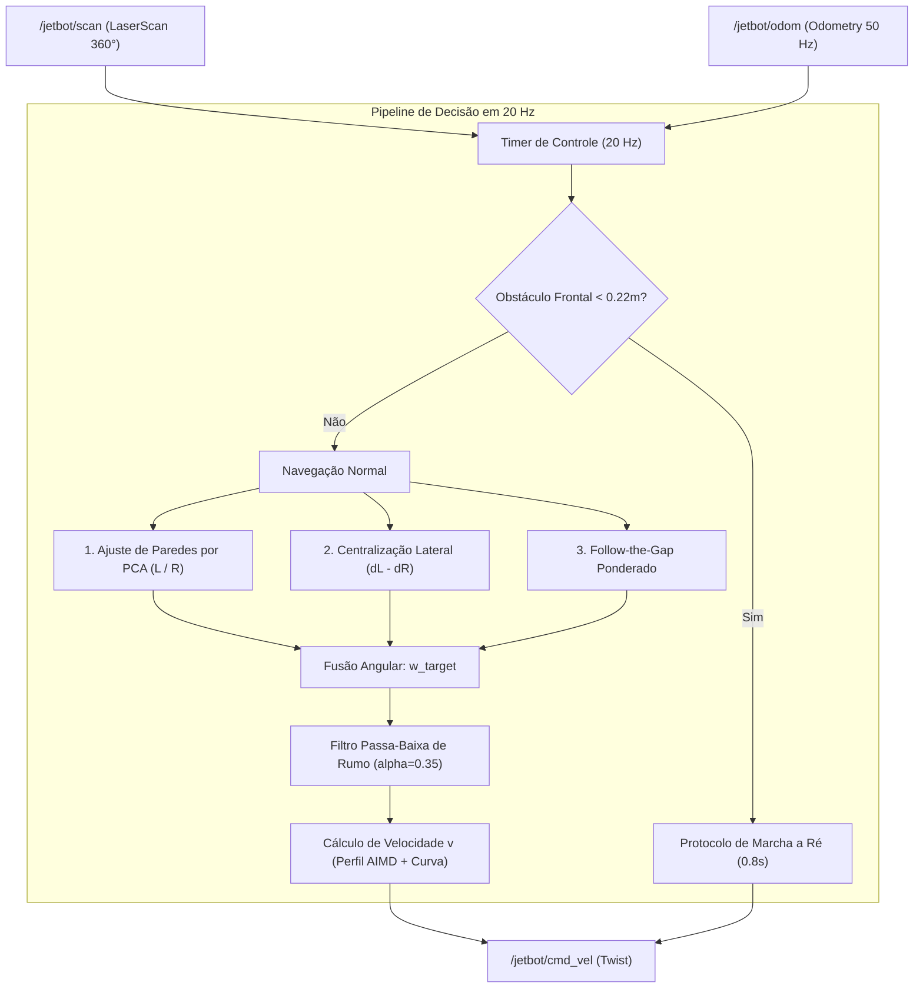

# 🏎️ Controlador de Corrida Autônoma (`race_follower.py`)

> Arquitetura do nó de direção reativa em tempo real com regressão de paredes por PCA, fusão Follow-the-Gap, amortecimento passa-baixa e protocolo de manobra reflexiva de emergência.

---

## 🎯 Objetivo e Topologia do Nó

O nó [gazebo_gz/scripts/race_follower.py](file:///home/lucaschristen/Documentos/jetbot_ros-master/gazebo_gz/scripts/race_follower.py) foi desenvolvido para vencer a prova dinâmica de pista fechada desconhecida (ambientes delimitados por paredes ou cones dos dois lados com aberturas intencionais):

---

## 📐 1. Detecção e Ajuste de Paredes por PCA (`wall_fit`)

Em vez de aplicar algoritmos pesados de RANSAC iterativo em 360 pontos, Lucas implementou **Análise de Componentes Principais (PCA)** com janela local delimitada no frame do robô:

* **Janela de Filtragem:** $x \in [-0.3, 1.5]\text{ m}$ à frente, $0.05 < |y| \le 2.0\text{ m}$ nas laterais.
* **Separação:** Pontos com $y > 0$ formam a nuvem esquerda ($P_L$), e $y < 0$ a nuvem direita ($P_R$).

### Dedução da Direção Principal por PCA:
Calcula-se o baricentro $(\bar{x}, \bar{y})$ e as covariâncias amostrais da nuvem:
$$S_{xx} = \sum (x_i - \bar{x})^2, \quad S_{yy} = \sum (y_i - \bar{y})^2, \quad S_{xy} = \sum (x_i - \bar{x})(y_i - \bar{y})$$

O autovetor principal da matriz de covariância define o ângulo de inclinação da parede:
$$\theta = \frac{1}{2} \operatorname{atan2}(2 S_{xy}, \, S_{xx} - S_{yy})$$
* O algoritmo garante que o vetor aponte sempre para frente no semiplano $+X$ ($\cos(\theta) \ge 0$).

### Distância Perpendicular ao Chassi:
A distância ortogonal da origem do robô até a reta que passa por $(\bar{x}, \bar{y})$ com ângulo $\theta$ é dada por:
$$d = \left| -\sin(\theta) \cdot \bar{x} + \cos(\theta) \cdot \bar{y} \right|$$

---

## ⚖️ 2. Centralização Dinâmica & Memória de Aberturas

Com as distâncias $d_L$ e $d_R$ calculadas:
1. **Direção Média do Corredor:** $\theta_{corridor} = \frac{\theta_L + \theta_R}{2}$.
2. **Correção de Rumo (*Heading*):** $w_{heading} = k_{heading} \cdot \theta_{corridor}$ com $k_{heading} = 2.0\text{ rad/s/rad}$.
3. **Erro Lateral de Centro:** $e_{lat} = d_L - d_R$.
4. **Correção de Centralização:** $w_{center} = k_{center} \cdot e_{lat}$ com $k_{center} = 1.5\text{ rad/s/m}$.

### A Sacada da Memória Lateral (`side_memory_time`):
Quando uma parede acaba temporariamente (ex: abertura na pista gerada pelo `gen_track.py`), a nuvem daquele lado cai abaixo de 6 pontos (`wall_min_points`). 
* O robô **armazena o último valor válido de distância por até $2.0\text{ segundos}$**.
* O ganho $k_{center}$ é atenuado em $50\%$ para evitar puxões bruscos para o lado aberto.

---

## 🕳️ 3. Follow-the-Gap Inteligente com Penalização de Infinito

O algoritmo varre o setor frontal $\pm 75^\circ$ em busca de feixes livres ($r_i > 0.8\text{ m}$) com largura mínima de $10^\circ$.

Para selecionar o melhor vão entre múltiplos candidatos, cada gap recebe uma pontuação (*score*):

$$\text{Score} = N_{feixes} \cdot \text{profundidade} \cdot \max\left(0.1, \, \cos(\theta_{gap} - \theta_{corridor})\right) \cdot \text{penalidade}$$

* **Alinhamento:** Favorece brechas que apontem para a mesma direção da linha média do corredor.
* **Penalidade de Infinito (`gap_inf_penalty = 0.3`):** Se mais de $50\%$ dos pontos do gap medirem alcance máximo ($r \ge r_{max}$), trata-se de um buraco para fora da pista! O score é cortado em $70\%$.
* **Ponderação Adaptativa:** Se houver obstáculo frontal ($d_{frente} < 1.2\text{ m}$), o peso do gap salta de $0.3$ para $1.0$, assumindo prioridade absoluta para desviar da colisão.

---

## 🚨 4. Protocolo de Manobra Reflexiva de Emergência

Se um obstáculo se aproximar a menos de $0.22\text{ m}$ (`stop_distance`):
1. O controlador interrompe imediatamente o avanço.
2. Analisa a soma dos alcances nos setores laterais ($[20^\circ, 90^\circ]$ vs $[-90^\circ, -20^\circ]$) para identificar qual lado tem mais espaço livre.
3. Aciona marcha a ré ($v = -0.15\text{ m/s}$) durante $0.8\text{ segundos}$, girando o volante no sentido inverso para afastar a frente do obstáculo.
4. Sinaliza o trecho no histórico de aprendizado (`self.seg_reverse[cur_seg] = True`) para que a velocidade seja severamente reduzida na próxima volta.

---

## 🌊 5. Filtro Passa-Baixa de Rumo (`heading_alpha`)

O comando de velocidade angular bruto $w_{target} = w_{heading} + w_{center} + w_{gap}$ passa por um filtro de média móvel exponencial de 1ª ordem:

$$w_{cmd}(t) = (1 - \alpha) \cdot w_{cmd}(t - \Delta t) + \alpha \cdot w_{target}, \quad \alpha = 0.35$$

* Elimina trepidações (*chattering*) de alta frequência provocadas por ruídos de medição do laser, garantindo esterçamento contínuo e suave.

---

## 🔗 Próxima Leitura
* [[📈 Aprendizado Espacial de Velocidade por Trecho (AIMD Profiling)|📈 Como o robô aprende onde acelerar e onde frear a cada volta]]
* [[🎯 Estimativa de Odometria e Contador de Voltas|🎯 Como as voltas são computadas e a linha de largada é detectada]]
