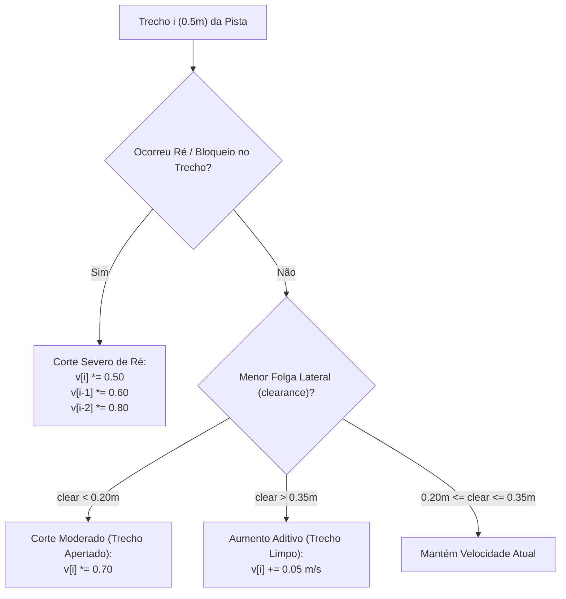

# 📈 Aprendizado Espacial de Velocidade por Trecho (AIMD Profiling)

> Algoritmo de memorização de circuito, ajuste de velocidade por trechos espaciais com política AIMD assimétrica e cálculo de frenagem antecipada cinemática.

---

## 🎯 O Conceito de Aprendizado em Pista Desconhecida

Na prova de *Trackdrive* do Formula Student Driverless, o protótipo percorre 10 voltas consecutivas. Na **1ª volta**, a pista é desconhecida e o veículo deve andar cautelosamente para mapear o terreno. A partir da **2ª volta**, o carro deve acelerar progressivamente nas retas e frear com precisão nas curvas para baixar o tempo de volta.

Lucas Christen implementou o **Aprendizado Espacial de Nível 1** em [race_follower.py](file:///home/lucaschristen/Documentos/jetbot_ros-master/gazebo_gz/scripts/race_follower.py), combinando:
1. Discretização espacial da pista em segmentos fixos de $0.5\text{ metros}$.
2. Heurística **AIMD** (*Additive Increase Multiplicative Decrease*) adaptada do controle de congestionamento de redes.
3. Propagação retroativa de desaceleração (*Backwards Braking Pass*).

---

## 📏 Discretização Espacial Indexada por Odometria

Em vez de indexar a velocidade pelo tempo $t$, a pista é discretizada pela **distância percorrida ao longo da volta $s$**:

$$i = \left\lfloor \frac{s}{\text{seg\_len}} \right\rfloor, \quad \text{seg\_len} = 0.50\text{ m}$$

* **Volta 1:** O comprimento total da pista é desconhecido. O vetor `self.profile` cresce dinamicamente conforme o robô avança, inicializando cada novo trecho com a velocidade base $v_{start} = 0.30\text{ m/s}$.
* **Fim da Volta 1 (Seed por Curvatura):**
  O algoritmo calcula a curvatura média $\bar{\kappa}_i$ de cada segmento baseada na razão entre o giro angular e a velocidade linear:
  $$\kappa = \frac{|w|}{v} \quad [\text{m}^{-1}]$$
  Se $\bar{\kappa}_i < 0.25\text{ m}^{-1}$ (o que corresponde a um raio de curvatura $R = 1/\kappa > 4.0\text{ metros}$, ou seja, uma reta nítida), o segmento recebe imediatamente um bônus de incentivo:
  $$v_i \leftarrow v_i + \text{straight\_bonus} \quad (+0.10\text{ m/s})$$

---

## 🔄 A Heurística de Atualização AIMD Assimétrica

Ao completar cada volta, o método `learn()` analisa as estatísticas coletadas em cada trecho $i$ para atualizar o perfil da volta seguinte:



### 1. Penalização Propagada por Marcha a Ré (`learn_down_reverse = 0.5`)
Se o robô bateu ou precisou dar ré no segmento $i$, significa que ele chegou excessivamente rápido naquele ponto.
* A velocidade no ponto de impacto é cortada pela metade: $v_i \leftarrow v_i \times 0.5$.
* **Propagação para trás:** Para evitar que o robô atinja o ponto de impacto no embalo, os **dois trechos imediatamente anteriores** também são punidos:
  $$v_{i-1} \le v_{i-1} \times 0.60 \qquad v_{i-2} \le v_{i-2} \times 0.80$$

### 2. Punição por Proximidade Crítica (`clear_tight = 0.20m`)
Se o feixe de laser mais próximo mediu menos de $20\text{ cm}$ das paredes em qualquer ponto do trecho:
$$v_i \leftarrow \min(v_i, \, v_i \times 0.70)$$

### 3. Aceleração Progressiva em Trechos Limpos (`clear_ok = 0.35m`)
Se o robô contornou o trecho com ampla folga ($> 35\text{ cm}$ de distância das paredes de ambos os lados):
$$v_i \leftarrow \min(v_i + 0.05, \, v_{max})$$

---

## 🛑 Física da Frenagem Antecipada (Lookahead Cinemático)

Aumentar a velocidade das retas introduz o risco do robô "entrar quente" no final da reta e não conseguir frear a tempo para a tomada de curva.

Para garantir segurança ativa sem ultrapassar a aderência dos pneus, o método `target_speed(dist)` calcula a **frenagem cinemática antecipada** olhando para os trechos futuros $j$ à frente:

```python
def target_speed(self, dist):
    i = self.seg_index(dist)
    v = self.profile[i]
    n = self.n_seg()
    a = self.g('brake_decel')  # 1.0 m/s^2
    look_m = self.g('v_max') ** 2 / (2 * a) + 2 * self.seg_len

    j = 1
    while (j * self.seg_len - self.seg_len) < look_m:
        d = (i + j) * self.seg_len - dist  # Distância até o início do trecho i+j
        vj = self.profile[(i + j) % n]     # Velocidade admitida no trecho à frente
        
        # Equação de Torricelli para desaceleração controlada
        v = min(v, math.sqrt(vj * vj + 2 * a * d))
        j += 1
    return v, i
```

$$\forall j > 0, \quad v_{atual} \le \sqrt{v_{trecho, j}^2 + 2 \cdot a_{brake} \cdot d_j}$$

* Se um grampo apertado a 3 metros exige $0.20\text{ m/s}$, a reta inteira começará a frear suavemente antes da entrada da curva a uma desaceleração controlada $a_{brake} = 1.0\text{ m/s}^2$.

---

## 💾 Persistência do Perfil em Disco (`~/.jetbot_race/`)

A cada volta concluída, os dados consolidados são gravados em arquivo YAML:

```yaml
track_id: track
seg_len: 0.5
track_length: 24.35
laps: 6
best_lap_time: 32.4
profile:
  - 0.55
  - 0.60
  - 0.75  # Reta principal acelerando
  - 0.35  # Frenagem antecipada antes da chicane
  - 0.25  # Curva lenta
```

Ao reiniciar o simulador com `load_profile:=true`, o robô já inicia a sessão com o mapa de velocidades ótimo memorizado, eliminando a volta de aquecimento lenta!

---

## 🔗 Próxima Leitura
* [[🎯 Estimativa de Odometria e Contador de Voltas|🎯 Detalhes da cronometragem e detecção de fechamento de voltas]]
* [[🔌 Camada de Atuacao e Motores Reais (I2C HATs)|🔌 Conexão com os motores físicos do JetBot]]
