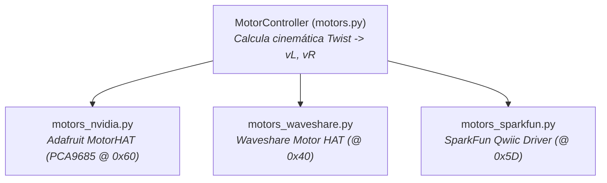

# 🔌 Camada de Atuação e Motores Reais (I2C HATs)

> Implementação da camada de abstração de hardware (HAL) para acionamento de motores DC reais via I2C, compensação de trim e display OLED de diagnóstico.

---

## 🎯 Da Simulação ao Chassi Físico

Enquanto o Gazebo utiliza o plugin de software `DiffDrive`, o robô físico JetBot (equipado com um módulo NVIDIA Jetson Nano / Orin Nano) controla seus motores elétricos através de shields de expansão (**Motor HATs**) conectados ao barramento **I2C-1**.

O módulo [jetbot_ros/motors.py](file:///home/lucaschristen/Documentos/jetbot_ros-master/jetbot_ros/motors.py) define a classe abstrata base `MotorController`, padronizando a conversão cinemática de mensagens ROS 2 `geometry_msgs/Twist` para comandos físicos de modulação por largura de pulso (**PWM**).

---

## 📐 Cinemática Inversa de Tração Diferencial

Dada uma velocidade linear longitudinal $v_x$ e uma taxa de rotação angular $w_z$ recebidas no tópico `/jetbot/cmd_vel`:

$$v_L = v_x - \frac{w_z \cdot L}{2} \qquad v_R = v_x + \frac{w_z \cdot L}{2}$$

* **Bitola entre Rodas ($L$):** $0.1016\text{ m}$ ($4\text{ polegadas}$).
* **Diâmetro da Roda ($D$):** $0.060325\text{ m}$ ($2 \frac{3}{8}\text{ polegadas}$).
* **Velocidade Máxima dos Motores:** Com rotação máxima nominal de $200\text{ RPM}$:
  $$v_{max} = \frac{200}{60} \cdot 2\pi \cdot \frac{D}{2} \approx 0.631\text{ m/s}$$

As velocidades $v_L$ e $v_R$ são normalizadas no intervalo $[-1.0, \, +1.0]$ e convertidas para inteiros de PWM de 8 bits ($0 \sim 255$).

---

## 🎛️ Suporte a Múltiplos Fabricantes de Motor HAT

A arquitetura orientada a objetos permite trocar o hardware físico sem alterar o software de controle:



### Implementação NVIDIA / Adafruit (`motors_nvidia.py`):
Utiliza o controlador I2C **PCA9685** integrado com ponte H dupla **TB6612FNG**:
```python
def _set_pwm(self, motor, value, trim):
    # Aplica trim de alinhamento e converte [-1, 1] para PWM 0..255
    pwm = int(min(max((abs(value) + trim) * self.max_pwm, 0), self.max_pwm))
    self.motors[motor].setSpeed(pwm)
    
    # Comuta direção do enrolamento (FORWARD / BACKWARD / RELEASE)
    if value > 0:
        cmd = Adafruit_MotorHAT.FORWARD
    elif value < 0:
        cmd = Adafruit_MotorHAT.BACKWARD
    else:
        cmd = Adafruit_MotorHAT.RELEASE
        
    self.motors[motor].run(cmd)
```

### Calibração e Trims de Fábrica:
Motores DC de corrente contínua baratos raramente giram na mesma velocidade sob a mesma tensão. Os parâmetros dinâmicos `left_trim` e `right_trim` permitem ajustar o deslocamento em linha reta através do serviço de parâmetros do ROS 2:
```bash
ros2 param set /jetbot/motors left_trim 0.05
```

---

## 📟 Display de Diagnóstico OLED SSD1306 (`oled.py`)

O robô embarca uma tela OLED monocromática de $128 \times 32$ pixels ([oled.py](file:///home/lucaschristen/Documentos/jetbot_ros-master/jetbot_ros/oled.py)) acionada pelo barramento I2C:
* Exibe o endereço IP da interface de rede Wi-Fi (`wlan0`) para permitir conexão SSH nos boxes sem monitor externo.
* Monitora o uso percentual de memória RAM e CPU do Jetson.
* Indica o status do nó ROS 2 de tração e modo de segurança.

---

## 🔗 Próxima Leitura
* [[🧠 Coleta de Dados e Navegacao por Deep Learning|🧠 Treinamento e inferência de redes neurais com PyTorch e TensorRT]]
* [[🏎️ Controlador de Corrida Autonoma (race_follower.py)|🏎️ Algoritmo de controle reativo por LiDAR]]
