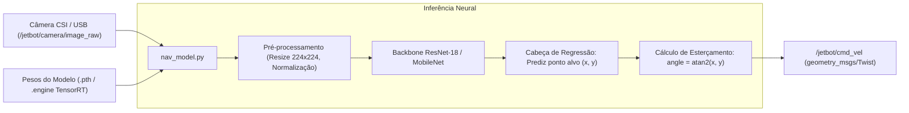

# 🧠 Coleta de Dados e Navegação por Deep Learning

> Pipeline de aquisição supervisionada de datasets de visão, treinamento de redes neurais convolucionais (CNNs) e inferência em tempo real acelerada por TensorRT no nó `nav_model`.

---

## 🎯 Da Condução Reativa ao End-to-End Deep Learning

Além do controle reativo por feixes de LiDAR ([[🏎️ Controlador de Corrida Autonoma (race_follower.py)|race_follower.py]]), a plataforma JetBot ROS 2 suporta **direção autônoma baseada exclusivamente em visão computacional (End-to-End Vision Driving)** através de Redes Neurais Convolucionais.

Esse módulo funciona como o laboratório de prototipagem para os modelos de visão profunda que detectam cones azuis/amarelos no monoposto real da UTForce.



---

## 📸 Pipeline de Coleta de Dados (`data_collection.py`)

O script [jetbot_ros/data_collection.py](file:///home/lucaschristen/Documentos/jetbot_ros-master/jetbot_ros/data_collection.py) orquestra a captura de imagens durante a teleoperação manual do robô:

1. **Classificação Binária (Desvio de Colisão):**
   * Salva os frames nas pastas `free/` (pista desobstruída à frente) e `blocked/` (obstáculo ou barreira de cones próxima).
2. **Regressão Contínua (Seguimento de Linha / Trajetória):**
   * O operador clica no ponto ideal da imagem para onde o robô deveria se deslocar.
   * O arquivo é gravado no disco com as coordenadas normalizadas no nome:
     `xy_{X}_{Y}_{UUID}.jpg`, onde $X, Y \in [-1.0, \, +1.0]$.

### Inicialização do Nó de Coleta:
```bash
ros2 launch jetbot_ros data_collection.launch.py output_dir:=~/meu_dataset/
```

---

## 🔬 O Nó de Navegação Neural (`nav_model.py`)

Em operação autônoma, o nó [nav_model.py](file:///home/lucaschristen/Documentos/jetbot_ros-master/jetbot_ros/nav_model.py) subscreve o tópico de imagem da câmera e executa a inferência:

```python
def image_listener(self, msg):
    # Converte a mensagem ROS Image para formato OpenCV / PIL
    img = np.frombuffer(msg.data, dtype=np.uint8).reshape(msg.height, msg.width, -1)
    if msg.encoding == 'bgr8':
        img = cv2.cvtColor(img, cv2.COLOR_BGR2RGB)
        
    # Inferência neural: prediz o ponto ótimo (x, y) na imagem
    xy = self.model.infer(PIL.Image.fromarray(img))
    
    x = xy[0]
    y = (0.5 - xy[1]) / 2.0
    
    # Converte coordenadas para o ângulo de esterçamento
    steering_angle = np.arctan2(x, y)
    
    # Gera comandos Twist proporcionais
    cmd = Twist()
    cmd.linear.x = self.get_parameter('speed_gain').value
    cmd.angular.z = -steering_angle * self.get_parameter('steering_gain').value
    self.velocity_publisher.publish(cmd)
```

---

## ⚡ Aceleração por Hardware via NVIDIA TensorRT

Para rodar inferência em mais de $60\text{ FPS}$ com baixíssimo consumo de energia na placa NVIDIA Jetson:
1. O modelo treinado em PyTorch (`.pth`) é exportado para o formato intermediário **ONNX**.
2. O compilador **TensorRT** quantiza os pesos para precisão de meia precisão em ponto flutuante (**FP16**), fundindo camadas convolucionais com ativações ReLU.
3. O nó carrega o engine binário compilado `.engine`, liberando a CPU para executar a odometria e o stack de navegação do ROS 2.

---

## 🔗 Próxima Leitura
* [[🏎️ Controlador de Corrida Autonoma (race_follower.py)|🏎️ Comparar a condução neural com o controle reativo por LiDAR]]
* [[🤖 Sistemas Autonomos e Formula Driverless|A aplicação desses conceitos no monoposto Formula SAE da UTForce]]
