# 🤖 Plataforma Autônoma JetBot ROS 2 — Visão Geral

> **Plataforma de Desenvolvimento, Simulação em Alta Fidelidade e Controle de Corrida Autônoma para Veículos em Escala**, concebida e portada por **Lucas Fernandes Christen** para os desafios de **Formula Student Driverless (FSD)** da equipe **UTForce E-Racing** (UTFPR Ponta Grossa).

---

## 📌 Identificação do Projeto & Repositório

* **Autor & Mantenedor:** Lucas Fernandes Christen
* **Repositório Local:** [jetbot_ros-master](file:///home/lucaschristen/Documentos/jetbot_ros-master)
* **Ambiente de Homologação:** Kubuntu 24.04 LTS com ROS 2 Jazzy Jalisco e Gazebo Harmonic 8.11 (`ros-jazzy-ros-gz`).
* **Upstream de Origem:** Baseado na arquitetura NVIDIA `dusty-nv/jetbot_ros` (fork `ItamarIliuk`), profundamente refatorado e modernizado por Lucas Christen para superar as descontinuações do Gazebo Classic 11 e migrar integralmente para o **Gazebo Harmonic (GZ Sim)** com novos plugins de física e ponte ROS 2.
* **Propósito de Engenharia:** Servir como o **banco de testes de software e controle reativo para o monoposto Formula Driverless da UTForce**, permitindo validar algoritmos de percepção de paredes/cones, SLAM, Follow-the-Gap e aprendizado de perfil de velocidade antes de embarcar no carro real.

---

## 🧭 Mapa da Documentação Técnica no Obsidian

```mermaid
graph TD
    Root([🤖 JetBot ROS 2 Driverless])
    
    Root --> M1["📁 01 - Arquitetura & Setup<br><i>ROS 2 Jazzy, Gazebo Harmonic & Modelo SDF</i>"]
    Root --> M2["📁 02 - Simulação & Visualização<br><i>Launch Unificado, Bridge YAML & Pistas Procedurais</i>"]
    Root --> M3["📁 03 - Controle & Corrida Autônoma<br><i>LiDAR PCA, Follow-the-Gap & Perfil AIMD</i>"]
    Root --> M4["📁 04 - Hardware Real & Deep Learning<br><i>I2C Motor HATs, OLED & Redes Neurais</i>"]
    
    M1 --> N11["[[🚀 Setup do Ambiente ROS 2 Jazzy, Gazebo Harmonic e Dependencias]]"]
    M1 --> N12["[[📦 Modelo SDF 1.9 e Fisica DART do Robo]]"]
    
    M2 --> N21["[[🌐 Orquestrador de Launch Unificado (jetbot.launch.py)]]"]
    M2 --> N22["[[🌉 Configuracao da Ponte ros_gz_bridge (bridge.yaml)]]"]
    M2 --> N23["[[🗺️ Gerador Procedural de Circuitos Fechados (gen_track.py)]]"]
    M2 --> N24["[[👁️ Cenas e Mundos de Simulacao (Worlds SDF)]]"]
    
    M3 --> N31["[[🏎️ Controlador de Corrida Autonoma (race_follower.py)]]"]
    M3 --> N32["[[📈 Aprendizado Espacial de Velocidade por Trecho (AIMD Profiling)]]"]
    M3 --> N33["[[🎯 Estimativa de Odometria e Contador de Voltas]]"]
    
    M4 --> N41["[[🔌 Camada de Atuacao e Motores Reais (I2C HATs)]]"]
    M4 --> N42["[[🧠 Coleta de Dados e Navegacao por Deep Learning]]"]
```



### 📁 01 - Arquitetura, Ambiente & Setup
1. [[🚀 Setup do Ambiente ROS 2 Jazzy, Gazebo Harmonic e Dependencias|🚀 Setup do Ambiente ROS 2 Jazzy, Gazebo Harmonic e Dependências]]: Configuração no Kubuntu 24.04, ferramentas de compilação, descontinuação do Gazebo Classic e inicialização sem colcon.
2. [[📦 Modelo SDF 1.9 e Fisica DART do Robo|📦 Modelo SDF 1.9 e Física DART do Robô]]: Especificação cinemática do chassi, malhas DAE/STL com escala $0.001$, contato esférico de roda ideal para odometria, sensores (Câmera + GPU LiDAR 360°) e plugin `gz::sim::systems::DiffDrive`.

### 📁 02 - Simulação & Visualização
1. [[🌐 Orquestrador de Launch Unificado (jetbot.launch.py)|🌐 Orquestrador de Launch Unificado (jetbot.launch.py)]]: Launch declarativo único com seleção dinâmica de mundos, flags de renderização headless, publicação de TFs estáticos de sensores e integração direta com o controlador de corrida.
2. [[🌉 Configuracao da Ponte ros_gz_bridge (bridge.yaml)|🌉 Configuração da Ponte ros_gz_bridge (bridge.yaml)]]: Mapeamento bidirecional e estrito entre tópicos nativos do Gazebo (`gz.msgs`) e mensagens ROS 2 (`/jetbot/cmd_vel`, `/jetbot/odom`, `/jetbot/scan`, `/jetbot/camera`).
3. [[🗺️ Gerador Procedural de Circuitos Fechados (gen_track.py)|🗺️ Gerador Procedural de Circuitos Fechados (gen_track.py)]]: Criação paramétrica de pistas fechadas por harmônicos de Fourier, suavização do traçado do circuito de Mônaco, rampas de elevação $H$ e aberturas controladas para teste de robustez.
4. [[👁️ Cenas e Mundos de Simulacao (Worlds SDF)|👁️ Cenas e Mundos de Simulação (Worlds SDF)]]: Catálogo dos mundos de teste: pista vazia, circuitos gerados (`track.sdf`, `track2.sdf`, `monaco.sdf`) e labirintos com obstáculos móveis (`maze.sdf`).

### 📁 03 - Controle & Corrida Autônoma (Driverless)
1. [[🏎️ Controlador de Corrida Autonoma (race_follower.py)|🏎️ Controlador de Corrida Autônoma (race_follower.py)]]: Algoritmo de direção reativo em tempo real: extração de tangentes de paredes via PCA em feixes de LiDAR, centralização dinâmica no corredor ($e_{lat} = d_L - d_R$), Follow-the-Gap ponderado e reflexo de emergência com ré e contra-esterço.
2. [[📈 Aprendizado Espacial de Velocidade por Trecho (AIMD Profiling)|📈 Aprendizado Espacial de Velocidade por Trecho (AIMD Profiling)]]: Otimização adaptativa da velocidade por trechos espaciais ($0.5\text{ m}$), heurística AIMD (aumento aditivo e corte multiplicativo), bônus de reta por curvatura $\kappa$ e algoritmo retroativo de frenagem antecipada ($v_i \le \sqrt{v_{target}^2 + 2 a_{brake} d}$).
3. [[🎯 Estimativa de Odometria e Contador de Voltas|🎯 Estimativa de Odometria e Contador de Voltas]]: Cronometragem de voltas fechadas, verificação de raio de tolerância na largada e fallback adaptativo por comprimento total estimado de pista.

### 📁 04 - Hardware Real & Deep Learning
1. [[🔌 Camada de Atuacao e Motores Reais (I2C HATs)|🔌 Camada de Atuação e Motores Reais (I2C HATs)]]: Drivers para hardware físico do JetBot (Adafruit DC Motor HAT, Waveshare, SparkFun) e controle do display OLED SSD1306 via barramento I2C.
2. [[🧠 Coleta de Dados e Navegacao por Deep Learning|🧠 Coleta de Dados e Navegação por Deep Learning]]: Pipeline de teleoperação para gravação de datasets visuais e nó de inferência com redes neurais treinadas em PyTorch/TensorRT para navegação autônoma por câmera.

---

## 🏗️ Fluxo de Arquitetura da Simulação & Controle

```
                ┌──────────────────────────────────────────────┐
                │          Gazebo Harmonic 8.11 (gz)           │
                │  - Física DART 1 ms                          │
                │  - Câmera 320x240 @ 15 Hz                    │
                │  - GPU LiDAR 360° @ 10 Hz (360 amostras)     │
                │  - DiffDrive System Plugin                   │
                └──────────────┬───────────────────────────────┘
                               │  Tópicos GZ: /jetbot/cmd_vel, /jetbot/scan, etc.
                               ▼
                ┌──────────────────────────────────────────────┐
                │          ros_gz_bridge (bridge.yaml)         │
                │  Converte GZ Topics <──> ROS 2 Topics        │
                └──────────────┬───────────────────────────────┘
                               │
            ┌──────────────────┴──────────────────┐
            ▼                                     ▼
┌───────────────────────────────┐     ┌───────────────────────────────┐
│          RViz2                │     │     race_follower.py          │
│  - Nuvem de LaserScan         │     │  1. Paredes por PCA (LiDAR)   │
│  - Imagem Câmera RGB          │     │  2. Follow-the-Gap            │
│  - Odometria / Pose TF        │     │  3. Controle Linear & Angular │
│                               │     │  4. Aprendizado Perfil AIMD   │
└───────────────────────────────┘     └──────────────┬────────────────┘
                                                     │
                                                     ▼ /jetbot/cmd_vel
                                              (Retorna ao robô)
```

---

## ⚡ Comandos Rápidos de Execução

```bash
# 1. Navegar até a raiz da plataforma
cd "/home/lucaschristen/Documentos/jetbot_ros-master"

# 2. Carregar o ambiente do ROS 2 Jazzy
source /opt/ros/jazzy/setup.bash

# 3. Lançar o simulador completo com mundo de pista e corrida autônoma ativada
ros2 launch gazebo_gz/launch/jetbot.launch.py world:=track.sdf race:=true

# 4. Lançar no circuito de Mônaco com visualizador RViz2
ros2 launch gazebo_gz/launch/jetbot.launch.py world:=monaco.sdf rviz:=true race:=true

# 5. Gerar um novo circuito fechado aleatório paramétrico
python3 gazebo_gz/scripts/gen_track.py --seed 42 --radius 5 --width 1.2 --openings 4 --out gazebo_gz/worlds/nova_pista.sdf
```

---

## 🔗 Navegação Cruzada
* 🏎️ Visão Geral da Equipe: [[🏎️ UTForce E-Racing - Visao Geral]]
* 🤖 Fundamentos de Formula Driverless: [[🤖 Sistemas Autonomos e Formula Driverless]]
* 📡 Telemetria do Carro: [[📡 Software de Telemetria UTForce - Visao Geral]]
* 🌟 Hub de Portfólio Pessoal: [[🤖 JetBot ROS - Hub Pessoal & Portfolio]]
* 📋 Central de Projetos Pessoais: [[📋 Central de Meus Projetos]]
