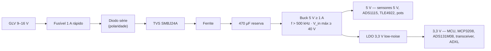
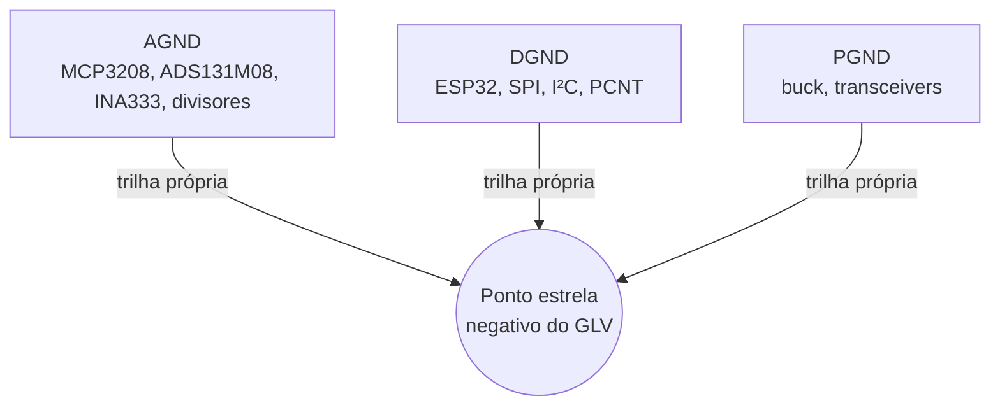

# ⚡ Alimentação Elétrica, Proteções TVS, UPS do Pi & Isolamento Galvânico

> Regulação por nó, supressão de transientes, aterramento e a peça que faltava na versão anterior: **desligamento limpo do Raspberry Pi**. Valores de [[🧭 Plano do Sistema de Telemetria (FSAE Eletrico)]] §8.

> [!info] Mudanças em relação à versão anterior
> * Cada nó tem **regulação própria** a partir do GLV. Nenhum nó alimenta outro; nenhum sensor remoto é alimentado por outro nó.
> * Fusível **1 A rápido** por nó (era PPTC 1,5 A). PPTC rearma sozinho e esconde o curto; em carro, prefere-se fusível que fica aberto e aparece no heartbeat.
> * TVS de entrada: **SMBJ24A** — o buck precisa aguentar o clamp (~39 V). Isso exclui bucks de 28 V.
> * Buck com **frequência > 500 kHz**, para o ripple ficar fora da banda dos sensores e do RC de 1,6 kHz.
> * **Raspberry Pi com UPS de supercapacitor** e sinal de desligamento. Corrupção de SD por queda de energia é a falha número um de Pi em carro.

---

## 🔌 1. Cadeia de alimentação por nó

Entrada: **9–16 V** do GLV (bateria de 12 V real sob carga, ventoinha e bomba ligando). Cada nó (VCU, VDN-Front, VDN-Rear, INU, Térmico, Logger B, Gateway LoRa) tem esta cadeia completa na própria PCB:

| Elemento | Especificação | Motivo |
| :--- | :--- | :--- |
| Fusível | 1 A, rápido, por nó | Um nó em curto não derruba os outros; fica aberto e o heartbeat some — falha visível |
| Diodo série | Schottky ≥ 2 A, ex.: SS34 | Polaridade invertida no conector não mata a placa. Queda ~0,4 V, aceitável em 9 V |
| TVS | **SMBJ24A** (standoff 24 V, clamp ≈ 39 V a 15 A) | Transientes de chaveamento do inversor e de relés. Não conduz a 16 V |
| Ferrite | 600 Ω @ 100 MHz, ≥ 2 A | Ruído > 10 MHz |
| Capacitor de reserva | 470 µF / 35 V eletrolítico de baixa ESR na entrada do buck | Cobre quedas de tensão de dezenas de ms sem *brownout* |
| Buck | 12 → 5 V, ≥ 1 A, **f_sw > 500 kHz, V_in(máx) ≥ 40 V** | Ripple fora da banda; sobrevive ao clamp do TVS |
| LDO | 5 → 3,3 V, low-noise, PSRR alto, ≥ 500 mA | Referência limpa para os ADCs (o V_REF do MCP3208 é este 3,3 V) |

**Sobre o buck:** os módulos prontos mais comuns são LM2596 — aceitam 40 V mas chaveiam a **150 kHz**, dentro da banda que interessa. Servem para a bancada; para o carro, preferir controlador com V_in ≥ 36–60 V e f_sw ≥ 500 kHz (famílias TPS5436x, LMR3363x/LMR3601x, MP4560). O **TPS54302 (28 V) não serve** com SMBJ24A. Se o buck escolhido for de 28 V, trocar o TVS por SMBJ18A (clamp ≈ 29 V) — marginal, mas coerente.

**Consumo estimado por nó:** ESP32-S3 sem rádio ~100 mA; MCP3208 < 1 mA; ADS131M08 ~30 mA; SN65HVD230 ~20 mA; dois MLX90621 ~10 mA; quatro TLE4922 ~30 mA; ADXL < 1 mA. Um VDN fica abaixo de 300 mA em 5 V. O buck de 1 A tem folga de 3×.

---

## 🍓 2. Raspberry Pi — a exceção que precisa de UPS

O Pi consome até 3 A em 5 V e **corrompe o cartão SD se perder energia escrevendo**. Overlay read-only ([[🛡️ Resiliencia contra Queda Abrupta de Energia e Modo Read-Only]]) protege o sistema, não o log. A solução é não deixar ele perder energia de repente:

| Requisito | Valor | Por quê |
| :--- | :--- | :--- |
| Autonomia após corte | ≥ 15 s a 1,5 A | `logger.stop()` + `sync` + `poweroff` levam < 10 s |
| Sinal de perda de energia | GPIO do Pi, ativo em < 10 ms | Dispara o *shutdown* limpo no `systemd` |
| Sinal de fim | GPIO do Pi → UPS corta a saída | Evita descarga total do supercap e reboot em loop |
| Tecnologia | **Supercapacitor**, não LiPo | Sem célula química na caixa de eletrônica; carrega em segundos; suporta calor |

Módulos comerciais de UPS com supercapacitor para Pi existem (ex.: Juice4halt e similares); qualquer um que exponha os dois sinais serve. **Teste T5 do Plano:** cortar a energia 10 vezes com o log gravando; o SD tem de estar íntegro nas 10.

O **Logger B** (ESP32 + microSD, [[🔴 Gateway e Logger Raspberry Pi (SocketCAN, Logs BLF e CSV)]] §5) é a segunda linha: grava em blocos de 4 kB com `fsync` a cada bloco e não roda sistema operacional — um corte abrupto perde no máximo o último bloco.

---

## 🛡️ 3. Proteções nas linhas de sinal

1. **CAN:** TVS dedicado para CAN (**PESD1CAN** ou NUP2105L) direto nos pinos `CAN-H`/`CAN-L` de cada nó, um por barramento. ESD até 30 kV.
2. **Entradas analógicas de sensores externos:** resistor série (o próprio R1 do divisor) + capacitor de 100 nF já limitam a energia de um transiente; TVS de 3,3 V só nas entradas que saem do carro por chicote longo (potenciômetros de amortecedor, ADXL de cubo).
3. **Entradas de 12 V do circuito de shutdown no VCU:** **optoacoplador** por entrada (PC817 ou equivalente com resistor de 2,2 kΩ). Nunca 12 V direto em GPIO, nem via divisor — o divisor não isola falha do SDC.
4. **Fusível de ramal:** cada sensor remoto alimentado em 5 V pelo nó (TLE4922, potenciômetro) passa por PPTC de 100 mA no conector. Aqui o PPTC faz sentido: chicote de roda esmagado não pode apagar o nó.

---

## 🌐 4. Aterramento

* Em cada PCB: plano AGND sob o condicionamento analógico, DGND sob o MCU, unidos em **um único ponto** (jumper 0 Ω) perto do ADC.
* Blindagem do cabo CAN aterrada em **uma ponta só** (no nó terminador), para não fechar loop de terra pelo chassi.
* Sensores remotos (ADXL, potenciômetro) usam o AGND do nó que os lê, via fio próprio no chicote. Nunca o chassi.

---

## 🔒 5. Isolamento entre alta e baixa tensão

Regulamento EV: nenhuma conexão galvânica entre o sistema trativo (até 100,8 V no 24s10p em carga plena — baixo para FSAE, mas ainda "TS") e o GLV. Isolamento monitorado pelo **IMD** (≥ 500 Ω/V).

* **CAN-1 com CVW300 e Orion:** o CAN é parte do GLV. O CVW300 e o Orion têm a interface CAN referenciada ao GLV, **mas confirmar no manual** que a porta CAN do inversor é isolada do barramento DC. Se não for, usar transceiver isolado **ISO1050** no lado do VCU.
* **Hall de corrente do BSPD:** sensor Hall de malha aberta (isolado por construção). Nunca shunt resistivo no TS para o GLV.
* **Leituras do SDC no VCU:** optoacopladas (§3). O SDC é GLV, mas a isolação evita que uma falha no VCU segure o SDC.

---

## 🔗 Próxima Leitura
* [[⚡ Circuitos Condicionadores (Divisores 33k-12k, Filtros RC e ADCs MCP3208-ADS131M08)|⚡ Condicionamento por canal]]
* [[🛡️ Resiliencia contra Queda Abrupta de Energia e Modo Read-Only|🛡️ Overlay read-only + UPS no Pi]]
* [[🌐 Topologia Macro da Rede CAN 500k e Distribuicao dos Nos|🌐 Topologia dos dois barramentos]]
