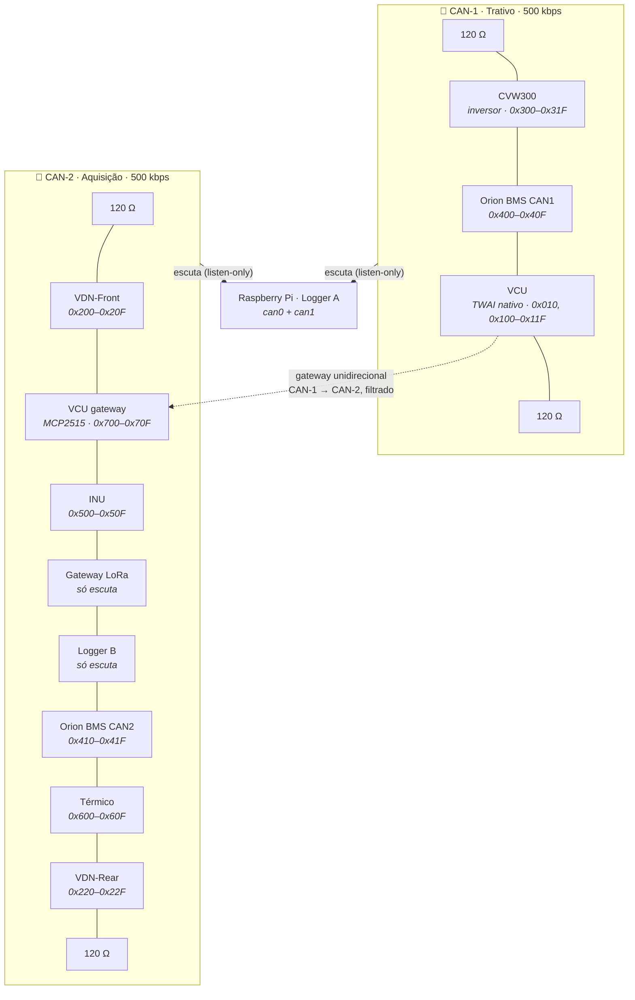

# 🌐 Topologia Macro dos Dois Barramentos CAN 500k & Distribuição dos Nós

> Mapeamento físico e elétrico dos nós no monoposto. Esta nota detalha a topologia decidida em [[🧭 Plano do Sistema de Telemetria (FSAE Eletrico)]] §3 — **dois barramentos CAN 2.0A a 500 kbps**, um trativo e um de aquisição — e substitui a versão anterior de barramento único com nós Heltec.

> [!info] O que mudou em relação à versão anterior
> * Um barramento virou **dois** (CAN-1 Trativo, CAN-2 Aquisição), para que um nó de sensor em *bus-off* nunca atrase o torque nem o AMS.
> * Os nós de sensor usam **ESP32-S3-DevKitC-1**, não Heltec V3 — o SX1262 da Heltec ocupa os pinos do SPI que o MCP3208 precisa.
> * O nó de controle passou a se chamar **VCU** (era PCU) e agora é o **gateway** entre os dois barramentos.
> * O Raspberry Pi **só escuta**, nos dois barramentos. Nunca transmite.
> * Entraram: **Logger B** (ESP32 + microSD) e **nó Térmico**. Saíram: sensores laser de ride height.

---

## 🗺️ 1. Diagrama dos Dois Barramentos

**Regra de ouro:** nada que esteja no CAN-2 consegue escrever no CAN-1. O único caminho entre os barramentos é o gateway do VCU, e ele só copia frames selecionados **de** CAN-1 **para** CAN-2 (`0x700`–`0x702`).

---

## 📦 2. Especificação e Localização de Cada Nó

| Nó | Placa | Barramento | Localização | Responsabilidade |
| :--- | :--- | :---: | :--- | :--- |
| **VCU** | ESP32-S3-WROOM-1 em PCB própria | CAN-1 (TWAI) + CAN-2 (MCP2515) | Cockpit, atrás do painel | APPS 1/2, BSE, pedal de freio, direção, estados do circuito de shutdown, comando de torque, log local L1, gateway. [[🔵 No PCU (Controle, Powertrain, APS, Freios e Direcao)]] |
| **VDN-Front** | ESP32-S3-DevKitC-1 | CAN-2 | *Bulkhead* dianteiro | Amortecedores FL/FR, aceleração de cubo FL/FR, aceleração vertical do chassi (frente), rodas FL/FR, temperatura de pneu FL/FR. [[🟢 No VDN-Front (ESP32 Heltec V3, Entradas Digitais e SPI)]] |
| **VDN-Rear** | ESP32-S3-DevKitC-1 (mesma PCB) | CAN-2 | Subchassi traseiro | Espelho do dianteiro para RL/RR. [[🟢 No VDN-Rear (ESP32 Heltec V3, Simetria e Sensores Traseiros)]] |
| **INU** | LilyGO T-Beam (ESP32 clássico) | CAN-2 | Centro de gravidade | BNO085, NEO-M8N, **base de tempo** (PPS → `0x504`). [[🟣 No INU (ESP32 T-Beam, GPS NEO-M8N e IMU BNO085 9-DoF)]] |
| **Térmico** | ESP32-S3-DevKitC-1 | CAN-2 | Junto ao radiador / bomba | Temperaturas de arrefecimento (motor e inversor), vazão, PWM de bomba e ventoinha, temperatura do redutor, tensão do GLV. |
| **Logger B** | ESP32-S3-DevKitC-1 + microSD | CAN-2, **TX desconectado** | Caixa de baixa tensão | Grava tudo do CAN-2. Redundância do Pi. |
| **Gateway LoRa** | Heltec WiFi LoRa 32 V3 | CAN-2, **TX desconectado** | Caixa de baixa tensão, antena no *roll hoop* | Monta o pacote de 41 bytes e transmite a 10 Hz. [[📡 Modulo LoRa SX1262, Bit-Packing Compacto e CRC16]] |
| **Raspberry Pi (Logger A)** | Pi 4 + HAT com dois CAN | CAN-1 e CAN-2, *listen-only* | Caixa de telemetria | Grava os dois barramentos (BLF), deriva canais, alimenta o display. **Nunca transmite.** [[🔴 Gateway e Logger Raspberry Pi (SocketCAN, Logs BLF e CSV)]] |
| **CVW300** | Inversor WEG | CAN-1 | Traseira | Telegramas definidos no WLP (pendência). |
| **Orion BMS** | Original, 2 canais CAN | CAN-1 (crítico) e CAN-2 (resumo) | Acumulador | Tensão/corrente/SOC/limites em CAN-1; resumo a 10 Hz em CAN-2. |

---

## ⚡ 3. Camada Física e Cabeamento

* **Cabo:** par trançado blindado (STP) com $Z_0 = 120\,\Omega \pm 10\%$, 22 AWG, um par por barramento. Os dois barramentos **não compartilham** blindagem nem conector.
* **Conectores:** Deutsch DTM selados. Nós passam o barramento *in-and-out*; stub < 3 cm dentro da placa.
* **Transceivers:** SN65HVD230 a 3,3 V em todos os nós ESP32. Pino $R_s$ com 10 kΩ para GND (controle de *slope*).
* **Terminação — 120 Ω exatamente em duas pontas por barramento:**

| Barramento | Ponta A | Ponta B | Observação |
| :--- | :--- | :--- | :--- |
| CAN-1 | CVW300 (traseira) | VCU (cockpit) | **Verificar** se o CVW300 e o Orion têm terminação interna selecionável antes de soldar. Medir 60 Ω com tudo desligado. |
| CAN-2 | VDN-Front (bico) | VDN-Rear (traseira) | Resistor dentro do conector final. Nós intermediários sem resistor. |

* **Nós somente-escuta** (Pi, Logger B, Gateway LoRa): transceiver montado, mas o pino TX do controlador **não vai ao pino D do transceiver** — fica ligado a 3,3 V (recessivo). Assim um bug de firmware não consegue transmitir nem enviar ACK. O driver TWAI roda em `TWAI_MODE_LISTEN_ONLY`.
* **Comprimento máximo:** a 500 kbps, ~100 m de barramento é o limite teórico; no carro são < 4 m. O que importa são os stubs.

---

## 🔍 4. Por que essa topologia (resumo de §3 do Plano)

| Decisão | Motivo |
| :--- | :--- |
| Dois barramentos | Isolamento de falha: *bus-off* de um sensor não toca o torque nem o AMS. Prova no teste T7. |
| VCU como gateway (não o Pi) | Determinístico, sempre ligado, já está nos dois barramentos. O Pi pode travar. |
| Pi só escuta | Elimina o Pi como fonte de tráfego errado; simplifica a análise de barramento. |
| Logger B | Um Pi com SD corrompido não pode ser o fim do registro. Custa < R$ 100. |
| DevKitC em vez de Heltec nos VDNs | SX1262 da Heltec ocupa GPIO 8–14 (SPI + controle) — exatamente onde o MCP3208 iria. |

---

## 🔗 Próxima Leitura
* [[🔵 No PCU (Controle, Powertrain, APS, Freios e Direcao)|➡️ Nó VCU (arquivo ainda chamado PCU)]]
* [[🟢 No VDN-Front (ESP32 Heltec V3, Entradas Digitais e SPI)|➡️ Nó VDN-Front]]
* [[🟢 No VDN-Rear (ESP32 Heltec V3, Simetria e Sensores Traseiros)|➡️ Nó VDN-Rear]]
* [[🟣 No INU (ESP32 T-Beam, GPS NEO-M8N e IMU BNO085 9-DoF)|➡️ Nó INU]]
* [[🌐 Arquitetura CAN 2.0B (500 kbps), Transceivers SN65HVD230 e Terminacao|🌐 Camada física e bit timing]]
* [[📊 Matriz de Mensagens CAN e Dicionario de IDs (DBC Veicular)|📊 Matriz CAN dos dois barramentos]]
