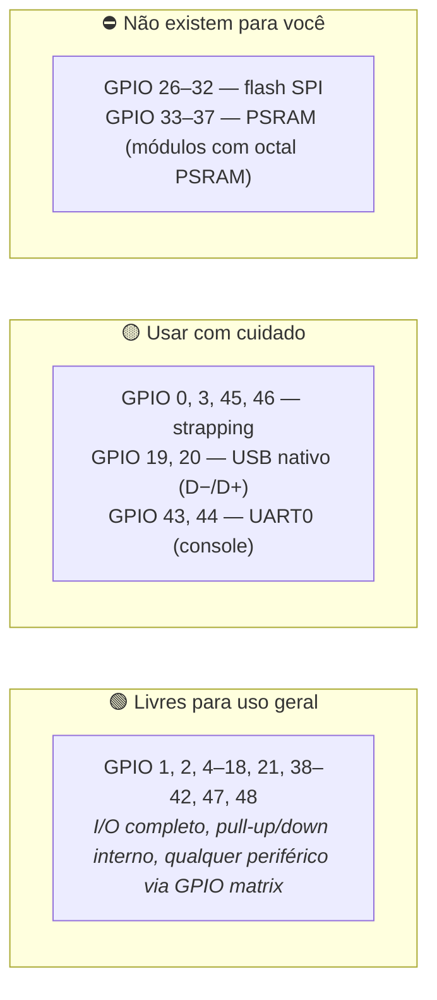
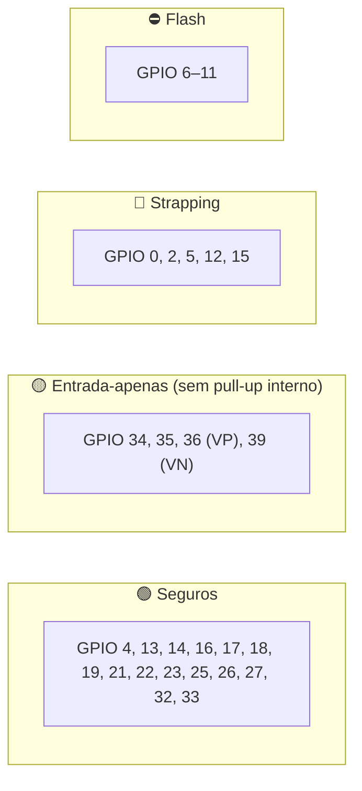

# 📌 Mapa Definitivo de Pinos — ESP32-S3 e ESP32 clássico

> Guia de bancada para escolher pinos sem travar o boot nem queimar entrada. O carro usa **dois chips diferentes**: **ESP32-S3** (VDN-Front, VDN-Rear, VCU, Térmico, Logger B, Gateway LoRa) e **ESP32 clássico** (INU na T-Beam). Os mapas são diferentes — misturar é o erro mais comum. A pinagem definitiva de cada nó está em [[🧭 Plano do Sistema de Telemetria (FSAE Eletrico)]] §6 e em [[📋 Tabela Mestre de Fiacao e Pinagem dos Sensores do Veiculo]].

> [!warning] O que mudou em relação à versão anterior
> * A versão anterior era só do ESP32 clássico e mandava ligar APS, freio e suspensão nos GPIOs 32–39 (ADC interno). **Isso não vale mais**: nenhum sensor do carro usa o ADC interno. Todos passam por ADC externo (MCP3208, ADS131M08, ADS1115). O ADC interno fica para diagnóstico de placa.
> * Entrou o mapa do **ESP32-S3**, que tem numeração e *strapping pins* diferentes.

---

## 🚦 1. Regra número zero: qual chip está na sua mão?

| Placa | Chip | Onde no carro | Mapa a usar |
| :--- | :--- | :--- | :---: |
| ESP32-S3-DevKitC-1 | ESP32-S3-WROOM-1 | VDN-Front, VDN-Rear, Térmico, Logger B | §2 |
| PCB própria do VCU | ESP32-S3-WROOM-1 | VCU | §2 |
| Heltec WiFi LoRa 32 V3 | ESP32-S3 + SX1262 | Gateway LoRa | §2 + §2.3 |
| LilyGO T-Beam | ESP32 clássico (LX6) + NEO-M8N | INU | §3 |

Sinais de que você está com o chip errado: código com `GPIO 34` no S3 (não existe como I/O livre — é PSRAM), código com `GPIO 45` no clássico (não existe).

---

## 🟦 2. ESP32-S3 (WROOM-1 / DevKitC-1)

### 2.1 Semáforo do S3

**Não há ADC2 utilizável para nós:** no S3, ADC1 = GPIO 1–10 e ADC2 = GPIO 11–20, e o ADC2 também briga com o Wi-Fi. Como o carro não usa o ADC interno, isso deixa de ser problema de projeto.

### 2.2 Strapping pins do S3

| GPIO | Função no boot | Nível esperado | Consequência se errado |
| :---: | :--- | :---: | :--- |
| **0** | Modo de boot | HIGH = roda o firmware; LOW = download | Sensor puxando para GND no boot → placa "não liga" |
| **3** | JTAG source (com eFuse) | Flutuante (pull-down interno fraco) | Raramente afeta; evitar pull-up externo |
| **45** | Tensão do VDD_SPI (flash) | LOW = 3,3 V; HIGH = 1,8 V | **Pull-up externo aqui trava a flash.** Equivalente ao GPIO 12 do clássico |
| **46** | Boot + ROM log | LOW | Não tem pull-up interno; deixar livre |

Na DevKitC os pinos 0 e 46 estão nos botões BOOT/RESET — não conectar sensor neles.

### 2.3 Pinos usados pelo projeto no S3

| Função | GPIO | Nó | Nota |
| :--- | :---: | :--- | :--- |
| TWAI (CAN) TX / RX | 6 / 7 | todos os S3 | Qualquer GPIO serve (GPIO matrix); 6/7 é a convenção do projeto |
| SPI2 (FSPI): CS / MOSI / CLK / MISO | 10 / 11 / 12 / 13 | VDN (MCP3208), VCU (ADS131M08), Logger B (microSD) | Pinos **IO_MUX** do FSPI: até 80 MHz sem passar pela matrix. Na **Heltec V3 estes são do SX1262** — por isso a Heltec só é o Gateway LoRa |
| SPI3: CS / MOSI / CLK / MISO / INT | 14 / 15 / 16 / 17 / 18 | VCU (MCP2515 + microSD CS 38) | Via GPIO matrix, limite ~40 MHz — sobra para o MCP2515 (10 MHz) |
| I²C0 SDA / SCL | 8 / 9 | VDN, VCU, Térmico | |
| I²C1 SDA / SCL | 17 / 18 | VDN | Segundo controlador: dois MLX90621 (endereço fixo) |
| PCNT | 4 / 5 | VDN (rodas), Térmico (vazão) | S3 tem **4 unidades** PCNT |
| Jumper de ID | 21 | VDN | |
| Entradas isoladas / INT | 39–42 | VCU | |
| Saídas de driver | 1 / 2 / 4 | VCU | |
| LED RGB | 48 | DevKitC | WS2812 na placa |

**Heltec WiFi LoRa 32 V3 (Gateway LoRa):** SX1262 em NSS 8, SCK 9, MOSI 10, MISO 11, RST 12, BUSY 13, DIO1 14; OLED em SDA 17 / SCL 18 / RST 21; **GPIO 36 = controle do Vext** (alimenta OLED e periféricos, ativo em LOW). CAN RX em 6, TX **fisicamente desconectado**. Livres: 2–7, 19/20 (USB), 26 (ADC), 33–35, 37–48 conforme a placa.

---

## 🟧 3. ESP32 clássico (só o INU na T-Beam)

### 3.1 Semáforo do clássico

### 3.2 Strapping pins do clássico

| GPIO | Nível no boot | Função | Consequência se errado |
| :---: | :---: | :--- | :--- |
| **0** | HIGH | Boot normal | LOW → modo download, carro "não liga" |
| **2** | LOW / flutuante | Com GPIO 0, seleciona download | HIGH no boot pode impedir gravação |
| **5** | HIGH | Timing do SDIO | Só gera aviso no log |
| **12** | **LOW** | **Tensão da flash**: LOW = 3,3 V, HIGH = 1,8 V | ⚠️ Pull-up externo → `flash read err, 1000` em loop. **Na T-Beam o 12 é o TX do GPS — a placa já cuida disso; não adicionar nada nele** |
| **15** | HIGH | Log do bootloader | LOW silencia o boot |

### 3.3 Pinos reservados pela T-Beam (não são livres)

| Grupo | GPIOs | O quê |
| :--- | :--- | :--- |
| Rádio LoRa (desligado no INU) | 5, 18, 19, 23, 26, 27, 32, 33 | SCK, CS, MISO, RST, DIO0, MOSI, DIO2, DIO1 |
| GPS | 34 (RX), 12 (TX) | NEO-M8N — e o PPS depende da revisão (37 ou 36/39) |
| PMU AXP192 | 21, 22 (I²C), 35 (IRQ) | Compartilhar o I²C é normal; endereço 0x34 |
| Botões / LED | 0, 38, 4 (LED em v1.1) | |

O que sobra para o INU: **25 (CAN TX), 4 (CAN RX — LED pisca, tudo bem), 13 (IMU INT), 14 (IMU RST opcional), 21/22 (I²C compartilhado), 37 (PPS)**. Confere com [[🟣 No INU (ESP32 T-Beam, GPS NEO-M8N e IMU BNO085 9-DoF)]] §2.

### 3.4 ADC1 × ADC2 (só para quem for usar o ADC interno em bancada)

ADC1 = GPIO 32–39, independente. ADC2 = GPIO 0, 2, 4, 12–15, 25–27, **bloqueado quando o Wi-Fi sobe**. Como nenhum sensor do carro passa pelo ADC interno, isso só importa em teste de bancada com `analogRead()`.

---

## 📏 4. Regras de ouro (valem para os dois chips)

1. **Sensor analógico do carro nunca entra em GPIO.** Vai para MCP3208 / ADS131M08 / ADS1115. Motivo: ADC interno do ESP32 tem não-linearidade de ~±6 %, ruído e referência que muda de chip para chip. Um ADC externo de R$ 15 resolve.
2. **Nenhum pino tolera 5 V.** Máximo absoluto V_DD + 0,3 V. Sensores de 5 V passam por divisor **ou** por ADC externo alimentado em 5 V (ADS1115).
3. **Strapping pin nunca vai ao chicote.** Só LED indicador com resistor, e mesmo assim só se o nível de boot for respeitado.
4. **Pull-up externo em I²C e em saída *open-drain* de sensor** (TLE4922). O pull-up interno de ~45 kΩ não segura um chicote de 1 m.
5. **Corrente por pino:** 12 mA nominal, 40 mA absoluto. LED, relé, buzzer → driver.
6. **Um pino, uma função.** Se o mesmo GPIO aparece em duas linhas da tabela do nó, a tabela está errada — foi assim que a versão anterior desta pasta colocou o PPS e o RX do GPS no GPIO 34.

---

## 🔗 Próximos Passos
* [[📋 Tabela Mestre de Fiacao e Pinagem dos Sensores do Veiculo|📋 Pinagem completa de cada nó, com cores e conectores]]
* [[📘 Guia Fundamental do ESP32 (Arquitetura, Dual-Core, Perifericos e Limites Eletricos)|📘 Arquitetura, FreeRTOS e limites elétricos]]
* [[🔌 Guia Pratico de Conexao de Sensores (Analogicos, Digitais, I2C, SPI e Niveis Logicos)|🔌 Como ligar cada tipo de sensor]]
