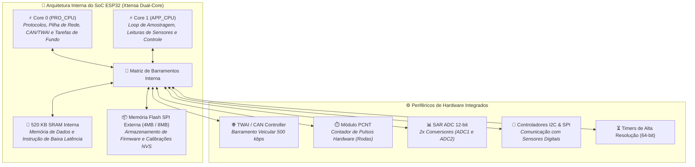
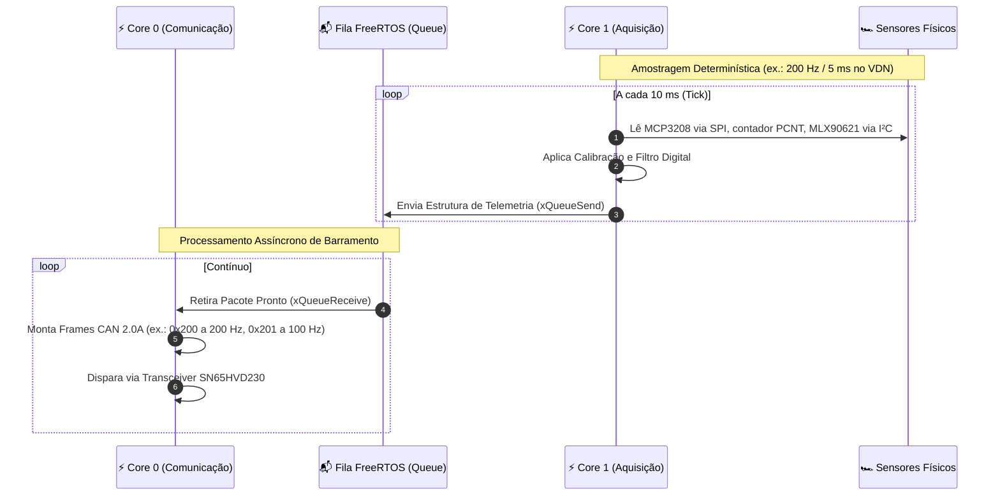

# 📘 Guia Fundamental do ESP32 — Arquitetura, Dual-Core, Periféricos e Limites Elétricos

> Manual técnico e didático sobre o funcionamento interno do System-on-Chip (SoC) ESP32, divisão de tarefas em múltiplos núcleos com FreeRTOS, periféricos de hardware para telemetria veicular e limites elétricos absolutos para proteção do circuito.

> [!info] Revisado em 2026-09-14
> O carro usa **dois chips**: ESP32-S3 (VDN-Front, VDN-Rear, VCU, Térmico, Logger B, Gateway LoRa) e ESP32 clássico (INU na T-Beam). Este guia vale para os dois; onde há diferença, está marcado. Pinos e ADC interno: ver [[📌 Mapa Definitivo de Pinos do ESP32 (Pinout, Strapping Pins, ADC1 vs ADC2 e Regras de Ouro)]]. **Nenhum sensor do carro usa o ADC interno** — o exemplo com `analogRead()` abaixo é didático.

---

## 🏎️ 1. Por que o ESP32 na Telemetria da UTForce?

Na engenharia de competição de um monoposto elétrico de Fórmula SAE, cada milissegundo e cada grama de peso contam. Antigamente, projetos acadêmicos utilizavam múltiplos microcontroladores lentos (como ATmega328P de 8 bits a 16 MHz) ou placas de desenvolvimento industriais extremamente caras e pesadas.

O **ESP32** (desenvolvido pela Espressif Systems) revolucionou a eletrônica embarcada ao combinar:
1. **Poder de Processamento**: Dois núcleos independentes de 32 bits rodando a **240 MHz** com FPU (*Floating Point Unit*), permitindo cálculos trigonométricos e dinâmicos em tempo real sem engasgar.
2. **Sistema Operacional de Tempo Real Nativo (FreeRTOS)**: Permite paralelismo real e temporização determinística em microssegundos para aquisição de sinais.
3. **Periféricos Dedicados Automotivos**: Módulo controlador de rede CAN integrado (**TWAI**), contadores de pulso por hardware (**PCNT**) e múltiplos barramentos I2C/SPI de alta velocidade.
4. **Custo e Escalabilidade**: Baixo custo, ampla disponibilidade, e a mesma base de código roda na DevKitC-1 (nós de sensor), na PCB própria do VCU, na T-Beam (INU) e na Heltec V3 (Gateway LoRa).

### Qual ESP32 em qual nó

| Nó | Placa | Chip | Por quê |
| :--- | :--- | :--- | :--- |
| VDN-Front, VDN-Rear, Térmico, Logger B | ESP32-S3-DevKitC-1 | S3 (LX7) | Sem rádio ocupando o SPI; 4 unidades PCNT; USB nativo para debug |
| VCU | PCB própria com ESP32-S3-WROOM-1 | S3 | Mesmo chip dos VDNs; PCB própria por causa de optoacopladores, MCP2515 e microSD |
| INU | LilyGO T-Beam | clássico (LX6) | GPS NEO-M8N embutido |
| Gateway LoRa | Heltec WiFi LoRa 32 V3 | S3 + SX1262 | Único nó onde a Heltec é a placa certa |

O **S3 tem um único controlador TWAI** (o clássico também). Por isso o VCU, que fala nos dois barramentos, usa MCP2515 em SPI para o segundo.



---

## 🧠 2. Arquitetura Interna: O Processador Xtensa 32-bit

O coração do ESP32 clássico (WROOM / WROVER / T-Beam) é baseado na arquitetura **Tensilica Xtensa Dual-Core 32-bit LX6**; o **ESP32-S3** usa **LX7**, com instruções vetoriais extras, USB OTG nativo, mais GPIOs (0–48) e suporte a PSRAM octal. Para telemetria, o que muda na prática é a numeração de pinos e a ausência de DAC no S3.

### Especificações Técnicas de Destaque:
* **Frequência de Clock**: Ajustável entre 80 MHz, 160 MHz e **240 MHz** (até ~600 DMIPS).
* **Memória SRAM**: $520\,\text{KB}$ dividida em:
  * SRAM0 ($64\,\text{KB}$): Cache e instruções críticas (`IRAM`).
  * SRAM1 ($128\,\text{KB}$): Código executado em RAM.
  * SRAM2 ($200\,\text{KB}$): Dados em tempo de execução (`DRAM`).
  * SRAM3 ($128\,\text{KB}$): Dados compartilhados com periféricos DMA.
* **Memória RTC (Fast e Slow)**: $8\,\text{KB} + 8\,\text{KB}$ alimentadas no modo *Deep Sleep* pelo coprocessador ULP (*Ultra Low Power*).
* **Memória Não-Volátil (NVS)**: Permite salvar na memória Flash parâmetros de calibração de sensores (como zero de potenciômetro e fator de escala de pressão) que persistem mesmo se o carro for desligado.

---

## ⚡ 3. O Dual-Core na Prática: Core 0 vs Core 1 com FreeRTOS

No desenvolvimento de telemetria automotiva, um erro comum de iniciantes é colocar toda a lógica em um único loop sequencial (`void loop()` do Arduino). Se a leitura de um sensor I2C travar ou a transmissão de um pacote CAN demorar $2\,\text{ms}$, todo o sistema sofre atraso (*jitter*), corrompendo a taxa de amostragem de dados críticos como a aceleração e o curso de suspensão.

Para eliminar esse problema, **a telemetria da UTForce utiliza a separação estrita de núcleos do ESP32 gerenciada pelo FreeRTOS**:



### Divisão de Responsabilidades na UTForce:
* **Core 0 (PRO_CPU - Protocol CPU)**:
  * Gerenciamento do barramento veicular **TWAI/CAN** (envio de mensagens a 500 kbps).
  * Tarefas de transmissão sem fio (LoRa / Wi-Fi / Bluetooth quando ativas).
  * *Watchdog* de sistema e tarefas de manutenção em background do FreeRTOS.
* **Core 1 (APP_CPU - Application CPU)**:
  * Leitura dos ADCs externos via SPI (MCP3208 nos VDNs, ADS131M08 no VCU) e I²C (ADS1115).
  * Leitura e processamento de pacotes I²C (matrizes térmicas MLX90621, AS5600, BNO085).
  * Execução dos cálculos de cinemática e filtros digitais (filtros de média móvel, passa-baixa Butterworth e calibração de zero).

### Exemplo Prático de Código em C++ (PlatformIO / ESP-IDF):

```cpp
#include <Arduino.h>
#include "freertos/FreeRTOS.h"
#include "freertos/task.h"
#include "freertos/queue.h"

// Estrutura de dados transmitida de um núcleo para o outro
struct TelemetryPacket {
    uint32_t timestamp_ms;
    uint16_t suspension_fl_raw;
    uint16_t suspension_fr_raw;
    float wheel_speed_fl_kmh;
};

// Handle da Fila segura entre núcleos
QueueHandle_t telemetryQueue;

// ==========================================
// TAREFA NO CORE 1: AQUISIÇÃO DE SENSORES
// ==========================================
void TaskSensorsCore1(void *pvParameters) {
    TickType_t xLastWakeTime = xTaskGetTickCount();
    const TickType_t xFrequency = pdMS_TO_TICKS(10); // 100 Hz exatos

    for (;;) {
        TelemetryPacket packet;
        packet.timestamp_ms = millis();
        // Leitura determinística de sensores.
        // DIDÁTICO: no carro estas leituras vêm do MCP3208 via SPI
        // (readMCP3208(0), readMCP3208(1)) — o ADC interno não é usado.
        packet.suspension_fl_raw = analogRead(1);   // GPIO 1 = ADC1_CH0 no S3
        packet.suspension_fr_raw = analogRead(2);   // GPIO 2 = ADC1_CH1 no S3
        packet.wheel_speed_fl_kmh = 42.5; // Exemplo de valor lido

        // Envia para a fila sem bloquear se estiver cheia (timeout 0)
        xQueueSend(telemetryQueue, &packet, 0);

        // Dorme até o próximo ciclo exato de 10 ms
        vTaskDelayUntil(&xLastWakeTime, xFrequency);
    }
}

// ==========================================
// TAREFA NO CORE 0: TRANSMISSÃO CAN BUS
// ==========================================
void TaskCommCore0(void *pvParameters) {
    TelemetryPacket rxPacket;

    for (;;) {
        // Aguarda pacote chegar na fila (bloqueia até receber)
        if (xQueueReceive(telemetryQueue, &rxPacket, portMAX_DELAY) == pdTRUE) {
            // Empacota e envia no barramento CAN veicular
            // twai_transmit_message(&can_msg, pdMS_TO_TICKS(5));
        }
    }
}

void setup() {
    Serial.begin(115200);

    // Cria fila com capacidade para 10 pacotes
    telemetryQueue = xQueueCreate(10, sizeof(TelemetryPacket));

    // Fixa a tarefa de sensores no Core 1 com prioridade alta (5)
    xTaskCreatePinnedToCore(
        TaskSensorsCore1, "SensorsTask", 4096, NULL, 5, NULL, 1
    );

    // Fixa a tarefa de comunicação no Core 0 com prioridade normal (3)
    xTaskCreatePinnedToCore(
        TaskCommCore0, "CommTask", 4096, NULL, 3, NULL, 0
    );
}

void loop() {
    // Loop principal fica vazio; FreeRTOS gerencia tudo nas tarefas criadas
    vTaskDelete(NULL);
}
```

---

## ⚙️ 4. Periféricos de Hardware Chave para Telemetria

### 1. Módulo TWAI (*Two-Wire Automotive Interface*) — Controlador CAN 2.0B
O ESP32 possui um controlador CAN 2.0B integrado de fábrica em nível de silício (chamado de TWAI pela Espressif por questões de marca registrada). Ele implementa:
* Padrão ISO 11898-1 (CAN 2.0A de 11 bits e CAN 2.0B de 29 bits estendido).
* Taxas de transmissão configuráveis de $25\,\text{kbps}$ até **$1\,\text{Mbps}$** (na UTForce usamos **$500\,\text{kbps}$** nos dois barramentos).
* **Um único controlador por chip**, tanto no clássico quanto no S3. O VCU, que precisa de CAN-1 e CAN-2, usa um **MCP2515** em SPI para o segundo. Nós que só escutam (Logger B, Gateway LoRa) rodam o TWAI em `TWAI_MODE_LISTEN_ONLY` e ainda por cima têm o pino TX desconectado do transceiver.
* Filtros de aceitação por hardware: o próprio chip descarta mensagens de outros IDs irrelevantes sem acordar a CPU.
* **Atenção**: O ESP32 possui o *controlador*, mas **não** os transceptores de linha. É mandatório conectar um chip transceptor externo como o **SN65HVD230** (alimentado a $3.3\,\text{V}$) entre as portas GPIO do ESP32 e os fios diferenciais `CAN_H` / `CAN_L`.

### 2. Módulo PCNT (*Pulse Counter*) — Contagem Sem Carga de CPU
Sensores de efeito Hall instalados nas rodas dentadas do cubo (como o **TLE4922**) geram centenas de pulsos elétricos por segundo. Se usássemos interrupções de software convencionais (`attachInterrupt()`), o processador gastaria até 40% de sua capacidade trocando contexto de interrupção em velocidades altas.
* O módulo **PCNT** conta pulsos eletricamente de forma autônoma via hardware, registrando contagens em registradores dedicados de 16 bits. O clássico tem 8 unidades; o **S3 tem 4** — o VDN usa duas, o Térmico uma.
* A CPU lê o contador acumulado a cada $10\,\text{ms}$ e calcula a velocidade sobre uma janela deslizante de $100\,\text{ms}$ ([[⏱️ Sensores de Roda TLE4922 e Contagem por Hardware PCNT]] §3).

### 3. SAR ADC (*Successive Approximation Register*) de 12 bits — **não usado para sensores do carro**
* **Dois ADCs**: no clássico ADC1 = GPIO 32–39 e ADC2 = GPIO 0, 2, 4, 12–15, 25–27; no S3 ADC1 = GPIO 1–10 e ADC2 = GPIO 11–20. O ADC2 briga com o Wi-Fi nos dois chips.
* Resolução nominal de 12 bits, mas com não-linearidade de vários por cento, ruído e referência interna que varia de chip para chip. Por isso o projeto usa **ADCs externos**: MCP3208 (VDN), ADS131M08 e ADS1115 (VCU, Térmico). Tabela em [[⚡ Circuitos Condicionadores (Divisores 33k-12k, Filtros RC e ADCs MCP3208-ADS131M08)]].
* O ADC interno serve para **diagnóstico de placa** (tensão do 3,3 V, temperatura) e para bancada.

---

## 🛡️ 5. Limites Elétricos Absolutos: Como Não Queimar o ESP32

O ESP32 é um microcontrolador CMOS fabricado em tecnologia de $40\,\text{nm}$. Seus transistores internos são extremamente sensíveis a sobretensão e sobrecorrente. Na oficina da UTForce, a maior causa de placas danificadas em bancada é o desconhecimento dos seguintes limites:

| Parâmetro Elétrico | Valor Nominal Recomendado | Limite Máximo Absoluto (Queima) | Consequência da Violação |
| :--- | :--- | :--- | :--- |
| **Tensão de Alimentação do Chip ($V_{DD}$)** | $3.3\,\text{V}$ | $3.6\,\text{V}$ | Destruição imediata da camada de óxido de silício. |
| **Tensão em Qualquer Pino GPIO ($V_{IN}$)** | $0.0\,\text{V}$ a $3.3\,\text{V}$ | $-0.3\,\text{V}$ a $V_{DD} + 0.3\,\text{V}$ | **NÃO É TOLERANTE A 5V!** Conectar sinal de sensor de $5\,\text{V}$ destrói a porta GPIO. |
| **Corrente Fornecida por Pino (*Source*)** | $12\,\text{mA}$ | $40\,\text{mA}$ | Superaquecimento do pino e queima permanente do driver de saída. |
| **Corrente Drenada por Pino (*Sink*)** | $12\,\text{mA}$ | $28\,\text{mA}$ | Degradação do transistor interno de pull-down. |
| **Corrente Total do Chip ($I_{VDD\_TOTAL}$)** | $\approx 250\,\text{mA}$ (com RF) | $1200\,\text{mA}$ | Fusão de trilhas internas do módulo e reinicialização cíclica (*brownout*). |

> [!CAUTION]
> ### O ESP32 NÃO é Tolerante a 5 Volts!
> Muitos sensores automotivos (sensores de pressão de combustível, sensores Hall antigos e potenciômetros industriais) são alimentados a $5\,\text{V}$ ou $12\,\text{V}$ e fornecem sinais analógicos ou digitais que chegam a $5\,\text{V}$.
> **NUNCA conecte o sinal de $5\,\text{V}$ diretamente a uma entrada do ESP32!** Sinal digital de 5 V passa por conversor de nível ou por pull-up em 3,3 V (caso do TLE4922, *open-drain*). Sinal analógico de 5 V vai para um **ADC externo** com o divisor certo para aquele ADC — não existe divisor "padrão": 33 k/12 k é para o ADS131M08 (±1,2 V), 12 k/24 k para o MCP3208 (3,3 V), e o ADS1115 alimentado em 5 V não precisa de nenhum. Ver [[⚡ Circuitos Condicionadores (Divisores 33k-12k, Filtros RC e ADCs MCP3208-ADS131M08)]] §1.

> [!WARNING]
> ### Limite de Fornecimento de Corrente (Alimentando Sensores)
> O pino `3V3` da placa de desenvolvimento é alimentado por um pequeno regulador de tensão linear (LDO, como AMS1117 ou ME6211). Esse regulador suporta tipicamente no máximo $500\,\text{mA}$ a $800\,\text{mA}$.
> Como o próprio ESP32 consome picos de até $300\,\text{mA}$ ao transmitir via RF, **nunca tente alimentar cargas indutivas, relés, telas grandes ou sensores que consomem mais de $150\,\text{mA}$ diretamente pelo pino de 3.3V da placa**! No projeto, cada nó tem buck 5 V + LDO 3,3 V próprios na PCB ([[⚡ Alimentacao Eletrica, Protecoes TVS e Isolamento Galvanico]] §1); a DevKitC recebe 5 V no pino `5V`, e o LDO dela alimenta só o chip.

---

## 🔗 Próximos Passos & Documentos Relacionados

* 📌 **Qual pino usar para cada coisa?** Consulte o [[📌 Mapa Definitivo de Pinos do ESP32 (Pinout, Strapping Pins, ADC1 vs ADC2 e Regras de Ouro)|Mapa Definitivo de Pinos do ESP32]].
* 🔌 **Como montar os divisores de tensão e filtros?** Consulte o [[🔌 Guia Pratico de Conexao de Sensores (Analogicos, Digitais, I2C, SPI e Niveis Logicos)|Guia Prático de Conexão de Sensores]].
* 📋 **Tabela de pinos de cada placa do carro:** Veja a [[📋 Tabela Mestre de Fiacao e Pinagem dos Sensores do Veiculo|Tabela Mestre de Fiação e Pinagem]].
* 🌐 **Arquitetura da rede CAN:** Consulte [[🌐 Arquitetura CAN 2.0B (500 kbps), Transceivers SN65HVD230 e Terminacao|Arquitetura CAN 2.0B e Transceivers]].
