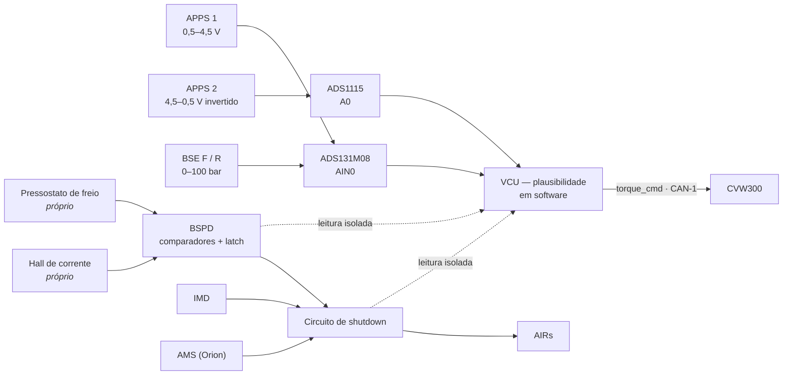

# 🔵 Nó VCU (Controle, Gateway, APPS, Freios & Direção)

> Especificação do **Vehicle Control Unit**. Era "PCU" nas notas antigas; o arquivo mantém o nome para não quebrar links. Placa: **ESP32-S3-WROOM-1 em PCB própria**. Barramentos: **CAN-1** (TWAI nativo) e **CAN-2** (MCP2515 em SPI). Fonte: [[🧭 Plano do Sistema de Telemetria (FSAE Eletrico)]] §3.3, §4.1, §5, §6.2, §7.

> [!warning] Mudanças em relação à versão anterior desta nota
> * **APPS1 e APPS2 em ADCs diferentes** (ADS131M08 e ADS1115). Dois sensores no mesmo chip não é redundância.
> * **Divisor 33k/12k só onde o destino é o ADS131M08** (FSR ±1,2 V). O ADS1115 alimentado em 5 V lê 0,5–4,5 V direto.
> * **Removidos:** as três "Pressões de Transmissão X/Y/Z" (não existem num redutor de FSAE elétrico) e o NTC de transmissão (foi para o nó Térmico).
> * **Adicionados:** leitura dos estados do circuito de shutdown (SDC, IMD, AMS, BSPD, AIRs, pré-carga, TSAL, RTD), pedal de freio, log local em microSD, gateway CAN-1→CAN-2.
> * **BSPD não é firmware.** É circuito analógico separado, com sensores próprios. O VCU só lê a saída dele.
> * Todas as taxas críticas em **100 Hz**; `regen_level` a 10 Hz.

---

## 🧭 1. Papel do VCU na cadeia de segurança

O VCU é o único nó da telemetria que **age**: calcula plausibilidade e manda torque ao CVW300. Tudo o resto observa.

Se o VCU morrer, o carro continua seguro: quem abre o shutdown é AMS, IMD e BSPD — nenhum deles depende do VCU.

---

## 🛡️ 2. Regras implementadas no firmware

| Regra | Condição | Reação | Recuperação |
| :--- | :--- | :--- | :--- |
| **APPS implausível** | \|APPS1 − APPS2\| > 10 % do curso por > 100 ms, ou um dos sensores fora de 0,5–4,5 V (curto/aberto) | `torque_cmd = 0`; bit em `0x010`; evento no log | Automática quando os dois voltam a concordar |
| **APPS × freio** | APPS > 25 % com freio acionado (pressão acima do limiar da equipe, ex.: 30 bar) | `torque_cmd = 0` | Só quando APPS < 5 % |
| **Sensor fora de faixa** (BSE, pedal, direção) | ADC < 2 % ou > 98 % da escala | Flag no frame; último valor válido por até 500 ms, depois NaN | Automática |
| **Estado de segurança mudou** | Qualquer bit de `sdc_ok`, `imd_ok`, `ams_ok`, `bspd_ok`, AIRs, pré-carga, TSAL, RTD | Emite `0x010` imediatamente (evento) além do 1 Hz | — |

Os limiares de 10 % / 100 ms / 25 % / 5 % vêm do regulamento EV; o de pressão de freio é parâmetro da equipe e fica no NVS. Algoritmo em [[🛑 Transdutores de Pressao Hidraulica e APS Duplo Redundante]] §3.

---

## 📌 3. Pinagem (ESP32-S3-WROOM-1)

| Função | GPIO | Observação |
| :--- | :---: | :--- |
| **CAN-1** TX / RX (TWAI nativo) | **6 / 7** | Barramento trativo. Terminação 120 Ω neste nó (ponta do CAN-1) |
| SPI2 — ADS131M08 CS / MOSI / CLK / MISO | **10 / 11 / 12 / 13** | 24 bit, 8 canais diferenciais, amostragem simultânea |
| ADS131M08 DRDY / SYNC-RESET | **21 / 47** | DRDY em interrupção; taxa de dados configurada em 1 kSPS, decimada para 100 Hz |
| SPI3 — MCP2515 CS / MOSI / CLK / MISO / INT | **14 / 15 / 16 / 17 / 18** | Segundo controlador CAN → **CAN-2**. O S3 só tem um TWAI |
| SPI3 — microSD CS | **38** | Compartilha SPI3 com o MCP2515 (CS separados) |
| I²C0 SDA / SCL | **8 / 9** | AS5600 (0x36) · ADS1115 (0x48) · PCF8574 (0x20) |
| Entradas diretas isoladas: `sdc_ok`, `precharge_done`, `rtd_btn` | **39 / 40 / 41** | Optoacoplador. As três que o VCU precisa para **agir** |
| Entradas via PCF8574: `imd_ok`, `ams_ok`, `bspd_ok`, `air_pos`, `air_neg`, `tsal` | expansor I²C | Só telemetria. INT do expansor em **42** |
| Saídas: RTD sound · TSAL enable · luz de falha | **1 / 2 / 4** | Via driver (MOSFET / relé) |
| LED de status | **48** | |

**Não usar:** 0, 3, 45, 46 (*strapping*), 19/20 (USB), 26–37 (flash/PSRAM), 43/44 (UART0).

---

## 🎛️ 4. Interfaces e condicionamento

| Canal | Sinal | ADC | Condicionamento | No ADC | Taxa |
| :--- | :--- | :--- | :--- | :---: | :---: |
| `apps1_raw` | 0,5–4,5 V | ADS131M08 AIN0 | Divisor **33 k / 12 k** (×0,267) | 0,13–1,20 V | 100 Hz |
| `apps2_raw` | **4,5–0,5 V** (curva invertida) | **ADS1115 A0** — ADC separado | **Nenhum**; ADS1115 alimentado em 5 V | 4,5–0,5 V | 100 Hz |
| `bse_press_front` | 0,5–4,5 V (0–100 bar) | ADS131M08 AIN1 | 33 k / 12 k | 0,13–1,20 V | 100 Hz |
| `bse_press_rear` | 0,5–4,5 V | ADS131M08 AIN2 | 33 k / 12 k | 0,13–1,20 V | 100 Hz |
| `steer_torque` | ±5 mV (ponte completa) | ADS131M08 AIN3 **diferencial** | INA333, R_G = 499 Ω (G ≈ 201), REF = 1,65 V; AINN ligado ao REF | ±1,0 V em torno de 1,65 V | 100 Hz |
| `brake_pedal_pos` | 0–5 V pot | ADS131M08 AIN4 | Divisor **38 k / 12 k** (×0,24) | 0–1,20 V | 100 Hz |
| `steer_angle` | I²C 12 bit | AS5600 (0x36) | Ímã diametral Ø6 mm, entreferro 1–2 mm | — | 100 Hz |
| `regen_level` | 0–5 V pot de painel | ADS1115 A1 | Nenhum | 0–5 V | 10 Hz |
| Estados de segurança | 12 V / 0 V | GPIO + PCF8574 | Optoacoplador por entrada; nunca 12 V direto no chip | — | evento + 1 Hz |

O ADS1115 a 860 SPS lê A0 e A1 alternados sem apertar os 100 Hz do APPS2 (dois canais → 430 SPS cada). A leitura de `regen_level` pode ser decimada em software.

> [!danger] O divisor não é "padrão"
> 33 k/12 k **só** para sinais de 0,5–4,5 V indo ao ADS131M08 (FSR ±1,2 V). O guia do Miro dizia 0,733× — isso leva 4,5 V a 3,3 V e satura o ADS131M08 em 2,75×. Corrigir o guia antes de montar. Tabela completa em [[⚡ Circuitos Condicionadores (Divisores 33k-12k, Filtros RC e ADCs MCP3208-ADS131M08)]].

---

## 📤 5. Frames emitidos

### CAN-1 (TWAI)

| ID | Nome | Taxa | DLC | Payload |
| :---: | :--- | :---: | :---: | :--- |
| `0x010` | `VCU_Safety` | evento + 1 Hz | 2 | bitmask dos 9 estados + contador |
| `0x100` | `VCU_Torque` | 100 Hz | 6 | `torque_cmd` i16 ×0,1 Nm · `torque_limit` i16 · `mode` u8 · `enable` u8 |
| `0x101` | `VCU_APPS` | 100 Hz | 7 | `apps1_raw` u16 · `apps2_raw` u16 · `apps_pct` u16 ×0,01 % · flags u8 |
| `0x102` | `VCU_Brake` | 100 Hz | 7 | `bse_front` u16 ×0,1 bar · `bse_rear` u16 · `pedal_pos` u16 ×0,1 mm · flags u8 |
| `0x103` | `VCU_Steer` | 100 Hz | 6 | `angle` i16 ×0,1 ° · `torque` i16 ×0,01 Nm · `rate` i16 ×0,1 °/s |
| `0x110` | `VCU_Inputs` | 10 Hz | 2 | `regen_level` u8 % · botões u8 |
| `0x10F` | `VCU_Heartbeat` | 1 Hz | 8 | layout comum |

### CAN-2 (MCP2515) — gateway, **unidirecional CAN-1 → CAN-2**

| ID | Nome | Taxa | DLC | Payload |
| :---: | :--- | :---: | :---: | :--- |
| `0x700` | `GW_Pedals` | 20 Hz | 8 | `apps_pct` u16 · `bse_f` u16 · `bse_r` u16 · `steer` i16 — subamostrado de `0x101/0x102/0x103` |
| `0x701` | `GW_Safety` | evento + 1 Hz | 2 | cópia de `0x010` |
| `0x702` | `GW_Inverter` | 20 Hz | 8 | cópia subamostrada de `0x300` |

O MCP2515 é configurado com o filtro de recepção fechado (não aceita nada) — o VCU **não lê** o CAN-2. Bug de firmware no lado da aquisição não tem caminho até o torque.

---

## 💾 6. Log local (camada L1)

microSD no SPI3: grava `0x010`, `0x100`–`0x103` e `0x300` a 100 Hz em blocos de 4 kB, buffer circular de 2 h, rotação de arquivo a cada 10 min. Sobrevive à queda do CAN-2, do Pi, do Logger B e do rádio. Formato: binário simples `[millis u32][id u16][dlc u8][data 8]` — decodificado no pós-processamento com o mesmo DBC.

---

## 🔗 Próxima Leitura
* [[🛑 Transdutores de Pressao Hidraulica e APS Duplo Redundante|🛑 APPS/BSE: curvas, plausibilidade e BSPD]]
* [[🏎️ Sensor de Angulo AS5600 e Célula de Torque com INA333|🏎️ Direção: AS5600 e INA333 lido em modo diferencial]]
* [[📊 Matriz de Mensagens CAN e Dicionario de IDs (DBC Veicular)|📊 Matriz CAN completa]]
* [[🟣 No INU (ESP32 T-Beam, GPS NEO-M8N e IMU BNO085 9-DoF)|➡️ Nó INU]]
