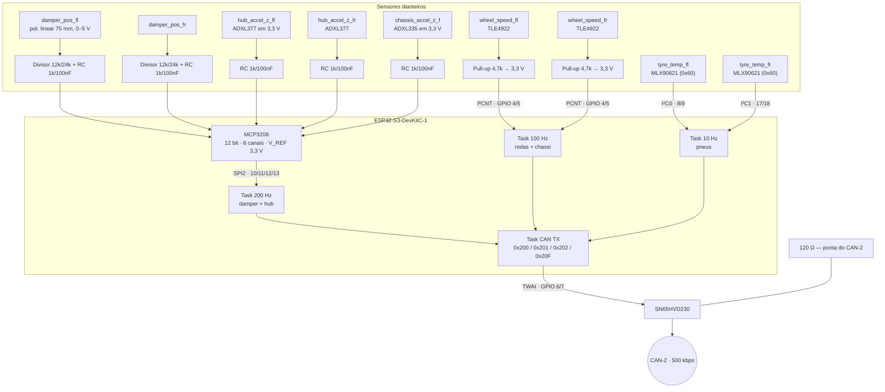

# 🟢 Nó VDN-Front (ESP32-S3-DevKitC-1, MCP3208, PCNT & I²C Duplo)

> Hardware, pinagem e pipeline de aquisição do **Nó de Dinâmica Veicular Dianteiro**. Placa: **ESP32-S3-DevKitC-1** (o nome do arquivo ainda diz "Heltec V3" — a placa foi trocada, ver [[📋 Revisao da Arquitetura Planejada (Miro)]] §2). Barramento: **CAN-2**. Fonte dos valores: [[🧭 Plano do Sistema de Telemetria (FSAE Eletrico)]] §4.4, §5, §6.1, §7.2.

> [!warning] Mudanças em relação à versão anterior desta nota
> * **Placa:** Heltec V3 → ESP32-S3-DevKitC-1. Na Heltec, GPIO 8–14 pertencem ao SX1262; o MCP3208 precisava deles.
> * **Ride height laser:** removido. Altura é derivada do curso do amortecedor ([[📐 Ride Height (Laser vs Potenciometro Linear) e Calibracao]]).
> * **Acelerômetro de cubo:** ADXL335 (±3 g) → **ADXL377 (±200 g)**. Zebra passa de 3 g.
> * **Térmico de pneu:** MLX90614 (1 ponto) → **MLX90621 (16×4)**, um por pneu, **em barramentos I²C separados**.
> * **Taxas:** amortecedor e cubo a **200 Hz**; rodas e chassi a 100 Hz; pneu a 10 Hz. Um frame por taxa.
> * **Divisor:** não é mais 33k/12k. Potenciômetro 0–5 V → **12 k / 24 k** (0,667) para o MCP3208 com V_REF = 3,3 V.

---

## 🧭 1. Diagrama em Blocos



---

## 📌 2. Pinagem (ESP32-S3-DevKitC-1)

Idêntica ao VDN-Rear. O nó descobre quem é pelo jumper no boot.

| Função | GPIO | Observação |
| :--- | :---: | :--- |
| CAN TX / RX | **6 / 7** | TWAI nativo → SN65HVD230 (D / R) |
| SPI2 — MCP3208 CS | **10** | Ativo em nível baixo |
| SPI2 — MOSI (→ D_IN) | **11** | Pinos nativos do FSPI no S3 — os mesmos que a Heltec usa para o rádio, aqui livres |
| SPI2 — CLK | **12** | 2 MHz |
| SPI2 — MISO (← D_OUT) | **13** | |
| PCNT unidade 0 — `wheel_speed_fl` | **4** | Pull-up externo 4,7 kΩ para 3,3 V |
| PCNT unidade 1 — `wheel_speed_fr` | **5** | Pull-up externo 4,7 kΩ para 3,3 V |
| I²C0 SDA / SCL — MLX90621 **esquerdo** | **8 / 9** | Pull-up 4,7 kΩ; 400 kHz |
| I²C1 SDA / SCL — MLX90621 **direito** | **17 / 18** | Segundo controlador I²C. **Obrigatório**: o MLX90621 tem endereço fixo 0x60, dois no mesmo bus colidem |
| Jumper de ID | **21** | Aberto (pull-up interno) = Front · GND = Rear |
| LED de status | **48** | RGB da própria DevKitC |
| Livres | 14, 15, 16, 38–42, 47 | Expansão |

**Não usar:** 0, 3, 45, 46 (*strapping*), 19/20 (USB nativo), 26–37 (flash/PSRAM do módulo), 43/44 (UART0 do console). Detalhe em [[📌 Mapa Definitivo de Pinos do ESP32 (Pinout, Strapping Pins, ADC1 vs ADC2 e Regras de Ouro)]].

---

## 🎛️ 3. Canais do MCP3208

V_REF = 3,3 V (mesmo LDO que alimenta o chip) → 0,806 mV/LSB. Filtro RC 1 kΩ / 100 nF ($f_c \approx 1{,}6$ kHz) em **todos** os canais; o capacitor também é o reservatório de carga do SAR.

| CH | Canal canônico | Sensor | Faixa do sensor | Condicionamento | No pino | Taxa |
| :---: | :--- | :--- | :---: | :--- | :---: | :---: |
| 0 | `damper_pos_fl` | Pot. linear 75 mm em 5 V | 0–5 V | Divisor **12 k (cima) / 24 k (baixo)** → ×0,667 | 0–3,33 V | 200 Hz |
| 1 | `damper_pos_fr` | idem | 0–5 V | idem | 0–3,33 V | 200 Hz |
| 2 | `hub_accel_z_fl` | **ADXL377** em 3,3 V, eixo Z | 1,65 V ± 6,5 mV/g | Só RC | 0–3,3 V | 200 Hz |
| 3 | `hub_accel_z_fr` | ADXL377 | idem | Só RC | 0–3,3 V | 200 Hz |
| 4 | `chassis_accel_z_f` | **ADXL335** em 3,3 V, eixo Z | 1,65 V ± 330 mV/g | Só RC | 0–3,3 V | 100 Hz |
| 5–7 | reserva | — | — | Conector de expansão | — | — |

> [!note] Por que ADXL377 no cubo e ADXL335 no chassi
> Massa não suspensa em zebra passa de 3 g com folga; o ADXL335 saturava e o pico virava patamar. O ADXL377 (±200 g) resolve 0,8 mg/LSB × 6,5 mV/g ≈ **0,12 g/LSB** no MCP3208 — suficiente para *wheel hop*, não para conforto. Já a massa suspensa fica dentro de ±3 g, e lá o ADXL335 dá 2,4 mg/LSB. Cada sensor na faixa certa.

**Sanidade:** ADC < 2 % ou > 98 % da escala por mais de 500 ms → flag `adc_fault` no heartbeat, valor vira NaN ([[🧭 Plano do Sistema de Telemetria (FSAE Eletrico)]] §9).

---

## 📤 4. Frames emitidos (CAN-2)

| ID | Nome | Taxa | DLC | Payload (Little Endian) |
| :---: | :--- | :---: | :---: | :--- |
| `0x200` | `VDNF_Damper` | **200 Hz** | 8 | `damper_fl` u16 ×0,01 mm · `damper_fr` u16 · `hub_az_fl` i16 ×0,01 g · `hub_az_fr` i16 |
| `0x201` | `VDNF_Wheel` | 100 Hz | 6 | `ws_fl` u16 ×0,01 km/h · `ws_fr` u16 · `chassis_az_f` i16 ×0,001 g |
| `0x202` | `VDNF_Tyre` | 10 Hz | 6 | FL in/mid/out u8 (−40 °C offset) · FR in/mid/out u8 |
| `0x20F` | `VDNF_Heartbeat` | 1 Hz | 8 | Layout comum, [[📊 Matriz de Mensagens CAN e Dicionario de IDs (DBC Veicular)]] §4 |

Carga deste nó no CAN-2: 200×135 + 100×115 + 10×115 + 135 ≈ **39,8 kbps (8 %)**.

---

## 💻 5. Firmware — leitura do MCP3208 (SPI2 do S3)

```cpp
#include <SPI.h>

#define PIN_CS   10
#define PIN_MOSI 11
#define PIN_CLK  12
#define PIN_MISO 13

SPIClass spi2(FSPI);   // no ESP32-S3, FSPI = SPI2

void setupMCP3208() {
    pinMode(PIN_CS, OUTPUT);
    digitalWrite(PIN_CS, HIGH);
    spi2.begin(PIN_CLK, PIN_MISO, PIN_MOSI, PIN_CS);
}

// Leitura single-ended de um canal (0..7). Retorna 0..4095.
uint16_t readMCP3208(uint8_t ch) {
    spi2.beginTransaction(SPISettings(2000000, MSBFIRST, SPI_MODE0));
    digitalWrite(PIN_CS, LOW);
    uint8_t b0 = 0b00000110 | ((ch & 0x04) >> 2);  // start, single, D2
    uint8_t b1 = (ch & 0x03) << 6;                 // D1, D0
    spi2.transfer(b0);
    uint8_t hi = spi2.transfer(b1);
    uint8_t lo = spi2.transfer(0x00);
    digitalWrite(PIN_CS, HIGH);
    spi2.endTransaction();
    return ((hi & 0x0F) << 8) | lo;
}

// Task a 200 Hz: CH0..CH3 a cada tick; CH4 a cada 2 ticks (100 Hz)
void taskFast(void*) {
    TickType_t wake = xTaskGetTickCount();
    for (;;) {
        vTaskDelayUntil(&wake, pdMS_TO_TICKS(5));
        uint16_t raw[4];
        for (uint8_t ch = 0; ch < 4; ch++) raw[ch] = readMCP3208(ch);
        // → escala, checagem 2 %/98 %, fila para 0x200
    }
}
```

A leitura dos 5 canais a 2 MHz leva ~50 µs; a task de 5 ms fica com > 98 % de folga. Não há razão para DMA aqui. Como o RC de 1,6 kHz não é anti-aliasing para 200 Hz, a recomendação da Fase 1 é rodar a task a 800 Hz (1,25 ms) e enviar a média de 4 amostras — ver [[⚡ Circuitos Condicionadores (Divisores 33k-12k, Filtros RC e ADCs MCP3208-ADS131M08)]] §4.

---

## 🔗 Próxima Leitura
* [[🟢 No VDN-Rear (ESP32 Heltec V3, Simetria e Sensores Traseiros)|➡️ VDN-Rear (mesma PCB)]]
* [[⏱️ Sensores de Roda TLE4922 e Contagem por Hardware PCNT|⏱️ PCNT e cálculo de velocidade a 100 Hz]]
* [[🌡️ Matriz Termica de Pneus MLX90614 e Sensores de Temperatura|🌡️ MLX90621 e os dois barramentos I²C]]
* [[⚡ Circuitos Condicionadores (Divisores 33k-12k, Filtros RC e ADCs MCP3208-ADS131M08)|⚡ Tabela de condicionamento por ADC]]
