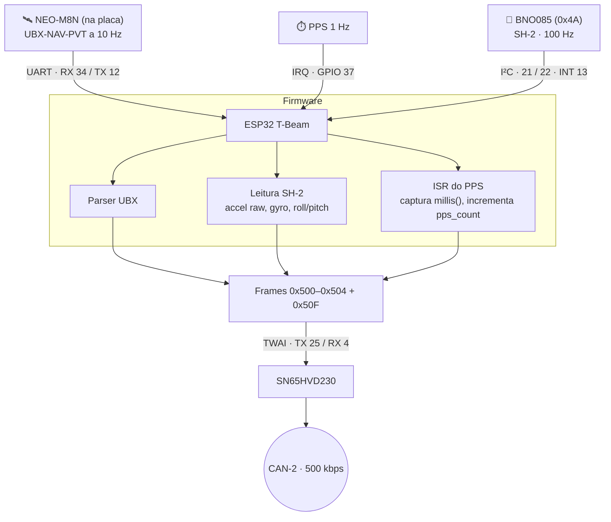

# 🟣 Nó INU (ESP32 T-Beam, GPS NEO-M8N & IMU BNO085 9-DoF)

> **Inertial Navigation Unit**: acelerações, taxas angulares, atitude, posição GNSS e — o mais importante — a **base de tempo** de todo o sistema via PPS. Placa: **LilyGO T-Beam** (ESP32 clássico; única placa do carro que não é S3, porque o GPS embutido justifica). Barramento: **CAN-2**. Fonte: [[🧭 Plano do Sistema de Telemetria (FSAE Eletrico)]] §4.5, §6.3, §7.2, §7.3.

> [!warning] Correções em relação à versão anterior desta nota
> * **CAN RX: GPIO 26 → GPIO 4.** O 26 é DIO0 do rádio LoRa da própria T-Beam — verificado na documentação da placa.
> * **IMU INT: GPIO 33 → GPIO 13.** O 33 é tipicamente DIO1 do rádio; trocado por segurança.
> * **PPS: GPIO 37** (a tabela antiga dizia 37, o diagrama dizia 34 — 34 já é o RX do GPS). Depende da revisão da placa: **confirmar** na sua.
> * **Taxas:** IMU a **100 Hz** (era 20/50 Hz misturado); GPS a 10 Hz; `time_sync` a 1 Hz na borda do PPS.
> * **Aceleração raw**, não "linear com gravidade subtraída": o Pi precisa do vetor bruto para comparar com os acelerômetros dos VDNs.

---

## 🧭 1. Diagrama em Blocos



---

## 📌 2. Pinagem (LilyGO T-Beam, ESP32 clássico)

| Função | GPIO | Situação | Observação |
| :--- | :---: | :---: | :--- |
| GPS RX (← TX do NEO-M8N) | **34** | ✅ nativo da placa | Entrada-apenas, serve para UART RX |
| GPS TX (→ RX do NEO-M8N) | **12** | ✅ nativo da placa | Strapping pin, mas a T-Beam já o usa assim |
| GPS PPS | **37** | ⚠️ confirmar | Se não responder, usar 36 ou 39 (entrada-apenas, aceitam interrupção) |
| CAN TX | **25** | ✅ livre | → pino D do SN65HVD230 |
| CAN RX | **4** | ✅ corrigido | ← pino R. **Não usar 26** (DIO0 do rádio) |
| IMU SDA / SCL | **21 / 22** | ✅ | Compartilha com o AXP192 (0x34) da placa; BNO085 em 0x4A. Sem conflito |
| IMU INT | **13** | ✅ corrigido | Era 33 (provável DIO1 do rádio) |
| IMU RST | 14 | opcional | Reset por software costuma bastar |

**Reservados à placa — não tocar:** 5, 18, 19, 23, 26, 27, 32, 33 (rádio LoRa), 12 e 34 (GPS), 21, 22, 35 (AXP192 / PMU IRQ), 0 e 38 (botões), 6–11 (flash). Na revisão v1.1 há um LED vermelho no **GPIO 4**: ele piscará com o tráfego CAN, o que é inofensivo e até útil; se incomodar, dessoldar o LED ou mover o RX para o GPIO 2. O rádio LoRa da T-Beam **fica desligado** — quem transmite é o Gateway LoRa (Heltec V3).

---

## 🛰️ 3. GPS u-blox NEO-M8N

* **Protocolo:** NMEA desligado; **UBX-NAV-PVT** binário a **10 Hz** (`CFG-RATE` = 100 ms). 92 bytes por solução: data/hora UTC com nanossegundos, lat/lon (×1e-7 °), altura, velocidade no solo, *heading of motion*, `numSV`, `fixType`.
* **10 Hz exige uma constelação só.** O NEO-M8N faz 10 Hz em GPS-only; com GPS+GLONASS cai para 5 Hz. Configurar `CFG-GNSS` para GPS (+SBAS) apenas.
* **Antena:** ativa, no topo do *roll hoop*, cabo curto. Plano de terra de ≥ 50 mm sob a antena patch.
* **PPS (`TIMEPULSE`):** pulso de subida a 1 Hz com jitter < 60 ns quando há *fix*. Sem *fix* o pulso continua, mas o `epoch` do PVT fica inválido — o frame `0x504` carrega `fix` para o Pi saber.

---

## 📐 4. IMU BNO085 (SH-2)

O BNO085 tem coprocessador de fusão. O INU pede três relatórios SH-2 a **100 Hz**:

| Relatório SH-2 | Canais canônicos | Motivo |
| :--- | :--- | :--- |
| `SH2_ACCELEROMETER` (raw, com gravidade) | `accel_x/y/z` i16 ×0,001 g | Comparável com ADXL dos VDNs; o Pi remove a gravidade usando a atitude |
| `SH2_GYROSCOPE_CALIBRATED` | `gyro_roll/pitch/yaw_rate` i16 ×0,01 °/s | Yaw rate alimenta o slip angle |
| `SH2_ROTATION_VECTOR` → Euler | `att_roll/pitch_angle` i16 ×0,01 ° | Só roll e pitch; *yaw* magnético não é confiável perto do inversor |

**Calibração:** giroscópio em repouso (5 s após ligar); acelerômetro em 6 posições na bancada; magnetômetro **não usado** (chassi de aço + cabos de potência = *hard-iron* variável). Salvar `SH2_CAL` no NVS.

**Montagem:** eixo X para a frente, Y para a esquerda, Z para cima (ISO 8855), o mais perto possível do CG. Rotação de montagem corrigida no firmware, não no Pi.

---

## ⏱️ 5. Base de tempo — `0x504 INU_TimeSync`

```mermaid
sequenceDiagram
    participant GPS as NEO-M8N
    participant INU as INU (ISR)
    participant CAN as CAN-2
    participant N as Cada nó
    participant Pi as Pi / Logger B

    GPS->>INU: borda PPS (início do segundo)
    Note over INU: t_pps = millis(); pps_count++
    GPS->>INU: UBX-NAV-PVT (~60 ms depois) com epoch do segundo
    INU->>CAN: 0x504 {epoch u32, ms u16, pps_count u16}
    CAN->>N: recebe 0x504
    Note over N: guarda (millis_local, epoch)
    N->>CAN: frames carimbados com millis_local
    CAN->>Pi: registra instante de chegada de cada frame
    Note over Pi: pós-processamento alinha tudo por 0x504
```

Nenhum nó tem RTC. Cada um guarda o par `(millis_local, epoch)` do último `0x504`; o Pi e o Logger B registram o instante de chegada de cada frame. Alinhamento por `0x504` no pós-processamento. Se o GPS perder *fix*, `pps_count` continua contando e o alinhamento relativo entre nós se mantém — só a hora absoluta fica em espera.

---

## 📤 6. Frames emitidos (CAN-2)

| ID | Nome | Taxa | DLC | Payload (LE) |
| :---: | :--- | :---: | :---: | :--- |
| `0x500` | `INU_Accel` | 100 Hz | 8 | `ax` i16 · `ay` i16 · `az` i16 (×0,001 g) · `yaw_rate` i16 ×0,01 °/s |
| `0x501` | `INU_Attitude` | 100 Hz | 8 | `roll_rate` i16 · `pitch_rate` i16 (×0,01 °/s) · `roll` i16 · `pitch` i16 (×0,01 °) |
| `0x502` | `INU_GPS_Pos` | 10 Hz | 8 | `lat` i32 ×1e-7 ° · `lon` i32 ×1e-7 ° |
| `0x503` | `INU_GPS_Vel` | 10 Hz | 8 | `speed` u16 ×0,01 km/h · `heading` u16 ×0,01 ° · `alt` i16 m · `sats` u8 · `fix` u8 |
| `0x504` | `INU_TimeSync` | **1 Hz, na borda do PPS** | 8 | `epoch` u32 · `ms` u16 · `pps_count` u16 |
| `0x50F` | `INU_Heartbeat` | 1 Hz | 8 | layout comum |

Carga no CAN-2: 2×100×135 + 2×10×135 + 2×135 ≈ **30 kbps (6 %)**.

---

## 🔗 Próxima Leitura
* [[🛰️ Unidade Inercial BNO085 e GPS NEO-M8N com Sincronismo PPS|🛰️ Protocolo UBX, PPS e calibração em detalhe]]
* [[⚡ Alimentacao Eletrica, Protecoes TVS e Isolamento Galvanico|⚡ Alimentação do nó]]
* [[📊 Matriz de Mensagens CAN e Dicionario de IDs (DBC Veicular)|📊 Matriz CAN]]
