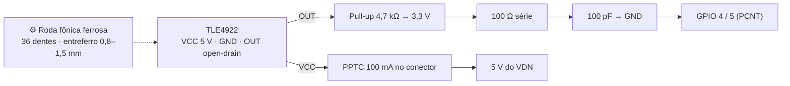

# ⏱️ Sensores de Roda TLE4922 & Contagem por Hardware PCNT

> Quatro `wheel_speed_[fl,fr,rl,rr]` (u16 ×0,01 km/h, **100 Hz**) medidos por Hall diferencial **Infineon TLE4922** em roda fônica ≥ 30 dentes, contados pelo **PCNT do ESP32-S3** nos VDNs (GPIO 4 e 5). Frame `0x201 / 0x221`.

> [!warning] O que mudou
> * Taxa: 10 Hz → **100 Hz** (slip ratio precisa resolver a dinâmica da roda). A contagem em janela de 10 ms é grossa demais em baixa velocidade — §3 mostra o método correto (contador acumulado + janela deslizante).
> * Placa: Heltec V3 → ESP32-S3-DevKitC-1 (o S3 tem **4 unidades PCNT**; o VDN usa 2).
> * API: `driver/pcnt.h` (legado) está **deprecada** no ESP-IDF 5 / Arduino-ESP32 3.x — o novo driver é `driver/pulse_cnt.h`.

---

## 🎯 1. Números do problema

Pneu de 13" com raio dinâmico $R \approx 0{,}23$ m → circunferência 1,445 m. Roda fônica de **36 dentes**.

| Velocidade | Rotação da roda | Pulsos/s por roda | Pulsos em 10 ms | Pulsos em 100 ms |
| :---: | :---: | :---: | :---: | :---: |
| 10 km/h | 1,92 rps | 69 | **0,7** | 6,9 |
| 40 km/h | 7,7 rps | 277 | 2,8 | 27,7 |
| 120 km/h | 23,1 rps | 830 | 8,3 | 83 |

Conclusão: **contar pulsos numa janela de 10 ms não funciona** — a 10 km/h a leitura oscila entre 0 e 1 pulso (erro de 100 %). Por isso o método de §3. E com 4 rodas a 830 pulsos/s cada, `attachInterrupt()` seriam 3 300 interrupções/s no núcleo — o PCNT conta sem CPU.

---

## ⚙️ 2. TLE4922 e circuito



* **Hall diferencial com ímã traseiro** (*back-biased*): detecta dente ferroso, imune a campo homogêneo externo (cabos do motor) e a vibração.
* **Saída open-drain**: alimentado em 5 V, mas o pull-up é para **3,3 V** — o pino do ESP32 nunca vê 5 V.
* **Filtro RF** 100 Ω / 100 pF (f_c ≈ 16 MHz) só contra irradiação do chicote de roda; não afeta os 830 Hz máximos.
* **Fusível PPTC de 100 mA** no conector: chicote de roda esmagado não apaga o nó.
* Cabo: 3 vias blindado, blindagem no AGND do VDN, uma ponta só.

---

## 📐 3. Velocidade a 100 Hz sem perder resolução

O PCNT conta **acumulado** (nunca é zerado em operação; contador de 16 bits com *overflow* tratado por interrupção ou usando o *watch point* de limite para incrementar um `uint32_t` em software). A task de 100 Hz lê o acumulado e mantém um histórico de 10 leituras (100 ms):

$$f_{pulsos} = \frac{N(t) - N(t - 100\,\text{ms})}{0{,}1\,\text{s}} \qquad v = \frac{f_{pulsos}}{Z} \cdot 2\pi R \cdot 3{,}6\ \text{[km/h]}$$

* Atualização a **100 Hz**, resolução de **1 pulso em 100 ms** → a 10 km/h, ±1,4 km/h; a 40 km/h, ±0,4 km/h (1 %).
* Abaixo de ~3 km/h (menos de 2 pulsos em 100 ms) reportar **0** e setar bit "baixa velocidade" — não interpolar.
* Alternativa para baixa velocidade (Fase 2, se precisar): medir o **período** entre bordas com o *capture* do MCPWM ou com `esp_timer` na ISR do PCNT *watch point*. Não é necessário para o slip ratio, que só interessa acima de 20 km/h.

**Roda fônica com ≥ 30 dentes** é o que torna 100 Hz viável. Com 12 dentes seria 1 pulso em 100 ms a 5 km/h — fica a nota para quem for usinar.

---

## 💻 4. Firmware — driver novo (`driver/pulse_cnt.h`, ESP-IDF 5)

```cpp
#include "driver/pulse_cnt.h"

static pcnt_unit_handle_t pcnt_fl = nullptr;
static volatile uint32_t  ovf_fl  = 0;      // estouros do contador de 16 bits

static bool IRAM_ATTR onReach(pcnt_unit_handle_t, const pcnt_watch_event_data_t*, void*) {
    ovf_fl++;                                 // watch point no limite alto
    return false;
}

void setupPCNT_FL() {
    pcnt_unit_config_t ucfg = { .low_limit = -1, .high_limit = 32000 };
    pcnt_new_unit(&ucfg, &pcnt_fl);

    pcnt_chan_config_t ccfg = { .edge_gpio_num = 4, .level_gpio_num = -1 };
    pcnt_channel_handle_t ch;
    pcnt_new_channel(pcnt_fl, &ccfg, &ch);
    pcnt_channel_set_edge_action(ch, PCNT_CHANNEL_EDGE_ACTION_INCREASE,   // borda de subida
                                     PCNT_CHANNEL_EDGE_ACTION_HOLD);      // ignora descida

    pcnt_glitch_filter_config_t f = { .max_glitch_ns = 1000 };            // < 1 µs = ruído
    pcnt_unit_set_glitch_filter(pcnt_fl, &f);

    pcnt_unit_add_watch_point(pcnt_fl, 32000);
    pcnt_event_callbacks_t cbs = { .on_reach = onReach };
    pcnt_unit_register_event_callbacks(pcnt_fl, &cbs, nullptr);

    pcnt_unit_enable(pcnt_fl);
    pcnt_unit_clear_count(pcnt_fl);
    pcnt_unit_start(pcnt_fl);
}

// Contagem acumulada de 32 bits (o watch point zera o contador ao atingir 32000)
uint32_t readAccum_FL() {
    int cnt = 0;
    pcnt_unit_get_count(pcnt_fl, &cnt);
    return ovf_fl * 32000UL + (uint32_t)cnt;
}

// Task 100 Hz — velocidade sobre janela deslizante de 100 ms
constexpr float TEETH = 36.0f, R_M = 0.23f;
void taskWheel(void*) {
    uint32_t hist[10] = {0}; uint8_t idx = 0;
    TickType_t wake = xTaskGetTickCount();
    for (;;) {
        vTaskDelayUntil(&wake, pdMS_TO_TICKS(10));
        uint32_t now = readAccum_FL();
        uint32_t d   = now - hist[idx];          // pulsos nos últimos 100 ms
        hist[idx] = now; idx = (idx + 1) % 10;
        float rps   = (d / TEETH) / 0.1f;
        float kmh   = rps * 2.0f * PI * R_M * 3.6f;
        uint16_t ws = (d < 2) ? 0 : (uint16_t)(kmh * 100.0f);   // 0,01 km/h
        // → fila para 0x201
    }
}
```

> [!note] Watch point e `clear`
> No driver novo, atingir o `high_limit` **zera** o contador automaticamente e chama `on_reach`. Por isso o acumulado é `ovf × 32000 + cnt`. Se o firmware ainda usar `driver/pcnt.h` legado (`pcnt_unit_config`, `pcnt_get_counter_value`), a lógica é a mesma — só a API muda.

---

## 🔗 Próxima Leitura
* [[🟢 No VDN-Front (ESP32 Heltec V3, Entradas Digitais e SPI)|🟢 Nó VDN]]
* [[⚙️ Calculos de Dinamica em Tempo Real (Slip, AeroBalance e G-Forces)|⚙️ Slip ratio com rodas a 100 Hz]]
* [[📘 Guia Fundamental do ESP32 (Arquitetura, Dual-Core, Perifericos e Limites Eletricos)|📘 Periférico PCNT]]
